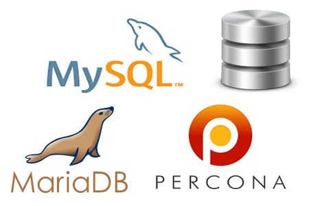
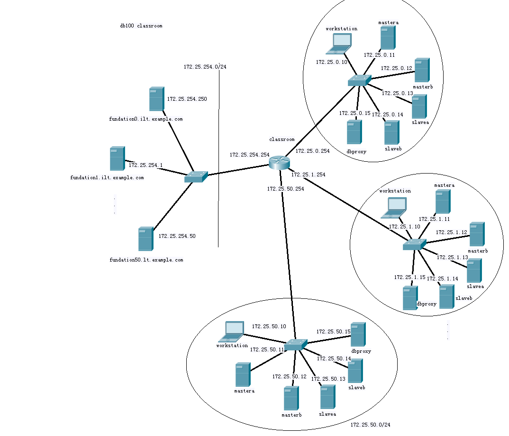

# MySQL 管理课程

[MySQL 管理课程](#mysql-管理课程)

- [为什么MySQL ?](#为什么mysql-)
- [Mysql 管理课程环境使用说明](#mysql-管理课程环境使用说明)
	- [授课网络环境配置如下](#授课网络环境配置如下)
	- [注意事项](#注意事项)
	- [网络拓扑图](#网络拓扑图)

> * 教学对象：有一定linux基础
> * 数据库版本：maraidb5.5 mariadb10.2 mysql5.7
> * 操作系统：RHEL7.2 最小化安装

MySQL 管理课程，预计课时5天，说是说数据库，其实也属于项目的一部分，我们会发现在项目的当中，多多少少都会用到数据库，而且数据库还是一个重要的组成部分，在整个项目环境当中呢，我们会讲到项目的搭建、迁移、拓展，一台机器变成多台机器，解决用户的性能问题，那么在拓展过程当中呢，我们第一步拓展的都是数据库，因为数据库的压力是最大的，第一个遇到性能瓶颈的都是在数据库上面，所以的话呢，我们在MySQL的课程当中会主要以系统管理员的角度去讲讲数据库的备份、冗余、扩展、高可用、负载均衡。

## 为什么MySQL ?

为什么是 MySQL ?对每一种技术,我们都考虑了其最大关注点,并提出同样
的问题。下面是我们对 MySQL 的考虑 :

* ** 它解决了我们的存储需求吗? **

  没错,我们需要映射、索引、排序和 blob 存储,这些MySQL 都有。

* ** 它常用吗? 你可以招聘到相关员工吗?  **

  MySQL 是目前生产线上最常使用的数据库之一。很容易招到使用过 MySQL 的人,我们可以到帕罗奥多市外走走,大喊我们需要 MySQL 工程师,就会冒出来好几个。这可不是开玩笑的。

*  ** 它的社区活跃吗? **

  非常活跃。有好多非常棒的书籍,和一个强大的在线社区。

* ** 面对故障,它健壮吗? **

  即使在最恶劣的情况下,我们也从来没有丢失过数据。

* ** 它的扩展性如何? **

  就它本身来说,只是一个很小的组件。我们需要一种上层的分片方案(这完全是另一个问题)。

* ** 你会是最大的用户吗? **

  不, 目 前 不 是。 最 大 的 用 户 包 括 Facebook、Twitter 和 Google。除非你能够改进一种技术,否则你不会想要成为它最大的用户。如果你是最大的用户,你会碰到一些新的扩展性问题,而其他人根本没机会遇到。

* ** 它的成熟度如何? **

  真正的区别在于成熟度。根据复杂度的不同,成熟度就好比衡量完成一个程序所需的血、汗和泪。MySQL 的确复杂,但可比不上那些神奇的自动集群 NoSQL 方案。而且,MySQL 拥有 28 年最好和最聪明的贡献,来自于诸如Facebook 和 Google 那样大规模使用它的公司。根据我们的成熟度定义,在我们审查的所有技术中,MySQL 是一个明智的选择。

* ** 有好的调试工具吗? **

  作为一个成熟的产品,你当然需要强大的调试和分析工具,因为人们很容易遇到一些类似的棘手情况。比如你可能在凌晨三点遇到问题(不止一次)。相比用另一种技术重写一遍熬到凌晨六点,发现问题的根源然后回去睡觉舒服多了。

*** 以上摘自——Yashwanth Nelapati 和 Marty Weiner Pinterest 2014 年 2 月 ***

## Mysql 管理课程环境使用说明

DB100课程基于RHEL7.2系统，课程教授学生完成基于此系统的Mysql 5.7 、MariaDB 10.2数据库管理课程和基础课程内容。

### 授课网络环境配置如下

* workstation虚拟机均安装rhel7.2系统，（安装图形化界面并配置runlevel 5启动，root密码为uplooking ，配置了基础的YUM源指向classroom）， workstation虚拟机均配置了2块虚拟机网卡，eth0接入物理机br0网桥，动态获得ip地址172.25.0.10；eth1接入物理机private网桥，不获得ip地址；workstation虚拟机均配置2块虚拟硬盘（vda、vdb），以方便授课演示。workstation虚拟机均配置2GB运行内存。

* mastera、masterb、slavea 、slaveb 和dbproxy虚拟机均安装rhel7.2系统，（没有安装图形化界面，root密码为uplooking ，配置了基础的YUM源指向classroom）， mastera、masterb、slavea 、slaveb 和dbproxy虚拟机均配置了2块虚拟机网卡，eth0接入物理机br0网桥，动态获得ip地址172.25.0.11~172.25.0.5；eth1接入物理机private网桥，不获得ip地址；mastera、masterb、slavea 、slaveb 和dbproxy虚拟机均配置2块虚拟硬盘（vda、vdb），以方便授课演示。mastera、masterb、slavea 、slaveb 和dbproxy虚拟机均配置512MB运行内存。

* 已在classroom上完成DNS配置，正向和方向域名及邮件代理域名和虚拟机域名设置如下：
  - classroom.example.com 172.25.254.254
  - fN.example.com 172.25.254.N
  - workstationN.example.com 172.25.N.10
  - masteraN.example.com 172.25.N.11
  - masterbN.example.com 172.25.N.12
  - slaveaN.example.com 172.25.N.13
  - slavebN.example.com 172.25.N.14
  - dbproxyN.example.com 172.25.N.15
  - N:1~80

* http://classroom.example.com/materials 为第三方软件包和资料目录，也可以通过http://materials.example.com 直接访问。

### 注意事项
** Mariadb 10.2 和Mysql 5.7 在yum安装中会有冲突，不要同时配置MariaDB和MySQL的源。 **

### 网络拓扑图

