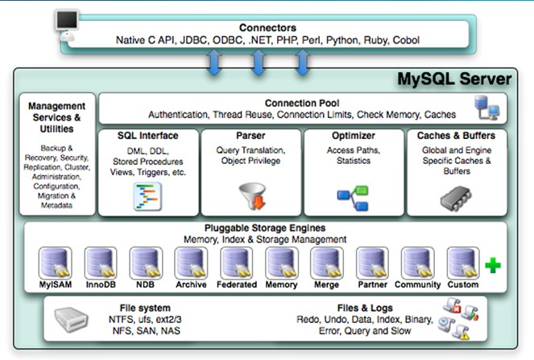
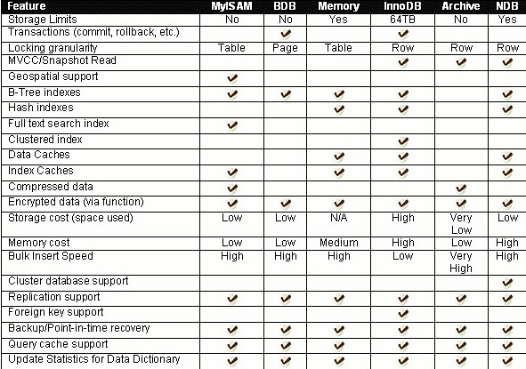
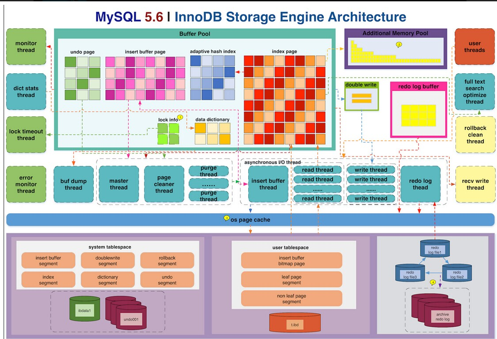

## MySQL和MariaDB数据库介绍
- [MySQL和MariaDB数据库介绍](#mysql和mariadb数据库介绍)
	- [数据库的基础概念](#数据库的基础概念)
	- [数据库的分类](#数据库的分类)
	- [什么是MySQL](#什么是mysql)
		- [MySQL 逻辑架构](#mysql-逻辑架构)
		- [MySQL 存储引擎](#mysql-存储引擎)
			- [* 存储引擎概述 *](#-存储引擎概述-)
			- [* 知名的两大存储引擎 *](#-知名的两大存储引擎-)
			- [* 事务 *](#-事务-)
			- [* 并发控制 *](#-并发控制-)
	- [如何获得MySQL相关资源](#如何获得mysql相关资源)
	- [MySQL在企业中的应用场景](#mysql在企业中的应用场景)
	- [MySQL 安装](#mysql-安装)
		- [RHEL 7.2 RPM 包安装 MariaDB 5.5](#rhel-7.2-rpm-包安装-mariadb-5.5)
		- [MySQL客户端的使用](#mysql客户端的使用)
		- [PHPmyAdmin在线工具使用](#phpmyadmin在线工具使用)


### 数据库的基础概念

*** 线上生产环境中有很多数据，举例说明，论坛、qq、微博、朋友圈等等。 ***

在我们线上生产环境当中有很多数据，那么用户比如说登一个论坛发了个帖子，这个帖子里的内容就是一个数据；用户登陆一个购物网站，买了一个商品，用户购买一个商品是一个订单信息，也是一个数据，各种各样的环境，我们会发现，在我们的线上应用当中，存在很多用户信息，他购买商品也好，发帖子也好，或者他打游戏注册帐号也好，等等，这些东西其实都是信息，我们需要将这些信息保存下来，因为以后每次用户登陆时都需要反复的读写，读写你购买过的商品，读写你发过的帖子，随着我们用户数量越来越多，这种类似的数据会越来越多，从一开始的一个用户到后面的一万个用户，到成年累月下来，我们发现论坛已经有了几千万条帖子，每个帖子又有很多的回复，这时候你会发现我们的数据量越来越大。


*** 数据早期保存的方式，文本文件，介绍读取方式、优缺点，举例说明，做一个小实验。 ***

那么在早些年的时候呢，我们说最早数据保存的方法是文本方式保存，文本文件保存，就是说我们网站上有一千万个帖子，我们把这一千万个帖子放在一个文本文档里，当用户登陆后要读帖的时候，就要从这个文本文件中去读，后来我们发现，当文本文件行数比较少的时候，几百行几千行几万行还行，要是几十万行几百万行的话，你会发现读取的时候非常的慢，慢的话，有的时候需要半分钟，有的时候可能需要五分钟，甚至有时候半小时，那么很明显这个速度是不行的，没有哪个用户说愿意为了看个帖子，在那里等个半小时。看到你帖子出来了，好，开始回帖，然后一个回帖操作完成又要等半个小时，才能看到回帖的结果。很明显不行，所以呢，我们会发现文本文档方式保存信息有一个非常大的缺点，就是我们的读写速度，随着文件内容的增加，他的读写速度会越来越慢，关于这一点，你们可以自己做个实验测以下，写个几十万行的数据2-3个G，过滤出某一行，或者读一下，看看要花多上多少时间。


```shell
#!/bin/bash
touch /tmp/a
for i in `seq 1 500000 `
do
	sed -n '1,$r /var/log/messages' /tmp/a
done
```

*** 我们希望的数据读取方式是怎样的呢？引出数据库的概念。 ***

我们在操作过程的当中，并不希望把所有的数据都读取出来，很多时候我可能只需要读取其中的一行，而文本文档的操作命令，属于牛操作，他需要从头部开始做，很多时候他过滤的话都会从头到尾寻找一遍，才能找到你需要的那一行数据，或者多行数据，那么在这个过程中会极大地消耗性能。我们希望实现的效果是，如果我们需要取其中的几行，则迅速地定位到那几行数据，也就是说我不单要知道文本文件所在的位置，我还知道文本文件当中每一行所在的系统的位置，不单是系统还有硬盘上的位置，他在硬盘的第几个磁道，第几个扇区，我要第十行到哪里去找，取第1000行到哪里去找，不需要从头部去找，这是一种文件的操作方法，或者是数据的操作方法，于是就有了我们的数据库。


~~~
数据库(database):  保存有组织的数据的容器(通常是一个文件或一组文件)。
数据库管理系统(DBMS): 顾名思义，既然是数据管理系统，就是用来管理数据的数据库软件
~~~

*** 误用导致混淆 ***

人们通常用数据库这个术语来代表他们使用的数据库软件。这是不正确的,它是引起混淆的根源。确切地说,数据库软件应称为DBMS(数据库管理系统)。数据库是通过DBMS创建和操纵的容器。数据库可以是保存在硬设备上的文件,但也可以不是。在很大程度上说,数据库究竟是文件还是别的什么东西并不重要,因为你并不直接访问数据库;你使用的是DBMS,它替你访问数据库。他相对于文本文件来说呢，有一个非常大的优势，就是读写速度，读写速度非常高，他可以在很短的时间当中找到你需要的数据。


数据库如果要实现这个功能，在几十G的文件中迅速定位到你需要的数据，他需要** 索引**，所以尽量去保存可索引数据，这样才会让读写性能有所提高。但是总会有人把图片视频（二进制数据）放到数据库中，数据库是没办法对二进制文件内容做索引的。数据分可索引数据和不可索引数据。但也不是说二进制数据就不能放在数据库中，只是说放进去对性能没有提高。比如说做个论坛，如果发帖有附件，那么附件是上传到网站根目录下的，在做备份的时候，数据库要备份，网站根目录下的文件要备份，有人呢就偷懒将所有数据都放到数据库下，备份的时候就只要备份数据库了，但是我不建议这么做，因为本身数据库已经很大了，你再把这些二进制文件往里面放会导致数据库更大，更加臃肿。而且数据库本身有很多缓冲，你放的文件太大，缓冲就用得多，缓冲用的多，内存消耗大，数据库的性能消耗会明显上升。所以自己去看，尽量不要去保存不可索引的数据。

### 数据库的分类

根据  ** 存储模型 ** 划分，数据库类型主要可分为:

* 网状数据库(Network Database)
* 关系数据库(Relational Database)
* 树状数据库(Hierarchical Database)
* 面向对象数据库(Object-oriented Database)等

关系模型就是指二维表格模型,因而一个关系型数据库就是由二维表及其之间的联系组成的一个数据组织。当前主流的关系型数据库有`Oracle、DB2、PostgreSQL、Microsoft SQL Server、Microsoft Access、MySQL、MariaDB、浪潮K-DB`等。

### 什么是MySQL

什么是mysql？摘自官方的一个解释，说 ** “MySQL 是采用客户/服务器模型的开放源码关系型 SQL 数据库管理系统,它 可以在多种操作系统上运行,它是由 MySQL Ab 公司开发、发布并支持的，后被sun收购，现在在oracle公司旗下，现在有一个知名的分支MariaDB。” ** 稍微有点长，我们一段一段来解释，里面有一些关键点，能够帮助你非常有效地去理解MySQL。

*** 第一个要点，客户/服务器模型。 ***

> 通过C/S和B/S的对比去介绍为什么mysql选择c/s模型，分别从方便、性能、稳定、安全四个方面来讲。

mysql是一个c/s模型地一套应用程序，其实讲到c/s模型大家就会联想到，b/s模型，c/s叫做客户端/服务器，b/s叫做浏览器/服务器。服务器还是服务器，只不过客户端是装一个应用服务呢，还是直接用浏览器。那么两种模型呢各有优劣点，如果我们希望使用起来更方便，那使用浏览器是更方便的，因为不管什么系统都自带浏览器，比如手机自带、pad自带，各种环境都有浏览器，这种情况比较方便；但是浏览器主要通过网络，那么性能、稳定、安全性就会受到一定地影响。而c/s模型就不是，我装一个客户端软件，客户端和服务器端地通信是走自己专有地协议的，他们可以实现一个高效、稳定的通信，所以c/s模型他最大的有点是性能高、稳定好、功能多、安全性好，各种各样的优点，相对于b/s模型来说要装一个客户端软件，用起来没有他方便。我们mysql用的是c/s模型，因为我们不是考虑让你用起来方便，我们的关注点就是性能更加高效，关注的就是安全，数据库里面的数据非常的重要，经常我们的用户名和密码都是放在数据库里面，数据库泄露会导致很多问题。大家平时在上网过程中有没有曾经遇到过一些情况，比如登陆微博、QQ，登陆的时候他告诉你，你的密码不够安全，要求你修改密码，之前有没有遇到过，莫名其妙，登上来就告诉你要修改密码，凭什么说你密码不安全，我告诉你哪怕你密码设得再复杂他也会跟你讲你的密码不安全，原因是因为他数据库泄露过了，他数据库泄露了又不能直接跟你讲：“我数据库泄露了，你快改密码阿！”他不能说的，只能告诉你你的密码不安全，让你改。如果你没有修改，很可能就会被盗号了。从这个例子我们就可以知道数据库的安全性问题的重要性。包括去年很火的，非常出名的一件事，12306数据库泄露，大家买过的火车票，买火车票时使用的身份证、用户名、密码、银行信息就都泄露了，泄露了大概十几个G的用户信息，知道吗？在12306上买过火车票吗？买过，那很可能你的身份证信息已经被泄露了。所以我们这里讲数据库关注的点，不是让你使用起来更方便，而是要保证性能、安全、稳定。稳定也是一个比较重要的地方，数据库不能出错，不能说连着连着，一会连不上了。今天去存钱，存完钱明天去取钱，存了多少钱不知道，为什么呢？数据库没连上，你昨天存的钱我找不到，这是一个稳定性。你要保证数据库7*24小时在线运行，不能出任何问题。好这就是我们讲的c/s模型。

*** 第二个要点，开放源码。 ***

> 介绍open source和closed source的概念和区别，介绍mysql的开源理念以及历史，介绍“去IOE”以及Mariadb的诞生。

什么叫做开源？open source和他相对应的就是闭源closed source应用，闭源的东西又叫做copyright（版权、著作权），微软的东西一般都是copyright；而开源的叫做copyleft（非盈利版权，公共版权）。公司赚钱有两个大的流派，一个流派就是以微软、oracle为首的闭源软件起家的，他们认为程序写完之后你得拿去卖，卖代码来赚钱，我卖给你使用，你给我钱，这样的话呢，我才能活得更滋润一点；开源应用不是，他认为我程序写完之后，可以免费给你使用，然后你要是觉得有问题，你告诉我你做过的修改，你也应该把他开源出来，我们开源的人越多，修改的人越多，程序就会越做越好，不反对你赚钱，但是你赚钱的收入点不是在程序本身，而是在于你后期所提供的服务，提供的一些额外的操作，这是开源领域的一些理念，以redhat为首，他就是以开源为目标的。
mysql开始设计的时候，就是一个开源产品，当然这是以前的事情了，mysql当年是开源的，然后被收购了，其实我们说阿，做开源的人呢，赚钱最好的方式就是找人把他给收了，收购的话基本上能赚一大票，收购mysql的是当时比较著名的sun公司，有很多非常经典的产品都是sun开发出来的，比如他的java编程语言。除了java语言以外sun公司还开发过很多经典的技术，那么sun公司的话，有钱有实力，但是呢不太会经营，最后就倒闭了，然后被另外一家收购，现在mysql所属于oracle。当年收购完mysql之后呢，他觉得，我的oracle产品面向于大型的公司，我需要一个产品来弥补中的端企业的空缺，于是他就收购了mysql，收购完之后本身觉得没什么位难题，后来mysql在oracle的带领下越做越好，因为oracle在数据库领域算得上是排名第一了。他有很多专有的数据库技术，能够让数据在读写过程当中，性能非常高，然后又有高可用，有很多的有点，mysql越做越好，好到什么程度呢？不单单是中小型企业在用，大型企业也开始用mysql，用下来觉得比oracle要好，出现这种现象，以至于我们在前几年的时候有人提出了一个，俗称为IT界的革命，叫做“去IOE”。
什么叫做“去IOE”呢？三个非常著名的公司，IBM、ORACLE、EMC，这三个公司有业界一流的产品，IBM有他的小型机，从服务器的性能上来讲小型机已经算是顶尖的，比你的pc server要好的多；然后oracle的数据业界顶尖的；EMC的存储设备也是业界顶尖的。经常呢有公司说我的压力特别大，我需要去买最好的硬件，就买这三家公司的，放在一起组成一套性能非常强大的这么一套硬件环境。后来这些公司发现这样不划算，因为你每年买这些硬件要花几千万，这些硬件非常贵的阿，像IBM的小型机几十万上百万；存储，没有一百万你别谈，谈不了，以后要是老板跟你说，要你搭一套商业的高性能的存储方案，特别是数据库用的，你先问他有没有一百万，一百万都不给我，拿什么去谈，谈不了；oracle也不说了，按cpu给你卖钱，看你的服务器几个cpu是吧，现在服务器多核，多核你就多付钱吧。后来公司说我一年买几千万，都没赚多少，赚的钱一大半用来买硬件了，能不能成本低一点。
IBM的小型机换成了pc server，比我们这里的服务器稍微好一点，我们是1U的，他们起码2U的，买一些pc server，单台服务器的性能比IBM的小型机要低，但是我们现在有非常成熟的集群解决方案，有高可用集群、负载均衡集群、高性能计算集群，当多台pc server放在一起的时候，他整体价格要比IBM的便宜，而且提供的整体性能也比IBM高，无非就是浪费一些地方，但是会发现得到的是成本降低、收益更好。一台IBM上百万，我买10台pc server性能就超过你了，所以pc server划算。
oracle这里不说了，你要收钱的，我就用不收钱的mysql，用mysql跑跑，当然了，现在有很多大公司会把oracle换成mysql，也不是全部都换掉，有一些非常核心的应用还是跑在oracle上面，oracle还是有他的有点的。存储这里呢，我们现在有isan的存储，以后讲到存储会去讲，isan存储比我们学过的nfs、samba的性能要高，但是成本低，不需要拿个几百万出来。针对这些情况，IBM怎么想的我不知道，EMC怎么想的我也不知道，但是我知道oracle怎么想的。oracle说我收购mysql是想让中小型企业用的，好阿，你们现在都用了是吧，oracle卖不出去了，那怎么办呢？是大家别用呢？还是怎么做比较好？把mysql掐死，你们不是觉得mysql开源不要钱吗，反正他是领养的孩子，oracle才是我自己的孩子，领养的孩子抢自己孩子的蛋糕，那我就掐死他。好了，oracle决定把mysql闭源，慢慢地将mysql的技术做逐步闭源。那他一做闭源，用户就发现问题了，我开始用mysql，结果你先在mysql也要收钱，那么最关键的是mysql的开发者，当年最早地开发者，一个开始在mysql-AB公司，后来被sun收购后去了sun公司，sun公司也是秉持开源理念地，所以也做地比较开心，oracle收购完之后呢，开始也开源，后来呢变闭源了，这些人受不了了，这些人不在乎赚多少钱，在乎地是个人理想。我要实现个人理想，我的理想就是把这个软件越做越好，然后让大家免费使用，这是个人理想，这些人称之为黑客。哪些人叫黑客，搞破坏的那些人不是黑客，崇尚开放、平等、自由的，然后又有高超的计算机水平的这些人就是黑客。就像linux的创始人，Linus Torvalds林纳斯 托瓦兹，他们都是非常著名的黑客。既然你mysql要收钱，那我就不干了，所以当年mysql最早的开发者当中的一个领头，他就跳槽出来了，然后带了一批手下做了一个开源社区又吸收了一批人，开始写一个新的数据库，就是我们rhel7当中的mariadb。
Mariadb，有很多地方跟mysql很像，你会发现在操作mariadb的过程当中用到的都是mysql的命令，登陆mysql、备份mysqldump，你会发现mariadb所有的接口都和mysql的接口一模一样，内部的函数名都和myslq的一模一样。所以呢，你可以很方便地从mysql的环境迁移到mariadb上面。maraidb也做的非常好，刚开始比不过mysql，但是近两年mysql有的优点他都有，甚至他还有很多自己转有的优点，oracle这时候坐不住了，我现在闭源，闭源以后呢没人来买我的oracle，大家换成mariadb了，那我这个闭源的意义就没了，所以最近呢又发表声明，说“大家放心，我以后不会再闭源了！mysql以后还会以开源的方式一直存在下去。”不会收钱了，但是也没什么人理他了，更多的人都愿意相信，愿意去使用mariadb了。mysql也有人用，mariadb也有人用，现在就变成这个市场，mysql和mariadb各占了一部分江山。这个呢就是开放源码。

*** 第三个要点，关系型。 ***

> 介绍关系型和非关系型数据库的概念和优劣点

所谓关系型是指,将数据保存在不同的表中,表与表之间支持一定的关系，而不是将所有数据放在 一个大的仓库内。这样就增加了速度并提高了灵活性。
什么是关系型数据库？我们在存放数据的时候，数据很多，几百万几千万行，如果说我们把所有的数据放在一个文件里面，虽然数据库的读写性能会比一般的程序来的高，但是文件太大总归多多少少会影响一些性能，为了能够让我更快地读取数据，我会考虑把数据拆分开来，不同的数据放在不同的文件当中，而数据库里面基本的存储方式叫做表。也就是说我们的数据是放在不同的表里面。数据库管理员管什么东西呢，管表，所以我们经常是这么说的，叫数据库管理员，男的叫表哥，女的叫表姐，老大叫做大表哥。那么我现在把数据放在不同的表里面，表和表之间能不能支持一定的关系，因为我们经常在操作表里的数据的时候是有关系的，比如说，我可能有个表叫员工表，有个表叫工资表，工资表里面发钱，发钱的时候呢，每一个发工资的人应该在员工表里面存在，你不能说发钱发给不是我们公司的人，不认识的人，这不行。所以呢，这是一个表和表之间的关系。能够把这些关系实现出来的，我们一般把他叫做关系型数据库。能够以表来存储，并在表和表之间支持一定的依赖关系，各种各样的依赖关系，可能是大小值的判断，可能是存在的判断，等等。当然我们除了关系型数据库以外呢，还有一种数据库叫做，键值型数据库，比如memcache\redis数据库，典型的代表例子，优点是性能更加高，基本都是使用内存来存放数据，但是能实现的功能很简单，他不是基于表的，功能很简单，你只能查a是多少，什么值是多少。

*** 第四个要点，SQL语句。 ***

> 介绍SQL语句的概念

MySQL 中的 SQL 指的是“结构化查询语言”。SQL 是访问数据库的最常用的标准化语言。他是统一的操作语法，我们说的是数据库统一的操作语法。也就是说在mysql里面学的sql语句以后你在其它数据库中也同样适用。每个数据库自己的sql语句很少，百分之九十五都是一样的。Sql语句时间不够学没关系，后面还有oracle课程，会去详细学习sql语句。
我们再回顾一下mysql的定义。MySQL 是采用客户/服务器模型的开放源码关系型 SQL 数据库管理系统,它可以在多种操作系统上运行,不要以为他只能在linux系统上运行，windows系统也能运行。应该这么说，Mysql在linux上运行性能更好，稳定性更高，包括oracle也是，oracle也能装在windows上面，但是跟装在linux上面性能不一样，oracle官方推荐安装在linux上面，mysql也有windows版本，整个安装过程相当简单。可以去下载一个“wamp.exe”软件，下载下来一路next安装到底，就类似与LAMP的环境，就搭建好了。这是多平台运行。Mysql从mysqlab公司到sun公司再到oracle公司。目前是在oracle公司旗下。

#### MySQL 逻辑架构



MySQL 逻辑架构由：连接池组件、管理服务和工具组件、sql接口组件、查询分析器组件、优化器组件、 缓冲组件、插件式存储引擎、物理文件组成。独有的插件式体系结构，各个存储引擎有自己的特点。

* `Connectors`指的是不同语言中与SQL的交互
* `Management Serveices & Utilities`： 系统管理和控制工具
* `Connection Pool`: 连接池。管理缓冲用户连接，线程处理等需要缓存的需求
* `SQL Interface`: SQL接口。接受用户的SQL命令，并且返回用户需要查询的结果。比如`select from`就是调用S`QL Interface`
* `Parser`: 解析器。SQL命令传递到解析器的时候会被解析器验证和解析。解析器是由Lex和YACC实现的，是一个很长的脚本。

	主要功能：

	a . 将SQL语句分解成数据结构，并将这个结构传递到后续步骤，以后SQL语句的传递和处理就是基于这个结构的

	b.  如果在分解构成中遇到错误，那么就说明这个sql语句是不合理的

* `Optimizer`: 查询优化器。SQL语句在查询之前会使用查询优化器对查询进行优化。他使用的是“选取-投影-联接”策略进行查询。

 用一个例子就可以理解： `select uid,name from user where gender = 1; `

 这个`select` 查询先根据`where` 语句进行选取，而不是先将表全部查询出来以后再进行`gender`过滤；这个`select`查询先根据`uid`和`name`进行属性投影，而不是将属性全部取出以后再进行过滤；将这两个查询条件联接起来生成最终查询结果

* `Cache`和`Buffer`： 查询缓存。

 如果查询缓存有命中的查询结果，查询语句就可以直接去查询缓存中取数据。这个缓存机制是由一系列小缓存组成的。比如表缓存，记录缓存，key缓存，权限缓存等

* `Engine` ：存储引擎。

 存储引擎是MySql中具体的与文件打交道的子系统。也是Mysql最具有特色的一个地方。

 Mysql的存储引擎是插件式的。它根据MySQL AB公司提供的文件访问层的一个抽象接口来定制一种文件访问机制（这种访问机制就叫存储引擎）

 现在有很多种存储引擎，各个存储引擎的优势各不一样，最常用的MyISAM,InnoDB

	MySQL 5.5 版本之前默认使用MyISAM引擎，它查询速度快，有较好的索引优化和数据压缩技术。但是它不支持事务。

	MySQL 5.5 版本开始默认使用InnoDB引擎，它是第一个支持拥有ACID特性事务的存储引擎，并且提供行级的锁定，应用也相当广泛。
	Mysql也支持自己定制存储引擎，甚至一个库中不同的表使用不同的存储引擎，这些都是允许的。

#### MySQL 存储引擎

##### * 存储引擎概述 *

`innodb`存储引擎：[/color][/b] 面向OLTP(online transaction processing)、行锁、支持外键、非锁定读、默认采用repeaable级别（可重复读）通过next-keylocking策略避免幻读、插入缓冲、二次写、自适应哈希索引、预读

`myisam`存储引擎：不支持事务、表锁、全文索引、适合olap（在线分析处理），其中myd:放数据文件，myi:放索引文件

`ndb`存储引擎：集群存储引擎，share nothing，可提高可用性

`memory`存储引擎：数据存放在内存中，表锁，并发性能差，默认使用哈希索引

`archive`存储引擎：只支持`insert`和`select` ，zlib算法压缩1：10，适合存储归档数据如日志等、行锁

`maria`存储引擎：目的取代myisam、缓存数据和索引、行锁、mvcc



---

##### * 知名的两大存储引擎 *

存储引擎是数据库当中非常重要的概念，这是一个重点。什么是存储引擎呢？引擎这个东西是用在车上的，说车子跑快跑慢，最直接的关系，引擎，当然不是唯一的关系。就像我们说计算机cpu是最直接的原因。对汽车来说呢，就是引擎最关键。数据库他的优点是数据读写比较快，那么他读写之所以比一般的应用程序快，那是因为他读写的方式不一样。我们把数据库读数据，读文件，写数据，写文件，那种读写操作的方法叫做存储引擎。指的是“DB读写数据的方式”。简单的一句话概括，数据库读写数据的方式叫做存储引擎。读写数据的方式会直接影响到数据库性能，所以是非常重要的。mysql用的是两大存储引擎，一个叫做myisam存储引擎，第二个叫做innodb存储引擎，这是最常见的、最知名的存储引擎，myisam和innodb存储引擎。其实还有其他存储引擎，大概我记得mysql支持8个不同的存储引擎，可能后来呢又扩容了，但是不管有几个，最常用的就是这么两个。

这两个存储引擎有各自的优劣点，有各自的特性。比如说，两个最大的区别，myisam是一个非事务型的存储引擎，可以支持表锁，或者说只支持表锁；innodb是一个事务型存储引擎，能够支持到行锁。这是两个特性，不是说事务型存储就能支持行锁，这是两个不同的特点，一个特点是事务型和非事务型，一个特点是行锁与表锁。实现行锁，其实大部分引擎实现的都是表锁，实现表锁的存储引擎不多，innodb是其中一个，ndb也是一个，比较著名的能够实现行锁的存储引擎。

INNODB可以实现行锁，所以INNODB在线上生存环境中，大并发用户请求下，他的性能损失并不大；而MYISAM用的是表锁，一旦并发用户数量多了，性能会急剧下降，随着他们用户数量的增加，冲突会明显增加，冲突次数越多，性能越低，排队用户越多。我们这里总结一下，我们推荐线上生产环境尽量使用INNODB，会有很多优点；但如果不涉及到锁冲突，不涉及到事务型，或者说不涉及到写操作，比如我这台服务器专门用来读，那么这个时候MYISAM的读性能是大于INNODB的，他是适合于小并发下面的读多写少的环境。锁行比锁表要麻烦，锁精度越精细，操作起来肯定越麻烦，所以在只读的环境下，用MYISAM肯定性能会高一些。多数情况下MYISAM存储引擎呢是给管理员做统计用的。管理员有一个数据库要去分析数据，一个人分析就够了，不会说有一千个用户同时登上去，大家一起分析，不会的。而且分析数据库，很多都是用的读环境，这个表当中有多少记录，哪个表当中有多少记录，表当中最大值是多少，最小值是多少，相对于上一次的统计结果我有什么样的改变，很多时候都是读操作。所以像这种线下数据统计分析比较适合于MYISAM。
另外提一下，还有一种情况下也会用MYISAM。在做主从同步的时候，也称为A/B复制。有一台服务器叫做Master，有一堆从服务器叫做Slave，Master用来做写操作，写完以后同步给从机，从机只用来做读操作。那么从机就是一个只读环境，用MYISAM数据库引擎，是不是符合我们读多写少的环境啊，而主服务器用INNODB，这也是一种架构的方式，了解一下，有的公司比较追求读性能就会用这种架构，但是我们大多数时候是主从都用INNODB。

接下来我们一起来了解一下MYSQL和MARIADB默认的存储引擎是什么，就是说你什么操作都不改，做数据读写的时候默认使用的存储引擎。MYSQL有几个不同的版本，在SUN公司手下的时候，有5.0版本和5.1版本，默认使用MYISAM存储引擎；后来被ORACLE收购之后的第一版本是5.5，开发的第二个版本是5.6，现在最新的版本是5.7，ORACLE收购完默认的存储引擎是INNODB。MARIADB有5.0，5.1相对于MYSQL的5.0和5.1，有一个MYSQL版本，就会有一个MARIADB版本。RHEL7默认用的MARIADB 5.5版本，MYSQL有5.6版本，MARIADB对应的是10版本，MYSQL 5.7版本，对应的是MARIADB 10.1版本。MARIADB说我以后不会跟着你的版本走，因为我后期开发的过程中，功能比你多，所以我版本跟你一样，会让用户有一个错误的判断，认为好像我有的功能MYSQL也有，而事实上MYSQL没有，我是超越MYSQL的。
ORACLE官方说，MYSQL 5.6版本性能要高出5.5版本的30%，相同的硬件，相同的机器上面，性能要高出30%。5.7相对于5.6高70%，这东西一般来说，我们在性能调优的时候是很难想象的，在相同的硬件上面，因为程序稍作修改让性能提升这么大。一般来说程序版本升级之后，性能增加个5%-10%，这是在一个可以理解的，通常的方案当中，但是ORACLE说能提升70%，他的确做了很多的修改。所以我的建议是，如果大家使用MYSQSL，那么起码要从5.6开始使用，最好是使用5.7版本，性能是一个问题，还有后面诸多问题，例如安全性问题、高可用的问题、很多延迟性的问题都得到了ORACLE公司非常有效的解决！当然ORACLE这么做也是有他的原因的，因为太多的人去使用MARIADB了，他如果不在MYSQL上作出一些重大的突破，就没人愿意去用MYSQL了，所以他还是有了非常大的改进。当然MARIADB也有了改进，你有的功能我也有，如果用MARIADB，我建议用10版本，这个倒不是性能问题，主要是一些新特性，和安全相关的一些特性，还有功能相关的一些特性，5.5版本确实是缺少了一些非常重要的一些特性，所以建议你上10或者10.1版本。
我们的课程当中还是以mariadb的5.5版本，因为常见的基础操作不管哪个版本都一样，基础讲完了会用mysql的5.7版本或者mariadb10.1版本，讲一些他们具有的新特性。以默认版本去讲基础操作，再以新版本去讲新特性。

###### INNODB

** INNODB 的特性 **

* 主体系结构：默认7个后台线程，4个io thread(insert buffer、log、read、write),1个master thread(优先级最高),1个锁(lock)监控线程，1个错误监控线程。可以通过`show engine innodb status`来查看。新版本已对默认的read thread和write thread分别增大到4个，可通过`show variables like 'innodb_io_thread%'`查看。

* 存储引擎组成：缓冲池(buffer pool)、重做日志缓冲池(redo log buffer)以及额外的内存池(additional memory pool).具体配置可由`show variables like 'innodb_buffer_pool_size'`、`show variables like
'innodb_log_buffer_size'`、`show variables like 'innodb_additional_mem_pool_size'`来查看。

* 缓冲池：占最大块内存，用来存放各种数据的缓存包括有索引页、数据页、undo页、插入缓冲、自适应哈希索引、innodb存储的锁信息、数据字典信息等。工作方式总是将数据库文件按页(每页16k)读取到缓冲池，然后按最近最少使用(lru)的算法来保留在缓冲池中的缓存数据。如果数据库文件需要修改，总是首先修改在缓存池中的页(发生修改后即为脏页)，然后再按照一定的频率将缓冲池的脏页刷新到文件。通过命令`show engine innodb status;`来查看。

* 日志缓冲：将重做日志信息先放入这个缓冲区，然后按一定频率将其刷新到重做日志文件。



---


* `master thread`:
  * loop主循环每秒一次的操作：
 日志缓冲刷新到磁盘，即使这个事务还没有提交。(总是执行，所以再大的事务commit 的时间也是很快的)           
合并插入缓冲(innodb当前一秒发生的io次数小于5次则执行)
至多刷新100个innodb的缓冲池中的脏页到磁盘(超过配置的脏页所占缓冲池比例则执
行，在配置文件中由innodb_max_dirty_pages_pac决定，默认是90，新版本是75，
google建议是80)
如果当前没用用户活动，切换到backgroud loop        

 * loop主循环每10秒一次的操作：
刷新100个脏页到磁盘(过去10秒IO操作小于200次则执行)
合并至多5个插入缓冲(总是)
将日志缓冲到磁盘(总是)
删除无用的Undo页(总是)
刷新100个或者10个脏页到磁盘(有超过70%的脏页，刷新100个脏页;否则刷新10个脏页)
产生一个检查点

 * backgroud loop，若当前没有用户活动(数据库空闲时)或者数据库关闭时，就会切换到这个循环：
删除无用的Undo页(总是)
合并20个插入缓冲(总是)
跳回到主循环(总是)
不断刷新100个页，直到符合条件(可能在flush loop中完成)

如果flush loop中也没有什么事情可以做了，InnoDB存储引擎会切换到suspend_loop，将master thread挂起，等待事件的发生。若启用了InnoDB存储引擎，却没有使用任何InnoDB存储引擎的表，那么master thread总是处于挂起状态

* `插入缓冲`：

 不是缓冲池的一部分，Insert Buffer是物理页的一个组成部分,它带来InnoDB性能的提高。根据B+算法(下文会提到)的特点，插入数据的时候会主键索引是顺序的，不会造成数据库的随机读取，而对于非聚集索引(即辅助索引)，叶子节点的插入不再是顺序的了，这时需要离散地访问非聚集索引，插入性能在这里变低了。InnoDB引入插入缓冲，判断非聚集索引页是否在缓冲池中，如果在则直接插入;不在，则先放在 插入缓冲区中。然后根据上述master thread中介绍的，会有一定的频率将插入缓冲合并。此外，辅助索引不能是唯一的，因为插入到插入缓冲时，并不去查找索引页的情况，否则仍然会造成随机读，失去插入缓冲的意义了。插入缓冲可能会占缓冲池中内存，默认也能会占到1/2，所以可以将这个值调小点，到1/3。通过IBUF_POOL_SIZE_PER_MAX_SIZE来设置，2表示1/2,3表示1/3。

* `两次写`：  

 它带来InnoDB数据的可靠性。如果写失效，可以通过重做日志进行恢复，但是重做日志中记录的是对页的物理操作，如果页本身损坏，再对其进行重做是没有意义的。所以，在应用重做日志前，需要一个页的副本，当写入失效发生时，先通过页的副本来还原该页，再进行重做，这就是doublewire。

> 恢复数据=页副本+重做日志

* `自适应哈希索引`：

 InnoDB存储引擎提出一种自适应哈希索引，存储引擎会监控对表上索引的查找，如果观察到建立建立哈希索引会带来速度的提升，则建立哈希索引，所以称之为自适应的。自适应哈希索引只能用来搜索等值的查询，如`select * from table where index_col='***'`, 此外自适应哈希是由InnoDB存储引擎控制的，我们只能通过i`nnodb_adaptive_hash_index`来禁用或启用，默认开启。


 ** INNODB 的表 **

 `表空间`：表空间可看做是InnoDB存储引擎逻辑结构的最高层。
 `段`：表空间由各个段组成，常见的段有数据段、索引段、回滚段等。
 `区`：由64个连续的页组成，每个页大小为16kb，即每个区大小为1MB。
 `页`：每页16kb，且不能更改。常见的页类型有：数据页、Undo页、系统页、事务数据页、插入缓冲位图页、插入缓冲空闲列表页、未压缩的二进制大对象页、压缩的二进制大对象页。
 `行`：InnoDB存储引擎是面向行的(row-oriented)，每页最多允许存放7992行数据。
 `行记录格式`：常见两种行记录格式Compact和Redundant，mysql5.1版本后，主要是Compact行记录格式。对于Compact，不管是char型还是varchar型，null型都是不占用存储空间的；对于Redudant,varchar的null不占用空间，char的null型是占用存储空间的。

 varchar类型的长度限制是65535，其实达不到，会有别的开销，一般是65530左右，这还跟选取的字符集有关。此外这个长度限制是一整行的，例如：`create table test(a varchar(22000), b varchar(22000), cvarchar(22000)) charset=latin1 engine=innodb;`也会报错。

 对于blob类型的数据，在数据页面中只保存了varchar(65535)的前768个字节前缀数据，之后跟的是偏移量，指向行溢出页，也就是Uncompressed BLOB Page。新的InnoDB Plugin引入了新的文件格式称为Barracuda，其有两种新的行记录格式Compressed和Dynamic，两者对于存入Blog字段采用了完全溢出的方式，在数据库页中存放20个字节的指针，实际的数据都存入在BLOB Page中。   


##### * 事务 *

 事务(Transaction)是并发控制的基本单位。

 所谓事务,它是一个操作序列,这些操作要么都执行,要么都不执行, 它是一个不可分割的工作单位。例如,银行转帐工作:从一个帐号扣款并 使另一个帐号增款,这两个操作要么都执行,要么都不执行。

 数据库事务必须具备ACID特性,ACID是Atomic(原子性)、 Consistency(一致性)、Isolation(隔离性)和Durability(持久性)的 英文缩写。

 * 原子性:

 指整个数据库事务是不可分割的工作单位。只有使据库中所 有的操作执行成功,才算整个事务成功;事务中任何一个SQL语句执行失 败,那么已经执行成功的SQL语句也必须撤销,数据库状态应该退回到执 行事务前的状态。

 * 一致性:

 指数据库事务不能破坏关系数据的完整性以及业务逻辑上的 一致性。例如对银行转帐事务,不管事务成功还是失败,应该保证事务结 束后ACCOUNTS表中Tom和Jack的存款总额为2000元。

 * 隔离性:

 指的是在并发环境中,当不同的事务同时操纵相同的数据 时,每个事务都有各自的完整数据空间。由并发事务所做的修改必须与任 何其他并发事务所做的修改隔离。事务查看数据更新时,数据所处的状态 要么是另一事务修改它之前的状态,要么是另一事务修改它之后的状态, 事务不会查看到中间状态的数据。

 * 持久性:

 指的是只要事务成功结束,它对数据库所做的更新就必须永 久保存下来。即使发生系统崩溃,重新启动数据库系统后,数据库还能恢 复到事务成功结束时的状态。

 事务的(ACID)特性是由关系数据库管理系统（RDBMS）来实现的。数据库管理系统采用日志来保证事务的原子性、一致性和 持久性。日志记录了事务对数据库所做的更新,如果某个事务在执行过程 中发生错误,就可以根据日志,撤销事务对数据库已做的更新,使数据库 退回到执行事务前的初始状态。 数据库管理系统采用锁机制来实现事务的隔离性。当多个事务同时更 新数据库中相同的数据时,只允许持有锁的事务能更新该数据,其他事务 必须等待,直到前一个事务释放了锁,其他事务才有机会更新该数据。


##### * 并发控制 *

###### 锁机制


InnoDB存储引擎锁的实现和Oracle非常类似，提供一致性的非锁定读、行级锁支持、行级锁没有相关的开销，可以同时得到并发性和一致性。

InnoDB存储引擎实现了如下两种标准的行级锁：

 1. 共享锁(S Lock)：允许事务读一行数据；
 2. 排他锁(X Lock)：允许事务删除或者更新一行数据。

当一个事务已经获得了行的共享锁，那么另外的事务可以立即获得行的共享锁，因为读取没有改变行的数据，我们称这种情况为锁兼容。但如果有事务想获得行的排他锁，则它必须等待事务释放行r上的共享锁————这种情况称为锁不兼容。

在InnoDB Plugin之前，只能通过`SHOW FULL PROCESSLIST;`，`SHOW ENGINE INOODB STATUS;`等命令来查看当前的数据库请求，然后再判断当前事务中的锁的情况。新版本的InnoDB Plugin中，在INFORMATION_SCHEMA架构下添加了`INNODB_TRX、INNODB_LOCKS、InnoDB_LOCK_WAITS`。通过这三张表，可以更简单地监控当前的事务并分析可能存在的锁的问题。

INNODB_TRX由8个字段组成：

> 通过`select * from infomation_schema.INNODB_TRX;`可查看

1. trx_id:InnoDB存储引擎内部唯一的事务ID
2. trx_state:当前事务的状态。
3. trx_started:事务的开始时间。
1. trx_requested_lock_id:等待事务的锁ID。如trx_state的状态为LOCK WAIT,那么该值代表当前的等待之前事务占用锁资源的ID.
1. 若trx_state不是LOCK WAIT,则该值为NULL。
1. trx_wait_started:事务等待开始的时间。
1. trx_weight:事务的权重，反映了一个事务修改和锁住的行数。在InnoDB存储引擎中，当发生死锁需要回滚时，InnoDB存储会选
择该值最小的进行回滚。
1. trx_mysql_thread_id:Mysql中的线程ID,`SHOW PROCESSLIST;`显示的结果。
1. trx_query:事务运行的sql语句。

INNODB_LOCKS表，该表由如下字段组成：

> 通过`select * from information_schema.INNODB_LOCK;`可查看

1. lock_id:锁的ID。
1. lock_trx_id:事务ID。
1. lock_mode:锁的模式。
1. lock_type:锁的类型，表锁还是行锁。
1. lock_table:要加锁的表。
1. lock_index:锁的索引。
1. lock_space:InnoDB存储引擎表空间的ID号。
1. lock_page:被锁住的页的数量。若是表锁，则该值为NULL。
1. lock_rec:被锁住的行的数量。若是表锁，则该值为NULL。
1. lock_data:被锁住的行的主键值。当是表锁时，该值为NULL。

INNODB_LOCK_WAIT由4个字段组成：

> 通过`select * from information_schema.INNODB_LOCK_WAITS;`可查看。

1. requesting_trx_id:申请锁资源的事务ID。
1. requesting_lock_id:申请的锁的ID。
1. blocking_trx_id:阻塞的锁的ID。


###### 多版本并发控制 MVCC

InnoDB存储引擎通过行`多版本控制 MVCC`的方式来读取当前执行时间数据库中行的数据。如果读取的行正在执行Delete、update操作，这时读取操作不会因此而会等待行上锁的释放，相反，InnoDB存储引擎会去读取行的一个快照数据。快照数据是指该行之前版本的数据，该实现是通过Undo段来实现。而Undo用来事务中回滚数据，因此快照本身是没有额外开销的。此外，快照数据是不需要上锁的，因为没有必要对历史的数据进行修改。一个行可能有不止一个快照数据，所以称这种技术为行多版本技术。由此带来并发控制，称之为多版本并发控制(Multi VersionConcurrency Control, MVCC)。

###### 事务的隔离级别

Read uncommitted、Read committed、Repeatable read、serializable。

在Read Committed和Repeatable Read下，InnoDB存储引擎使用非锁定一致性读。然而，对于快照的定义却不同。在Read Committed事务隔离级别下，对于快照数据，非一致性读总是读取被锁定行的最新一份快照数据。在Repeatable事务隔离级别下，对于快照数据，非一致性读总是读取事务开始时的行数据版本。   

###### 锁的问题

> 丢失更新：经典的数据库问题，当两个或多个事务选择同一行，然后基于最初选定的值更新该行时，会发生丢失更新问题。每个事务都不知道其它事务的存在。最后的更新将重写由其它事务所做的更新，这将导致数据丢失。 　　

				 例:
             事务A和事务B同时修改某行的值，
              1.事务A将数值改为1并提交
              2.事务B将数值改为2并提交。
              这时数据的值为2，事务A所做的更新将会丢失。
              解决办法：事务并行变串行操作，对更新操作加排他锁。

> 脏读：一个事务读到另一个事务未提交的更新数据，即读到脏数据。

          例:
              1.Mary的原工资为1000, 财务人员将Mary的工资改为了8000(但未提交事务)       
              2.Mary读取自己的工资 ,发现自己的工资变为了8000，欢天喜地！
              3.而财务发现操作有误，回滚了事务,Mary的工资又变为了1000, 像这样,Mary记取的工资数8000是一个脏数据。
              解决办法：脏读只有在事务隔离级别是Read Uncommitted的情况下才会出现，innoDB默认隔离级别是Repeatable Read，所以生产环境下不会出现脏读。

> 不可重复读：在同一个事务中,多次读取同一数据,返回的结果有所不同。换句话说就是,后续读取可以读到另一个事务已提交的更新数据。相反"可重复读"在同一事务多次读取数据时,能够保证所读数据一样,也就是后续读取不能读到另一事务已提交的更新数据。脏读和不可重复读的主要区别在于，脏读是读到未提交的数据，不可重复读是读到已提交的数据。

				  例:
              1.在事务1中，Mary 读取了自己的工资为1000,操作并没有完成
              2.在事务2中，这时财务人员修改了Mary的工资为2000,并提交了事务.
              3.在事务1中，Mary 再次读取自己的工资时，工资变为了2000
              解决办法：读到已提交的数据，一般数据库是可接受的，因此事务隔离级别一般设为Read Committed。Mysql InnoDB通过Next-Key Lock算法避免不可重复读，默认隔离级别为Repeatable Read。

---

### 如何获得MySQL相关资源

* 为了学习更多的MySQL知识,请访问MySQL官网 http://dev.mysql.com/。
* 为了下载服务器的一个副本,请访问MySQL官网 http://dev.mysql.com/downloads/。

### MySQL在企业中的应用场景

MySQL 是世界上 ** 最受欢迎的开源数据库 ** ,她拥有相当大的装机量。而且 DB-Engines 的排名一直处于数据库总榜第二名的位置,仅次于 Oracle。MySQL 在开源领域排名第一,而第二大开源数据库 PostgreSQL 的分数仅仅是 MySQL 的零头。

MySQL 拥有庞大的用户群,国外的有 ** Facebook、Flickr、eBay ** 等,国内的有 ** 阿里、腾讯、新浪、百度等 ** 。而这些互联网和大部分传统公司的服务需要 ** 7×24 ** 小时连续工作。当此类型网站的部分数据库服务器宕机时,就需要高可用技术将流量牵引至备份主机,从而此时这些公司需要通过 ** 备份和恢复 ** 手段来产生备机,并通过 ** 复制 ** 来同步主备机间的状态,同时部署各种 ** 监控 ** 软件来监控服务器状态。当异常数据库服务器宕机时,通过手工或自动化手段将主机流量切换至备机,这个动作叫作 ** failover ** 。而一些大型公司在面对成千上万台 MySQL 服务器时,通常使用 ** 自动化运维脚本 ** 或程序完成上述种种动作。

### MySQL 安装


> 首先我们学习安装 MariaDB 5.5,后续学习 AB replication 的时候再学习如何安装 MySQL 5.7，以及 MariaDB 10.2

安装方法

- a) 二进制文件		解压即可	编译好的
- b) 包管理		rpm,deb			编译好的，有版本(推荐使用)
- c) 源代码		类似Mplayer			自己编译（按需选择参数；代码优化）

#### RHEL 7.2 RPM 包安装 MariaDB 5.5
|项目|参数|
|:--|:--|
|软件名|	mariadb-server 5.5|
|service|	mariadb|
|daemon|	mysqld|
|配置文件 |/etc/my.cnf	/etc/my.cnf.d/*.cnf|
|数据文件	|/var/lib/mysql|
|日志文件|	/var/log/mariadb/mariadb.log（错误日志，启动日志）|
|端口号	|3306|

```shell
# 安装必要的软件包
[root@mastera0 ~]# yum install -y vim net-tools wget

[root@mastera0 ~]# yum list|grep mariadb
Repodata is over 2 weeks old. Install yum-cron? Or run: yum makecache fast
mariadb-libs.x86_64                     1:5.5.44-2.el7             @anaconda/7.2
mariadb.x86_64                          1:5.5.44-2.el7             rhel_dvd     
mariadb-bench.x86_64                    1:5.5.44-2.el7             rhel_dvd     
mariadb-devel.i686                      1:5.5.44-2.el7             rhel_dvd     
mariadb-devel.x86_64                    1:5.5.44-2.el7             rhel_dvd     
mariadb-libs.i686                       1:5.5.44-2.el7             rhel_dvd     
mariadb-server.x86_64                   1:5.5.44-2.el7             rhel_dvd     
mariadb-test.x86_64                     1:5.5.44-2.el7             rhel_dvd     
[root@mastera0 ~]# yum install -y mariadb-server
# 查看软件架构
[root@mastera0 ~]# rpm -ql mariadb-server
# 启动服务
[root@mastera0 ~]# systemctl start mariadb
# 查看守护进程
[root@mastera0 ~]# ps -ef|grep mysqld
mysql     2496     1  0 13:56 ?        00:00:00 /bin/sh /usr/bin/mysqld_safe --basedir=/usr
mysql     2653  2496  0 13:56 ?        00:00:00 /usr/libexec/mysqld --basedir=/usr --datadir=/var/lib/mysql --plugin-dir=/usr/lib64/mysql/plugin --log-error=/var/log/mariadb/mariadb.log --pid-file=/var/run/mariadb/mariadb.pid --socket=/var/lib/mysql/mysql.sock
root      2694  2347  0 13:56 pts/0    00:00:00 grep --color=auto mysqld
# 查看监听端口号
[root@mastera0 ~]# netstat -luntp|grep mysqld
tcp        0      0 0.0.0.0:3306            0.0.0.0:*               LISTEN      2653/mysqld
```
我们任何一个程序安装完成之后都要去看一下他的组成`rpm -ql mariadb-server`，我们的每个程序都有这样几个部分，配置文件目录、脚本文件目录、数据文件目录、日志文件目录等。我们可以用rpm –ql <程序名>来查看程序的组成。我们可以看到mariadb-server的配置文件为/etc/my.cnf；脚本文件目录为/usr/local/mysql/bin/；数据文件目录为/var/lib/mysql/;日志文件在/var/log/mysql.log。接下来我们详细介绍每一下脚本文件目录中的脚本。

```
MYSQL服务器和服务器启动脚本：
Mysqld		 MySQL服务器
mysqld_safe、mysql.server和mysqld_multi是服务器启动脚本
mysql_install_db	初始化数据目录和初始数据库

访问服务器的客户程序：
mysql		是一个命令行客户程序，用于交互式或以批处理模式执行SQL语句
mysqladmin		是用于管理功能的客户程序
mysqlcheck		执行表维护操作
mysqldump和mysqlhotcopy负责数据库备份
mysqlimport		导入数据文件
mysqlshow		显示信息数据库和表的相关信息

独立于服务器操作的工具程序：
myisamchk		执行表维护操作
myisampack		产生压缩、只读的表
mysqlbinlog		是处理二进制日志文件的实用工具
perror		显示错误代码的含义
```

#### MySQL客户端的使用
|项目|参数|
|:--|:--|
|软件名称|	 mariadb 5.5|
|命令|	mysql 登陆连接mysql服务器|
|	|mysqladmin	修改数据库服务器用户密码|
||mysqldump	备份|
|	|mysqlbinlog	二进制日志的查看|

~~~
命令的使用
mysql
	1.服务启动后，mariadb5.5直接登陆，不需要密码
	2.退出 \q exit ctrl+d
		-u 用户名 	空格可有可无 -u root;-uroot
		-p 密码 	不可以有空格 -puplooking
				# mysql -uroot -puplooking
				#	mysql -uroot -puplooking123

mysqladmin
	1.无密码情况下添加密码
		mysqladmin -uroot password 'uplooking'
			-u 用户名 空格可有可无 -u root;-uroot
			password 新密码	一定要有空格
	2.有密码情况下修改密码
		mysqladmin -uroot -puplooking password 'uplooking123'
			-u 用户名	可有可无
			-p 当前密码	不能有
			password 新密码	有
~~~

```shell
[root@mastera0 ~]# mysql==>未设置密码登陆
Welcome to the MariaDB monitor. Commands end with ; or \g.
Your MariaDB connection id is 2
Server version: 5.5.41-MariaDB MariaDB Server
Copyright (c) 2000, 2014, Oracle, MariaDB Corporation Ab and others.
Type 'help;' or '\h' for help. Type '\c' to clear the current input statement.
MariaDB [(none)]> \q
Bye
[root@mastera0 ~]# mysqladmin -uroot password "uplooking"==>设置密码
[root@mastera0 ~]# mysql -uroot -p==>登陆
Enter password:
Welcome to the MariaDB monitor. Commands end with ; or \g.
Your MariaDB connection id is 4
Server version: 5.5.41-MariaDB MariaDB Server
Copyright (c) 2000, 2014, Oracle, MariaDB Corporation Ab and others.
Type 'help;' or '\h' for help. Type '\c' to clear the current input statement.
MariaDB [(none)]> show databases==>;分号提交命令
+--------------------+
| Database
|
+--------------------+
| information_schema |==>临时数据库
| mysql
|==>做 mysql 初始化的库
| performance_schema |
| test
|==>临时共享库,任何人都可以看
+--------------------+
4 rows in set (0.00 sec)
[root@serverg ~]# cat ~/.mysql_history==>查看之前的命令但是不全
Bye
```

#### PHPmyAdmin在线工具使用

PHPMYADMIN 是一个使用 PHP 语言编写的,使用 web 管理 MYSQL 的组件。严
格意义上说,它也是一种 MYSQL 的客户端。最近一段时间,出现的很多依靠网
站连接 MYSQL 进行管理的产品,在这些“WEB GUI”中,PHPMYADMIN 是使用范
围最为广泛的,同时也受到很多 MYSQL 数据库管理员的好评。通过它,你可以
非常轻松,非常方便的管理 MYSQL 数据库

* 获取 PHPMYADMIN

你可以到 PHPMYADMIN 的官方网站 http://www.phpmyadmin.net 下载最新的版本。

* 安装 PHPMYADMIN

```shell
1.yum install -y httpd php php-mysql mariadb-server php-mbstring
ftp://rpmfind.net/linux/centos/7.2.1511/os/x86_64/Packages/php-mbstring-5.4.16-36.el7_1.x86_64.rpm

2.systemctl start httpd
3.systemctl start mariadb
4.mysqladmin -uroot password uplooking
5.mysql -uroot -puplooking
>create database phpmyadmin
>grant all on phpmyadmin.* to php@localhost identified by 'uplooking';
>flush privileges;

6.echo hi > /var/www/html/index.html
测试一下web服务是否成功

7.tar jxf /mnt/courses/db100/rhel7.2/materials/phpMyAdmin-4.4.15.5-all-languages.tar.bz2 -C /var/www/html
8.chmod -R 755 html
9.mv config.sample.inc.php config.sample.inc;vim config.inc.php
$cfg['blowfish_secret'] = ''; /* YOU MUST FILL IN THIS FOR COOKIE AUTH! */

/*
 * Servers configuration
 */
$i = 0;

/*
 * First server
 */
$i++;
/* Authentication type */
$cfg['Servers'][$i]['user']          = 'root';
$cfg['Servers'][$i]['password']      = 'uplooking';
$cfg['Servers'][$i]['auth_type'] = 'config';


10.vim /etc/httpd/conf/httpd.conf
<IfModule dir_module>
    DirectoryIndex index.html index.php
</IfModule>

11.systemctl restart httpd
从浏览器输入172.25.0.10
```


默认安装phpMyAdmin，通常只能连一台MySql服务器，其配置信息是保存在phpMyAdmin的配置文件里的，当我们需要在多台服务器之间进行切换登陆的时候，修改起来非常麻烦。遵照下面的配置方法，我们可以方便的使用phpMyAdmin连接多台MySQL。

登陆phpMyAdmin时只需输入用户名、密码，服务器地址为下拉列表可选，登陆后也可选择其他服务器快速切换。 （推荐）

优点：登陆操作简便，登陆后切换服务器无须退出当前连接。

```shell
$hosts = array(
'1'=>array('host'=>'localhost','user'=>'root','password'=>'uplooking'),
'2'=>array('host'=>'172.25.0.11','user'=>'root','password'=>'uplooking')
);

for ($i=1;$i<=count($hosts);$i++){

/* Authentication type */
$cfg['Servers'][$i]['user']          = $hosts[$i]['user'];
$cfg['Servers'][$i]['password']      = $hosts[$i]['password'];
$cfg['Servers'][$i]['auth_type'] = 'config';
/* Server parameters */
$cfg['Servers'][$i]['host'] = $hosts[$i]['host'];
$cfg['Servers'][$i]['connect_type'] = 'tcp';
$cfg['Servers'][$i]['compress'] = false;
$cfg['Servers'][$i]['AllowNoPassword'] = false;
}
```

