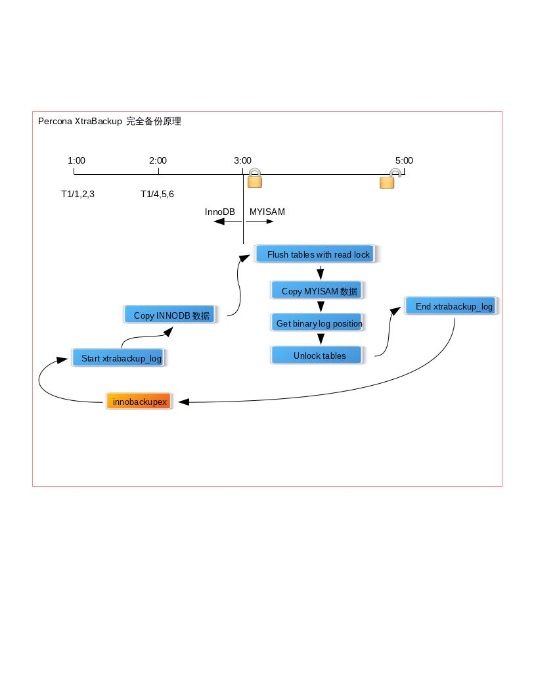
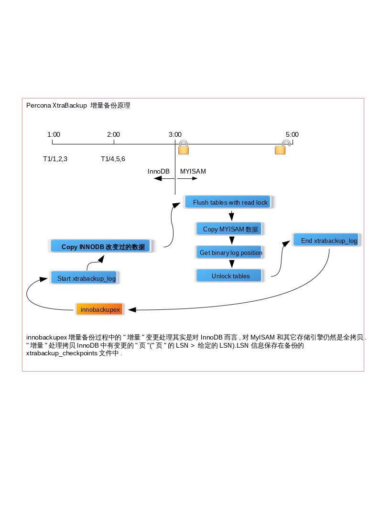
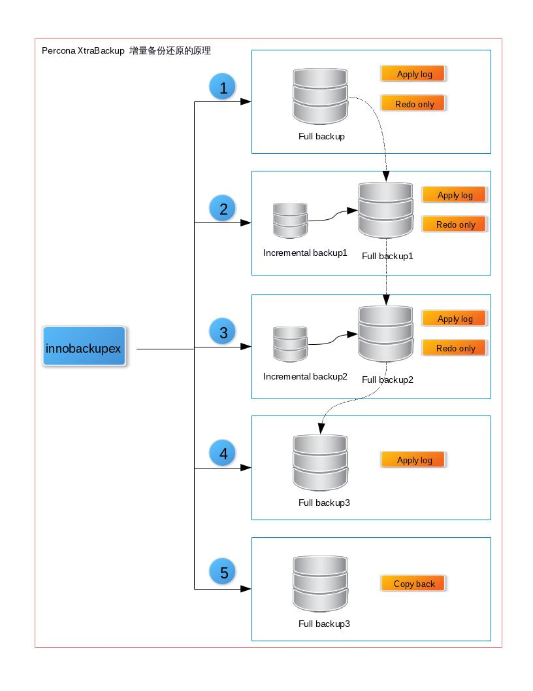
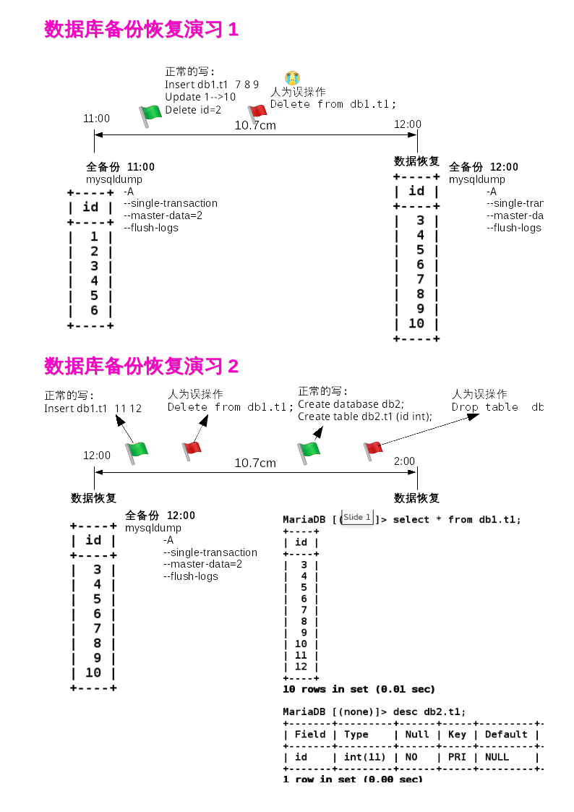
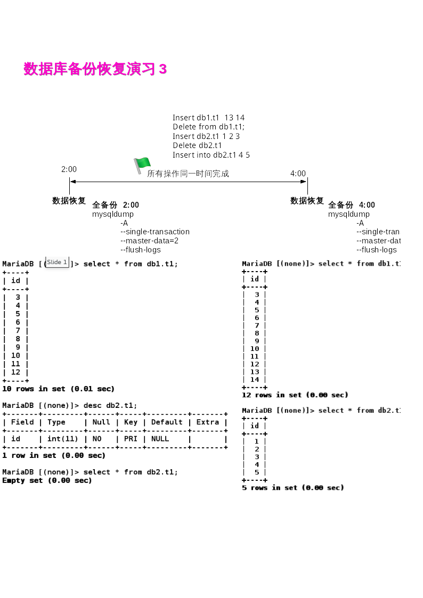

## 备份与恢复


- [备份与恢复](#备份与恢复)
	- [为什么要备份](#为什么要备份)
	- [什么是备份](#什么是备份)
	- [备份的两大要素](#备份的两大要素)
	- [备份的分类](#备份的分类)
	- [备份和恢复工具](#备份和恢复工具)
		- [* 数据库备份恢复模拟一 *](#-数据库备份恢复模拟一-)
		- [* 数据库备份恢复模拟二 *](#-数据库备份恢复模拟二-)
		- [* 数据库备份恢复模拟三 *](#-数据库备份恢复模拟三-)
	- [设计 MySQL 备份计划](#设计-mysql-备份计划)
	- [实战项目](#实战项目)

---
### 为什么要备份

服务器维护的工作永远都有一个不变的主题,那就是备份。正所谓,手里
有粮,心里不慌。从事数据库相关工作一样永远都不要忘记一个重点:备份。
因为,有了备份,我们就什么都不怕。出了任何问题(当然,我们善意的希望
永远不要出什么问题),只要我们手上有完整的备份,那就有机会恢复回来。

### 什么是备份

备份已经成为所有DBA的必修科目，到底什么是备份恢复呢？简单的讲：备份，就是把数据保存一份备用；恢复，就是把保存的数据还原回去。
当服务器出现故障需要修复，或者数据破坏需要恢复，又比如系统宕机、硬件损坏、用户错误删除数据等场景，都是需要借用备份才能执行恢复。

备份是备份，冗余是冗余。概念不一样，备份是将数据以隔离的方式保存，将备份的数据放在其他地方，原来的数据被上修改，备份的数据不会变更。也就是说备份出来的数据不会因为原数据的改变而改变，这样就比较安全。但是备份的缺点是，他不是瞬间还原，备份在还原过程中是有耗时的，他不是瞬间还原，例如，我们有几百个G的文件要还原回去，慢慢拷吧，几个小时。冗余不一样，他是热备，能够瞬间恢复。主服务器/从服务器，主服务器坏掉，从服务器就顶上工作，所以冗余在可用性上来讲，恢复的速度上来讲，比备份来的快，但是冗余有他的缺点，备份有他的优点，比如我们作主从同步，主服务器和从服务器数据都一样的，如果主服务器上有人错删了一个表，我们把这种操作称为误操作，那么从服务器也会发生误操作，所以呢，冗余不能解决人为的误操作，而备份可以解决。冗余他能解决硬件故障，但是误操作无法解决，备份不是瞬间还原，但是既可以解决硬件故障又能解决误操作，他们各有优劣点，而真实的线上生产环境是两种方法一起使用，既有冗余环境，又有周期性备份，管理员要周期性地进行备份，同时有多台服务器作冗余。

|  | 定义     | 优点     | 缺点    |
|:-| :------------- | :------------- |
| 备份       | 将数据以隔离的方式保存      |解决硬件故障，误操作|不是瞬间还原|
| 冗余      | 人为地增加重复部分，其目的是用来对原本的单一部分进行备份，以达到增强其安全性的目的,构建冗余（主服务器从服务器）的环境     |恢复速度快|解决硬件故障，误操作无法解决|


### 备份的两大要素

> MySQL对存储引擎的选择会导致备份明显更复杂。问题是，对于给定的存储引擎，如何得到一致的备份。

实际上有两类一致性需要考虑：数据一致性和文件一致性。

- 数据一致性：备份数据在指定时间点一致
- 文件一致性：确保文件在磁盘上一致
- 服务可用性：数据库是否可以读写，既能读也能写才是服务可用。

当我们在备份数据的时候，如果有人在修改表的内容，那么我们备份出来的数据可能就会有问题，备份出来的数据可能不是我们要的时间点。比如我需要将4点这个状态的数据备份，从4点开始备份一直到5点结束，在这个过程中，有人在4.30修改一个数据，假设是将A员工的工资从4000改为5000，那么我们最后备份出来的数据到底是几点的状态就未知了。如果4.30的时候已经备份过A员工了，那么我们备份出来的A员工的工资就还是4000；如果4.30的时候还没有备份到A员工，那么我们最后备份出来的A员工的工资就变成5000了。这就是数据不一致的情况，那么我们如何来保证数据一致呢？

### 备份的分类

1. 分类：冷备、热备、异地灾备
2. 冷备的分类：
	- 物理备份、逻辑备份
	- 完全备份、增量备份
  - 在线（热）备份、温备份、离线（冷）备份

#### 物理备份和逻辑备份

有两种主要的方法来备份MySQL数据：逻辑备份（也叫“导出”）和直接复制原始文件的物理备份。逻辑备份将数据包含在一种MySQL能够解析的格式中，要么是SQL，要么是以某个符号分隔的文本。原始文件是指存在与硬盘上的文件。

任何一种备份都有其有点和缺点。

##### 逻辑备份

逻辑备份有如下优点：

* 逻辑备份是可以用编辑器或者像`grep`和`sed`之类的命令查看和操作的普通文件。当需要恢复数据或只想查看数据但不恢复时，这都是非常有帮助的。
* 恢复非常简单。可以通过管道把它们输入到`mysql`，或者使用`mysqlimport`。
* 可以通过网络来备份和恢复——也就是说，可以与Mysql主机不同的另外一台机器上操作。
* 可以在类似Amazon RDS这样不能访问底层文件系统的的系统中使用。
* 非常灵活，因为`mysqldump`———大部分人喜欢的工具——可以接受许多选项，例如可以用where子句来限制需要备份那些行。
* 与存储引擎无关。因为是从MySQL服务器中提取数据而生成，所以消除了底层数据存储和不同。因此，可以从InnoDB表中备份，然后只需极小的工作量就可以还原到MyISAM表中。而对于原始数据却不能这么做。
* 有助于避免数据损坏。如果磁盘驱动器有故障而要恢复原始文件时，你将会得到一个错误并且/或生成一个部分或损坏的备份。如果MySQL在内存中的数据还没有损坏，当不能够得到一个正常的原始文件复制时，有时还可以得到一个可以信赖的逻辑备份。

尽管如此，逻辑备份也有它的缺点：

* 必须由数据库服务器完成生成逻辑备份的工作，因此要使用更多的cpu周期。
* 逻辑备份在某些场景下比数据库文件本身还要更大。ASCII形式的数据不总是和存储引擎存储数据一样高效。
* 无法保证导出后再还原出来的一定是同样的数据。浮点表示的问题、软件Bug等都会导致问题，尽管非常少见。
* 从逻辑备份中还原需要MySQL加载和解释语句，转化为存储格式，并重建索引，所有这一切会很慢。

最大的缺点是从MySQL中导出数据和通过SQL语句将其加载回去的开消。如果使用逻辑备份，测试恢复需要的时间将非常重要。

##### 物理备份

物理备份有如下好处：

* 基于文件的物理备份，只需要将需要的文件复制到其他地方即可完成备份。不需要额外的工作来生成原始文件。
* 物理备份的恢复就更简单了，这取决于存储引擎。对于MyISAM，只需要简单地复制文件到目的地即可。对于InnoDB则需要停止数据库服务，可能还要采取其他一些步骤。
* InnoDB和MyISAM的物理备份非常容易跨平台、操作系统和MySQL版本。（逻辑备份导出亦是如此。这里特别指出这一点是为了消除大家的担心。）
* 从物理备份中恢复会更开，无法完全缓冲到内容中，则物理备份的恢复要快非常多——至少要快一个数量级。事实上，逻辑备份最可怕的地方就是不确定的还原时间。

物理备份也有其缺点，比如：

* InnoDB的原始文件通常比相应的逻辑别分要大的多。InnoDB的表空间往往包含很多未使用的空间。还有很多空间用来存储数据以外的用途（插入缓冲、回滚段等）。
* 物理备份不总是跨平台、操作系统及MySQL版本。文件名大小写敏感和浮点格式可能会遇到麻烦。很可能因浮点格式不同而不能移动文件到另一个系统（虽然主流处理器都使用IEEE浮点格式。）

物理备份通常更加简单高效。尽管如此，对于需要长期保留的备份，或者是满足法律
合规要求的备份，尽量不要完全依赖物理备份。至少每隔一段时间还是需要做一次逻辑备份。

除非经过测试，不要假定备份（特别是物理备份）是正常的。对InnoDB来说，这意味着需要启动一个MySQL实例，执行InnoDB恢复操作，然后运行`CHECK TABLES`。也可以跳过这一操作，仅对文件运行innochecksum，但我们不建议这样做。对于MyISAM，可以运行`CHECK TABLES`，或者使用mysqlcheck。使用`mysqlcheck`可以对所有表执行`CHECK TABLES`操作。

建议混合使用物理和逻辑两种方法来做备份：先使用物理复制，以此数据启动MySQL服务器实例并运行`mysqlcheck`。然后，周期性地使用mysqldump执行逻辑备份。这样做可以获得两种方法的优点，不会使生产服务器在导出时有过渡负担。如果能够方便地利用文件系统的快照，也可以生成一个快照，将该快照复制到另外一个服务器上并释放，然后测试原始文件，再执行逻辑备份。

注意：值得一提的是物理备份会更容易出错；很难像`mysqldump`一样简单。

#### 增量备份和差异备份

当数据量很庞大时，一个常见的策略是做定期的增量或差异备份。他们之间的区别有点容易让人混淆，所以先来澄清这两个术语：

差异备份，是对自上次全备份后所有改变的部分而做的备份；
增量备份，是从任意类型的上次备份后所有修改做的备份；

例如，假设每周日做一个全备份。在周一，对自周日以来所有的改变做一个差异备份。在周二，就有两个选择：备份自周日以来所有的改变（差异），或只别分自周一后所有的改变（增量）。

增量和差异备份都是部分备份：它们一般不包含完整的数据集，因为某些数据几乎肯定没有改变。部分备份对减少服务器开销、备份时间及备份空间而言都很合适。尽管某些部分备份并不会真正减少服务器的开销。例如Percona XtraBackup和MySQL Enterprise Backup，仍然会扫描服务器上的所有数据块，因而并不会节约太多的开销，但它们确实会减少一定量的备份时间和大量用于压缩的CPU时间，当然也会减少磁盘空间使用。

不要因为会用高级备份技术而自负，解决方案越复杂，面临的风险也越大。要注意分析隐藏的危险，如果多次迭代备份紧密地耦合在一起，则只要其中的一次迭代备份有损坏，就可能导致所有的备份都无效。

下面有一些建议：

* 使用Percona XtraBackup和MySQL Enterprise Backup中的增量备份特性。
* 备份二进制日志。可以在每次备份后使用flush logs来开始一个新二进制日志，这样就只需要备份新的二进制日志。
* 不要备份没有变化的表。有些存储引擎，例如，MyISAM，会记录每个表最后修改时间。可以通过查看磁盘上的文件或运行show table status 来查看这个时间。如果使用InnoDB，可以利用触发器记录修改时间到一个小的“最后修改时间”表中，帮助跟踪最新的修改操作。需要确保只对变更不频繁的表进行跟踪，这样才能降低开销。通过定制的备份脚本可以轻松获取到哪些表有变更。
例如，如果有包含不同语种各个月的名称列表，或者州或区域的简写之类的“查找”表，将它们放在一个单独的数据库是一个好主意，这样就不需要每次都备份这些表。
* 不要备份没有改变的行。有时候这样做影响会很大——例如，如果有一个从其他数据构建的数据仓库，从技术讲完全是冗余的，就可以仅备份构建仓库的数据，而不是数据仓库本身。即使从源数据文件重建仓库的“恢复”时间较长，这也是个好想法。相对于从全备份中可能获得的快速恢复时间，避免备份可以节约更多的宗的时间开销。临时数据也可以不用备份，例如保留网站会话数据的表。
* 备份所有的数据，然后发送到一个有去重特性的目的地，例如ZFS文件管理程序。

增量备份的缺点包括增加恢复复杂性，额外的风险，以及更长的恢复时间。如果可以做全备，考虑到简便性，我们建议尽量做全备。

不管如何，还是需要经常做全备份——建议至少一周一次。你肯定不希望使用一个月的所有增量备份来进行恢复。即使一周也还是有很多的工作和风险的。

#### 在线（热）备份、温备份、离线（冷）备份

如果可能，关闭MySQL做备份是最简单最安全的，也是所有获取一致性副本的方法中最好的，而且损坏或不一致的风险最小。如果关闭了MySQL，就根本不用关心InnoDB缓冲池中的脏页或这其他缓存。也不需要担心数据在尝试备份的过程中被修改，并且因为服务器不对应用提供访问，所以可以更快地完成备份。

尽管如此，让服务器停机的代价可能比看起来要更昂贵。即使能最小化停机时间，在高负载和高数据量下关闭和重启MySQL也可能要花很长一段时间。因此，必须要设计不需要生产服务器停机的备份。即便如此，由于一致性的需要，对服务器进行在线备份仍然会有明显的服务中断。

- 离线（冷）备份:备份过程中，服务中断
- 温备份：备份过程中，只能读不能写
- 在线（热）备份：备份过程中，服务正常使用

在规划备份时，有一些与性能相关的因素需要考虑。

* 锁时间：需要持有锁多长时间，例如在备份期间持有的全局 `flush tables with read lock`?
* 备份时间：复制备份到目的地需要多久？
* 备份负载：在复制备份到目的地时对服务器性能的影响有多少？
* 恢复时间：把备份镜像从存储位置复制到MySQL服务器，重放二进制日志等，需要多久？

最大的权衡时备份时间与备份负载。可以牺牲其一以增加另外一个。例如，可以提高备份的优先级，代价是降低服务器性能。同样，也可以利用负载的特性来设计备份。

### 备份和恢复工具

1) 物理备份：cp tar lvm快照方式

2) 逻辑备份：mysqldump

#### tar

##### tar备份步骤

- 1）停止服务 systemctl stop mariadb
- 2）备份数据 tar -cf /tmp/mysql.all.tar /var/lib/mysql
- 3）启动服务 systemctl start mariadb

##### tar还原步骤

- 1）停止服务 systemctl stop mariadb
- 2）清环境   rm -rf /var/lib/mysql/*
- 3）导入数据 tar -xf /tmp/mysql.all.tar -C /
- 4）启动服务 systemctl start mariadb
- 5）测试	  > select * from db1.t1;


##### * 课堂实战1: 利用tar实现物理备份并还原 *

```shell
# 备份
[root@mastera0 ~]# systemctl stop mariadb
[root@mastera0 ~]# tar -cf /tmp/mysql.all.tar /var/lib/mysql/
tar: Removing leading \`/\' from member names
[root@mastera0 ~]# systemctl start mariadb
[root@mastera0 ~]# ll /tmp
total 29772
-rw-r--r--. 1 root root 30484480 Aug 30 11:28 mysql.all.tar


# 还原
[root@mastera0 ~]# systemctl stop mariadb
ot@mastera0 ~]# rm -rf /var/lib/mysql/*
[root@mastera0 ~]# ll /var/lib/mysql
total 0
[root@mastera0 ~]# tar -xf /tmp/mysql.all.tar -C /
[root@mastera0 ~]# ll /var/lib/mysql
total 28700
-rw-rw----. 1 mysql mysql    16384 Aug 30 11:27 aria_log.00000001
-rw-rw----. 1 mysql mysql       52 Aug 30 11:27 aria_log_control
drwx------. 2 mysql mysql       32 Aug 30 11:24 db1
-rw-rw----. 1 mysql mysql 18874368 Aug 30 11:27 ibdata1
-rw-rw----. 1 mysql mysql  5242880 Aug 30 11:27 ib_logfile0
-rw-rw----. 1 mysql mysql  5242880 Aug 30 11:23 ib_logfile1
drwx------. 2 mysql mysql     4096 Aug 30 11:23 mysql
drwx------. 2 mysql mysql     4096 Aug 30 11:23 performance_schema
drwx------. 2 mysql mysql        6 Aug 30 11:23 test
[root@mastera0 ~]# systemctl start mariadb
[root@mastera0 ~]# echo \"select * from db1.t1\"|mysql -uroot -puplooking
id
1
2
```

#### LVM SnapShot

##### * lvm快照的优点和缺点 *

事实上,MySQL 数据库的备份是一个让管理员一直很头疼的问题。各种工作
虽 然 不 少 ,但是 各 有优 劣 , 想找 到一个 比较 完 美 的方 法 却 非常 困 难 。
Mysqldump 作为数据的逻辑备份工具,弱点在于无法进行在线热备,同时在数
据库比较大的时候,备份和恢复的时间是在长得让人无法接受。Mysqlhotcopy
虽然克服了普通系统命令备份必须关闭 mysql 服务的尴尬,但是这东西只能用
于备份使用 MYISAM 存储引擎的数据表,并且只能在类 UNIX 环境中使用。如果
使用 mysql replication 的话,倒是可以解决热备问题。但是你需要承担增加
一台服务器的成本。同时,如果数据被无意或恶意的篡改、删除,那么 slave
服务器上的数据同样不能幸免。
相对于以上方法,在中、大规模的 MySQL 应用环境中,我推荐使用 LVM 快
照的方式来制作备份。为什么这种方式比较好呢?

原因如下:

1、 在大多数情况下,这种方式几乎算得上是热备。它无需关闭服务,
只需要设置只读或者类似这样的限制。
2、 支持所有基于本地磁盘的存储引擎,比如 MYISAM、InnoDB 和 BDB,
还支持 Solid、PrimeXT 和 Faction。
3、 备份速度最快,因为你只需要拷贝相关的二进制数据文件即可。
4、 由于只是简单的拷贝文件,因此对服务器开销非常低。
5、 保存方式多种多样,你可以备份到磁带上、FTP 服务器上、NFS 服务
器上或者其他什么网络服务器,以及使用各种网络备份软件来备份。
做到这些很简单,说到底就是拷贝文件而已。
6、 恢复速度很快。恢复所需要的时间等于你把数据拷贝回来的时间。
你可以想出更多的方法让这个时间变得更短。
7、
无需使用昂贵的商业软件。

当然,每个事物都有其两面性,它也存在一些缺点:
1、 很明显,你的系统需要支持快照。
2、 在一些公司里,系统管理员和 DBA 属于不同的团队。而使用快照需要
系统 root 权限。因此,你可能需要做一些团队协调工作或者干脆在
DBA Team 里安插一个系统管理员。这种事在某些公司很容易,但也
可能很麻烦。
3、 无法确切的预计服务停止时间。因为,这种方法到底什么时候算热备
什么时候不算,完全取决于 FLUSH TABLE WITH READ LOCK 命令执行
时间的长短。因此,我还是建议你在凌晨干这件事情。或者干脆定下
一个维护时间段(比如某些网络游戏运营商的做法)。
4、 如果你把日志放在独立的设备上或者你的数据分布在多个卷上,那么
就比较麻烦了。因为这样一来你就无法得到全部数据的一致性快照,
这就是所谓的多卷上的数据问题。不过,有些系统可能自动做到多卷
快照。


现在,我们来看看如果使用 LVM 的快照功能来制作 MySQL 备份。
当然,首先我们准备好相应的环境。配置一个 LVM,并且划分合适大小的
LV,并且将其挂载到 MySQL 的数据文件目录上。在这个例子中,你可以看到我
已经建立好了一个名叫 db1 的数据库,并且里面包含一个叫做 t1 的表,
并且已经写入了一些数据。

/var/lib/mysql/--->lv ---->snapshot

/dev/vdb---fdisk---/dev/vdb1 1G---->mkfs.ext4--->目录树

/dev/vdb---fdisk---/dev/vdb1 1G--pv--vg--lv--->mkfs.ext4--->目录树

##### * os支持lvm方式 lv1---/var/lib/mysql *

```
	1)fdisk
	2)pv
	3)vg
	4)lv
	5)mkfs ext4 (xfs)
	6)停止服务
	7)全备份tar
	8)挂接/var/lib/mysql/
	9)导入数据(注意权限，ugo，selinux)
	10)启动服务
```

##### * lvm快照备份数据 *

```
# 与数据库服务相关的操作
	1)添加全局的读锁（只能读不能写---》数据不会变）> flush tables with read lock;
	2)创建快照	lvcreate -s -L 1G -n snap1 /dev/vgmysql/lv1 --->/dev/vgmysql/snap1
	3)解锁		> unlock tables;

# 与数据库服务无关的操作
	4)挂接快照	mount /dev/vgmysql/snap1 /mnt (如果是xfs，mount -o nouuid /dev/vgmysql/snap1 /mnt )
	5)tar打包	cd /mnt;tar -cf /tmp/mysql.2.tar ./*
	6)umount	umount /mnt
	7)删除快照	lvremove /dev/vgmysql/snap1
```

##### * lvm快照还原数据 *

```
	1）停止服务 systemctl stop mariadb
	2）清环境   rm -rf /var/lib/mysql/*
	3）导入数据 tar -xf /tmp/mysql.2.tar -C /var/lib/mysql
	4）启动服务 systemctl start mariadb
	5）测试	  > select * from db1.t1;
```

##### * 课堂实战2: 利用LVM快照实现物理备份并还原 *

```shell
# lv1-->/var/lib/mysql
[root@mastera0 mysql]# fdisk -l

Disk /dev/vda: 10.7 GB, 10737418240 bytes, 20971520 sectors
Units = sectors of 1 * 512 = 512 bytes
Sector size (logical/physical): 512 bytes / 512 bytes
I/O size (minimum/optimal): 512 bytes / 512 bytes
Disk label type: dos
Disk identifier: 0x000deb17

   Device Boot      Start         End      Blocks   Id  System
/dev/vda1   *        2048      411647      204800   83  Linux
/dev/vda2          411648    20971519    10279936   8e  Linux LVM

Disk /dev/vdb: 21.5 GB, 21474836480 bytes, 41943040 sectors
Units = sectors of 1 * 512 = 512 bytes
Sector size (logical/physical): 512 bytes / 512 bytes
I/O size (minimum/optimal): 512 bytes / 512 bytes


Disk /dev/mapper/rhel-root: 9458 MB, 9458155520 bytes, 18472960 sectors
Units = sectors of 1 * 512 = 512 bytes
Sector size (logical/physical): 512 bytes / 512 bytes
I/O size (minimum/optimal): 512 bytes / 512 bytes


Disk /dev/mapper/rhel-swap: 536 MB, 536870912 bytes, 1048576 sectors
Units = sectors of 1 * 512 = 512 bytes
Sector size (logical/physical): 512 bytes / 512 bytes
I/O size (minimum/optimal): 512 bytes / 512 bytes


Disk /dev/mapper/rhel-home: 524 MB, 524288000 bytes, 1024000 sectors
Units = sectors of 1 * 512 = 512 bytes
Sector size (logical/physical): 512 bytes / 512 bytes
I/O size (minimum/optimal): 512 bytes / 512 bytes

[root@mastera0 mysql]#
[root@mastera0 mysql]# fdisk /dev/vdb
Welcome to fdisk (util-linux 2.23.2).

Changes will remain in memory only, until you decide to write them.
Be careful before using the write command.

Device does not contain a recognized partition table
Building a new DOS disklabel with disk identifier 0xb9ec589f.

Command (m for help): n
Partition type:
   p   primary (0 primary, 0 extended, 4 free)
   e   extended
Select (default p): p
Partition number (1-4, default 1): 1
First sector (2048-41943039, default 2048):
Using default value 2048
Last sector, +sectors or +size{K,M,G} (2048-41943039, default 41943039): +1G
Partition 1 of type Linux and of size 1 GiB is set

Command (m for help): n
Partition type:
   p   primary (1 primary, 0 extended, 3 free)
   e   extended
Select (default p): p
Partition number (2-4, default 2): 2
First sector (2099200-41943039, default 2099200):
Using default value 2099200
Last sector, +sectors or +size{K,M,G} (2099200-41943039, default 41943039): +1G
Partition 2 of type Linux and of size 1 GiB is set

Command (m for help): p

Disk /dev/vdb: 21.5 GB, 21474836480 bytes, 41943040 sectors
Units = sectors of 1 * 512 = 512 bytes
Sector size (logical/physical): 512 bytes / 512 bytes
I/O size (minimum/optimal): 512 bytes / 512 bytes
Disk label type: dos
Disk identifier: 0xb9ec589f

   Device Boot      Start         End      Blocks   Id  System
/dev/vdb1            2048     2099199     1048576   83  Linux
/dev/vdb2         2099200     4196351     1048576   83  Linux

Command (m for help): w
The partition table has been altered!

Calling ioctl() to re-read partition table.
Syncing disks.
[root@mastera0 mysql]# ls /dev/vdb*
/dev/vdb  /dev/vdb1  /dev/vdb2
[root@mastera0 mysql]# pvcreate /dev/vdb{1,2}
  Physical volume \"/dev/vdb1\" successfully created
  Physical volume \"/dev/vdb2\" successfully created
[root@mastera0 mysql]# vgcreate vgmysql /dev/vdb{1,2}
  Volume group \"vgmysql\" successfully created
[root@mastera0 mysql]# lvcreate -L 1G -n lv1 vgmysql
  Logical volume \"lv1\" created.
[root@mastera0 mysql]# lvs
  LV   VG      Attr       LSize   Pool Origin Data%  Meta%  Move Log Cpy%Sync Convert
  home rhel    -wi-ao---- 500.00m                                                    
  root rhel    -wi-ao----   8.81g                                                    
  swap rhel    -wi-ao---- 512.00m                                                    
  lv1  vgmysql -wi-a-----   1.00g                                                    
[root@mastera0 mysql]# mkfs.ext4 /dev/vgmysql/lv1
mke2fs 1.42.9 (28-Dec-2013)
Filesystem label=
OS type: Linux
Block size=4096 (log=2)
Fragment size=4096 (log=2)
Stride=0 blocks, Stripe width=0 blocks
65536 inodes, 262144 blocks
13107 blocks (5.00%) reserved for the super user
First data block=0
Maximum filesystem blocks=268435456
8 block groups
32768 blocks per group, 32768 fragments per group
8192 inodes per group
Superblock backups stored on blocks:
	32768, 98304, 163840, 229376

Allocating group tables: done                            
Writing inode tables: done                            
Creating journal (8192 blocks): done
Writing superblocks and filesystem accounting information: done

[root@mastera0 mysql]#
[root@mastera0 mysql]# systemctl stop mariadb
[root@mastera0 mysql]# tar -cf /tmp/mysql.1.tar /var/lib/mysql/
tar: Removing leading \`/\' from member names
[root@mastera0 mysql]# mount /dev/vgmysql/lv1 /var/lib/mysql^C
[root@mastera0 mysql]# ll -dZ /var/lib/mysql
drwxr-xr-x. mysql mysql system_u:object_r:mysqld_db_t:s0 /var/lib/mysql
[root@mastera0 mysql]# mount /dev/vgmysql/lv1 /var/lib/mysql
[root@mastera0 mysql]# ll -dZ /var/lib/mysql
drwxr-xr-x. root root system_u:object_r:unlabeled_t:s0 /var/lib/mysql
[root@mastera0 mysql]# ll  /var/lib/mysql
total 16
drwx------. 2 root root 16384 Aug 30 13:57 lost+found
[root@mastera0 ~]# ll -d /var/lib/mysql
drwxr-xr-x. 3 root root 4096 Aug 30 13:57 /var/lib/mysql
[root@mastera0 ~]# tar -xf /tmp/mysql.1.tar -C /
[root@mastera0 ~]# ll -d /var/lib/mysql
drwxr-xr-x. 7 mysql mysql 4096 Aug 30 14:01 /var/lib/mysql
[root@mastera0 ~]# ll  /var/lib/mysql
total 28724
-rw-rw----. 1 mysql mysql    16384 Aug 30 14:01 aria_log.00000001
-rw-rw----. 1 mysql mysql       52 Aug 30 14:01 aria_log_control
drwx------. 2 mysql mysql     4096 Aug 30 11:24 db1
-rw-rw----. 1 mysql mysql 18874368 Aug 30 14:01 ibdata1
-rw-rw----. 1 mysql mysql  5242880 Aug 30 14:01 ib_logfile0
-rw-rw----. 1 mysql mysql  5242880 Aug 30 11:23 ib_logfile1
drwx------. 2 root  root     16384 Aug 30 13:57 lost+found
drwx------. 2 mysql mysql     4096 Aug 30 11:23 mysql
drwx------. 2 mysql mysql     4096 Aug 30 11:23 performance_schema
drwx------. 2 mysql mysql     4096 Aug 30 11:23 test
[root@mastera0 ~]# systemctl start mariadb
Job for mariadb.service failed because the control process exited with error code. See "systemctl status mariadb.service" and "journalctl -xe" for details.
[root@mastera0 ~]# setenforce 0
[root@mastera0 ~]# systemctl start mariadb
[root@mastera0 ~]# ll  /var/lib/mysql -Z
-rw-rw----. mysql mysql unconfined_u:object_r:unlabeled_t:s0 aria_log.00000001
-rw-rw----. mysql mysql unconfined_u:object_r:unlabeled_t:s0 aria_log_control
drwx------. mysql mysql unconfined_u:object_r:unlabeled_t:s0 db1
-rw-rw----. mysql mysql unconfined_u:object_r:unlabeled_t:s0 ibdata1
-rw-rw----. mysql mysql unconfined_u:object_r:unlabeled_t:s0 ib_logfile0
-rw-rw----. mysql mysql unconfined_u:object_r:unlabeled_t:s0 ib_logfile1
drwx------. root  root  system_u:object_r:unlabeled_t:s0 lost+found
drwx------. mysql mysql unconfined_u:object_r:unlabeled_t:s0 mysql
srwxrwxrwx. mysql mysql system_u:object_r:unlabeled_t:s0 mysql.sock
drwx------. mysql mysql unconfined_u:object_r:unlabeled_t:s0 performance_schema
drwx------. mysql mysql unconfined_u:object_r:unlabeled_t:s0 test

# lvm快照备份
MariaDB [(none)]> flush tables with read lock;
Query OK, 0 rows affected (0.00 sec)
## 数据库加上全局读锁后，立刻在新终端中创建快照
[root@mastera0 ~]# lvcreate -s -L 500M -n snap1 /dev/vgmysql/lv1
  Logical volume "snap1" created.
## 快照创建之后，解锁，服务可以正常适用了
MariaDB [(none)]> unlock tables;
Query OK, 0 rows affected (0.00 sec)

## 挂接快照使用
[root@mastera0 ~]# mount /dev/vgmysql/snap1 /mnt
[root@mastera0 ~]# ls /mnt
aria_log.00000001  db1      ib_logfile0  lost+found  mysql.sock          test
aria_log_control   ibdata1  ib_logfile1  mysql       performance_schema
[root@mastera0 ~]# cd /mnt
[root@mastera0 mnt]# tar -cf /tmp/mysql.2.tar ./*
tar: ./mysql.sock: socket ignored
[root@mastera0 mnt]# ll /tmp
total 89316
drwxr-xr-x. 2 root root        6 Aug 30 11:31 a
-rw-r--r--. 1 root root 30484480 Aug 30 14:01 mysql.1.tar
-rw-r--r--. 1 root root 30484480 Aug 30 14:58 mysql.2.tar
-rw-r--r--. 1 root root 30484480 Aug 30 11:28 mysql.all.tar
[root@mastera0 mnt]# cd
[root@mastera0 ~]# umount /mnt
[root@mastera0 ~]# lv
lvchange     lvdisplay    lvmchange    lvmdiskscan  lvmpolld     lvreduce     lvresize
lvconvert    lvextend     lvmconf      lvmdump      lvmsadc      lvremove     lvs
lvcreate     lvm          lvmconfig    lvmetad      lvmsar       lvrename     lvscan
[root@mastera0 ~]# lvremove /dev/vgmysql/snap1
Do you really want to remove active logical volume snap1? [y/n]: y
  Logical volume "snap1" successfully removed

# 还原数据
[root@mastera0 ~]# systemctl stop mariadb
[root@mastera0 ~]# rm -rf /var/lib/mysql/*
[root@mastera0 ~]# tar -xf /tmp/mysql.2.tar -C /var/lib/mysql
[root@mastera0 ~]# ll /var/lib/mysql
total 28712
-rw-rw----. 1 mysql mysql    16384 Aug 30 14:01 aria_log.00000001
-rw-rw----. 1 mysql mysql       52 Aug 30 14:01 aria_log_control
drwx------. 2 mysql mysql     4096 Aug 30 11:24 db1
-rw-rw----. 1 mysql mysql 18874368 Aug 30 14:42 ibdata1
-rw-rw----. 1 mysql mysql  5242880 Aug 30 14:42 ib_logfile0
-rw-rw----. 1 mysql mysql  5242880 Aug 30 11:23 ib_logfile1
drwx------. 2 root  root      4096 Aug 30 13:57 lost+found
drwx------. 2 mysql mysql     4096 Aug 30 11:23 mysql
drwx------. 2 mysql mysql     4096 Aug 30 11:23 performance_schema
drwx------. 2 mysql mysql     4096 Aug 30 11:23 test
[root@mastera0 ~]# systemctl start mariadb
[root@mastera0 ~]# echo "select * from db1.t1" | mysql -uroot -puplooking
id
1
2
```


#### mysqldump

逻辑备份和物理备份各有优缺点,逻辑备份保存的是 SQL 文本,可以在各种条件下恢
复,但是对于大数据量的系统,备份和恢复的时间都比较长;物理备份恰恰相反,由于是文
件的物理 cp,备份和恢复时间都比较短,但是备份的文件在不同的平台上不一定兼容。
其中,mysqldump 是最常用的逻辑备份工具,适合各种存储引擎,希望大家重点掌握。

##### * MyISAM和INNODB表的备份 *

|存储引擎|数据一致|服务可用|实现方式|
|:--|:--|:--|:--|
|MYISAM	|ok	|no	|锁表|
|INNODB|ok|	ok	|MVCC|

##### * mysqldump命令的用法 *

```
	mysqldump 备份数据---逻辑备份sql语句
		-u 用户名
		-p 密码
		-A 所有的库
		--single-transaction INNODB存储引擎的表备份时能够做到数据一致，服务可用
	mysqldump -uroot -puplooking -A --single-transaction > /tmp/mysql.201608301600.sql
		--lock-all-tables    MYISAM存储引擎的表备份时能够做到数据一致，服务不可用
	mysqldump -uroot -puplooking -A --lock-all-tables > /tmp/mysql.xxx.sql
```

##### * mysqldump备份步骤 *

	INNODB	mysqldump -uroot -puplooking -A --single-transaction > /tmp/mysql.201608301600.sql
	MYISAM	mysqldump -uroot -puplooking -A --lock-all-tables > /tmp/mysql.xxx.sql

##### * mysqldump还原步骤 *

```
	1）停止服务
	2）清空环境
	3）启动服务
	4）导入数据
	5）刷新授权
	6）测试

```

##### * 课堂实战3: 利用mysqldump实现逻辑备份并还原 *

```shell
[root@mastera0 ~]# mysqldump -uroot -puplooking -A --single-transaction > /tmp/mysql.all.1.sql
[root@mastera0 ~]# ll /tmp
total 89820
drwxr-xr-x. 2 root root        6 Aug 30 11:31 a
-rw-r--r--. 1 root root 30484480 Aug 30 14:01 mysql.1.tar
-rw-r--r--. 1 root root 30484480 Aug 30 14:58 mysql.2.tar
-rw-r--r--. 1 root root   515980 Aug 30 16:02 mysql.all.1.sql
-rw-r--r--. 1 root root 30484480 Aug 30 11:28 mysql.all.tar
[root@mastera0 ~]# systemctl stop mariadb
[root@mastera0 ~]# rm -rf /var/lib/mysql/*
[root@mastera0 ~]# ll /var/lib/mysql
total 0
[root@mastera0 ~]# systemctl start mariadb
[root@mastera0 ~]# ll /var/lib/mysql
total 28704
-rw-rw----. 1 mysql mysql    16384 Aug 30 16:10 aria_log.00000001
-rw-rw----. 1 mysql mysql       52 Aug 30 16:10 aria_log_control
-rw-rw----. 1 mysql mysql 18874368 Aug 30 16:10 ibdata1
-rw-rw----. 1 mysql mysql  5242880 Aug 30 16:10 ib_logfile0
-rw-rw----. 1 mysql mysql  5242880 Aug 30 16:10 ib_logfile1
drwx------. 2 mysql mysql     4096 Aug 30 16:10 mysql
srwxrwxrwx. 1 mysql mysql        0 Aug 30 16:10 mysql.sock
drwx------. 2 mysql mysql     4096 Aug 30 16:10 performance_schema
drwx------. 2 mysql mysql     4096 Aug 30 16:10 test
[root@mastera0 ~]# mysql
Welcome to the MariaDB monitor.  Commands end with ; or \g.
Your MariaDB connection id is 2
Server version: 5.5.44-MariaDB MariaDB Server

Copyright (c) 2000, 2015, Oracle, MariaDB Corporation Ab and others.

Type 'help;' or '\h' for help. Type '\c' to clear the current input statement.

MariaDB [(none)]> \q
Bye
[root@mastera0 ~]#


[root@mastera0 ~]# mysql < /tmp/mysql.all.1.sql
[root@mastera0 ~]# mysql
Welcome to the MariaDB monitor.  Commands end with ; or \g.
Your MariaDB connection id is 4
Server version: 5.5.44-MariaDB MariaDB Server

Copyright (c) 2000, 2015, Oracle, MariaDB Corporation Ab and others.

Type 'help;' or '\h' for help. Type '\c' to clear the current input statement.

MariaDB [(none)]> flush privileges;
Query OK, 0 rows affected (0.00 sec)

MariaDB [(none)]> \q
Bye
[root@mastera0 ~]# mysql
ERROR 1045 (28000): Access denied for user \'root\'@\'localhost\' (using password: NO)
[root@mastera0 ~]# mysql -uroot -puplooking
Welcome to the MariaDB monitor.  Commands end with ; or \g.
Your MariaDB connection id is 6
Server version: 5.5.44-MariaDB MariaDB Server

Copyright (c) 2000, 2015, Oracle, MariaDB Corporation Ab and others.

Type \'help;\' or \'\h\' for help. Type \'\c\' to clear the current input statement.

MariaDB [(none)]> select * from db1.t1;
+----+
| id |
+----+
|  1 |
|  2 |
|  3 |
+----+
3 rows in set (0.00 sec)

MariaDB [(none)]> show databases;
+---------------------+
| Database            |
+---------------------+
| information_schema  |
| db1                 |
| db2                 |
| #mysql50#lost+found |
| mysql               |
| performance_schema  |
| test                |
+---------------------+
7 rows in set (0.00 sec)

MariaDB [(none)]> exit
```
---

#### Percona Xtrabackup






> 如何获取软件？

	[Percona官网](www.percona.com)

> 教室环境已经下载好软件，存放路径为：

	http://classroom.example.com/content/MYSQL/04-others/soft/Percona-XtraBackup-2.3.4-re80c779-el7-x86_64-bundle.tar

> 缺少libev.so.4()(64bit)

	http://classroom.example.com/content/MYSQL/04-others/soft/libev-4.15-6.el7.x86_64.rpm

> install libev-4.15-6.el7.x86_64.rpm

	# install percona-xtrabackup-2.3.4-1.el7.x86_64.rpm
	# install percona-xtrabackup-2.3.4-1.el7.x86_64.rpm

> 查看软件架构

* 软件名		percona-xtrabackup
* 命令		innobackupex
* 选项
	--user=name		用户名

	----password=name	密码

	--apply-log		重演回滚

	--copy-back		还原数据

	--redo-only		只重演不回滚，与apply-log同时使用


> 示例1-全备份并还原

* 全备份		

	innobackupex --user=root --password=uplooking /tmp/backup

* 还原全备份

	innobackupex --apply-log /tmp/backup/2016-----


	innobackupex --copy-back /tmp/backup/2016-----

~~~
	1）停止服务
	2）请环境
	3）导入数据
		1> apply-log
		2> copy-back
	4）修改权限
	5）启动服务
	6）测试
~~~

> 示例2-全备增备并还原

~~~
	全备份		innobackupex --user=root --password=uplooking /tmp/backup
	增量备份1	innobackupex --user=root --password=uplooking --incremental-basedir=/tmp/backup/2016-09-01_11-32-43 --incremental /tmp/backup
	增量备份2	innobackupex --user=root --password=uplooking --incremental-basedir= --incremental
	增量备份3	innobackupex --user=root --password=uplooking --incremental-basedir= --incremental

	全备份还原	innobackupex --apply-log  --redo-only /tmp/backup/全备份
			innobackupex --apply-log  --redo-only /tmp/backup/全备份 --incremental-dir=增量1
			innobackupex --apply-log  --redo-only /tmp/backup/全备份 --incremental-dir=增量2
			innobackupex --apply-log  --redo-only /tmp/backup/全备份 --incremental-dir=增量3
			innobackupex --apply-log  /tmp/backup/全备份
			innobackupex --copy-back  /tmp/backup/全备份
~~~


##### * 课堂实战4：innobackupex实时增量备份和还原 *

```shell
## install
[root@mastera0 ~]# setenforce 0
[root@mastera0 ~]# systemctl stop firewalld
[root@mastera0 ~]# wget http://classroom.example.com/content/MYSQL/04-others/soft/Percona-XtraBackup-2.3.4-re80c779-el7-x86_64-bundle.tar
--2016-09-01 10:41:05--  http://classroom.example.com/content/MYSQL/04-others/soft/Percona-XtraBackup-2.3.4-re80c779-el7-x86_64-bundle.tar
Reusing existing connection to classroom.example.com:80.
HTTP request sent, awaiting response... 200 OK
Length: 25548800 (24M) [application/x-tar]
Saving to: ‘Percona-XtraBackup-2.3.4-re80c779-el7-x86_64-bundle.tar’

100%[===========================================>] 25,548,800   122MB/s   in 0.2s   

2016-09-01 10:41:05 (122 MB/s) - ‘Percona-XtraBackup-2.3.4-re80c779-el7-x86_64-bundle.tar’ saved [25548800/25548800]

FINISHED --2016-09-01 10:41:05--
Total wall clock time: 0.3s
Downloaded: 1 files, 24M in 0.2s (122 MB/s)
[root@mastera0 ~]# ls
anaconda-ks.cfg  Percona-XtraBackup-2.3.4-re80c779-el7-x86_64-bundle.tar
[root@mastera0 ~]# tar -xf Percona-XtraBackup-2.3.4-re80c779-el7-x86_64-bundle.tar
[root@mastera0 ~]# ls
anaconda-ks.cfg
percona-xtrabackup-2.3.4-1.el7.x86_64.rpm
Percona-XtraBackup-2.3.4-re80c779-el7-x86_64-bundle.tar
percona-xtrabackup-debuginfo-2.3.4-1.el7.x86_64.rpm
percona-xtrabackup-test-2.3.4-1.el7.x86_64.rpm
[root@mastera0 ~]# yum localinstall -y percona-xtrabackup
Loaded plugins: product-id, search-disabled-repos, subscription-manager
This system is not registered to Red Hat Subscription Management. You can use subscription-manager to register.
Skipping: percona-xtrabackup, filename does not end in .rpm.
Nothing to do
[root@mastera0 ~]# yum localinstall -y percona-xtrabackup-2.3.4-1.el7.x86_64.rpm
Loaded plugins: product-id, search-disabled-repos, subscription-manager
This system is not registered to Red Hat Subscription Management. You can use subscription-manager to register.
Examining percona-xtrabackup-2.3.4-1.el7.x86_64.rpm: percona-xtrabackup-2.3.4-1.el7.x86_64
Marking percona-xtrabackup-2.3.4-1.el7.x86_64.rpm to be installed
Resolving Dependencies
--> Running transaction check
---> Package percona-xtrabackup.x86_64 0:2.3.4-1.el7 will be installed
--> Processing Dependency: rsync for package: percona-xtrabackup-2.3.4-1.el7.x86_64
rhel_dvd                                                      | 4.1 kB  00:00:00     
--> Processing Dependency: libev.so.4()(64bit) for package: percona-xtrabackup-2.3.4-1.el7.x86_64
--> Running transaction check
---> Package percona-xtrabackup.x86_64 0:2.3.4-1.el7 will be installed
--> Processing Dependency: libev.so.4()(64bit) for package: percona-xtrabackup-2.3.4-1.el7.x86_64
---> Package rsync.x86_64 0:3.0.9-17.el7 will be installed
--> Finished Dependency Resolution
Error: Package: percona-xtrabackup-2.3.4-1.el7.x86_64 (/percona-xtrabackup-2.3.4-1.el7.x86_64)
           Requires: libev.so.4()(64bit)
 You could try using --skip-broken to work around the problem
 You could try running: rpm -Va --nofiles --nodigest
[root@mastera0 ~]# wget http://classroom.example.com/content/MYSQL/04-others/soft/libev-4.15-6.el7.x86_64.rpm
--2016-09-01 10:43:37--  http://classroom.example.com/content/MYSQL/04-others/soft/libev-4.15-6.el7.x86_64.rpm
Resolving classroom.example.com (classroom.example.com)... 172.25.254.254
Connecting to classroom.example.com (classroom.example.com)|172.25.254.254|:80... connected.
HTTP request sent, awaiting response... 200 OK
Length: 44964 (44K) [application/x-rpm]
Saving to: ‘libev-4.15-6.el7.x86_64.rpm’

100%[===========================================>] 44,964      --.-K/s   in 0s      

2016-09-01 10:43:37 (360 MB/s) - ‘libev-4.15-6.el7.x86_64.rpm’ saved [44964/44964]

[root@mastera0 ~]# ls
anaconda-ks.cfg
libev-4.15-6.el7.x86_64.rpm
percona-xtrabackup-2.3.4-1.el7.x86_64.rpm
Percona-XtraBackup-2.3.4-re80c779-el7-x86_64-bundle.tar
percona-xtrabackup-debuginfo-2.3.4-1.el7.x86_64.rpm
percona-xtrabackup-test-2.3.4-1.el7.x86_64.rpm
[root@mastera0 ~]# yum localinstall -y libev-4.15-6.el7.x86_64.rpm
Loaded plugins: product-id, search-disabled-repos, subscription-manager
This system is not registered to Red Hat Subscription Management. You can use subscription-manager to register.
Examining libev-4.15-6.el7.x86_64.rpm: libev-4.15-6.el7.x86_64
Marking libev-4.15-6.el7.x86_64.rpm to be installed
Resolving Dependencies
--> Running transaction check
---> Package libev.x86_64 0:4.15-6.el7 will be installed
--> Finished Dependency Resolution

Dependencies Resolved

=====================================================================================
 Package      Arch          Version            Repository                       Size
=====================================================================================
Installing:
 libev        x86_64        4.15-6.el7         /libev-4.15-6.el7.x86_64         86 k

Transaction Summary
=====================================================================================
Install  1 Package

Total size: 86 k
Installed size: 86 k
Downloading packages:
Running transaction check
Running transaction test
Transaction test succeeded
Running transaction
  Installing : libev-4.15-6.el7.x86_64                                           1/1
  Verifying  : libev-4.15-6.el7.x86_64                                           1/1

Installed:
  libev.x86_64 0:4.15-6.el7                                                          

Complete!
[root@mastera0 ~]# yum localinstall -y percona-xtrabackup-2.3.4-1.el7.x86_64.rpm Loaded plugins: product-id, search-disabled-repos, subscription-manager
This system is not registered to Red Hat Subscription Management. You can use subscription-manager to register.
Examining percona-xtrabackup-2.3.4-1.el7.x86_64.rpm: percona-xtrabackup-2.3.4-1.el7.x86_64
Marking percona-xtrabackup-2.3.4-1.el7.x86_64.rpm to be installed
Resolving Dependencies
--> Running transaction check
---> Package percona-xtrabackup.x86_64 0:2.3.4-1.el7 will be installed
--> Processing Dependency: rsync for package: percona-xtrabackup-2.3.4-1.el7.x86_64
--> Running transaction check
---> Package rsync.x86_64 0:3.0.9-17.el7 will be installed
--> Finished Dependency Resolution

Dependencies Resolved

=====================================================================================
 Package            Arch   Version      Repository                              Size
=====================================================================================
Installing:
 percona-xtrabackup x86_64 2.3.4-1.el7  /percona-xtrabackup-2.3.4-1.el7.x86_64  21 M
Installing for dependencies:
 rsync              x86_64 3.0.9-17.el7 rhel_dvd                               359 k

Transaction Summary
=====================================================================================
Install  1 Package (+1 Dependent package)

Total size: 22 M
Total download size: 359 k
Installed size: 22 M
Downloading packages:
rsync-3.0.9-17.el7.x86_64.rpm                                 | 359 kB  00:00:00     
Running transaction check
Running transaction test
Transaction test succeeded
Running transaction
  Installing : rsync-3.0.9-17.el7.x86_64                                         1/2
  Installing : percona-xtrabackup-2.3.4-1.el7.x86_64                             2/2
  Verifying  : rsync-3.0.9-17.el7.x86_64                                         1/2
  Verifying  : percona-xtrabackup-2.3.4-1.el7.x86_64                             2/2

Installed:
  percona-xtrabackup.x86_64 0:2.3.4-1.el7                                            

Dependency Installed:
  rsync.x86_64 0:3.0.9-17.el7                                                        

Complete!
[root@mastera0 ~]# ls
anaconda-ks.cfg
libev-4.15-6.el7.x86_64.rpm
percona-xtrabackup-2.3.4-1.el7.x86_64.rpm
Percona-XtraBackup-2.3.4-re80c779-el7-x86_64-bundle.tar
percona-xtrabackup-debuginfo-2.3.4-1.el7.x86_64.rpm
percona-xtrabackup-test-2.3.4-1.el7.x86_64.rpm
[root@mastera0 ~]# rpm -ql percona-xtrabackup
/usr/bin/innobackupex
/usr/bin/xbcloud
/usr/bin/xbcloud_osenv
/usr/bin/xbcrypt
/usr/bin/xbstream
/usr/bin/xtrabackup
/usr/share/doc/percona-xtrabackup-2.3.4
/usr/share/doc/percona-xtrabackup-2.3.4/COPYING
/usr/share/man/man1/innobackupex.1.gz
/usr/share/man/man1/xbcrypt.1.gz
/usr/share/man/man1/xbstream.1.gz
/usr/share/man/man1/xtrabackup.1.gz

## backup
[root@mastera0 mysql-log]# innobackupex --user=root --password=uplooking /tmp/backup
160901 11:32:43 innobackupex: Starting the backup operation

IMPORTANT: Please check that the backup run completes successfully.
           At the end of a successful backup run innobackupex
           prints \"completed OK!\".

Can\'t locate Digest/MD5.pm in @INC (@INC contains: /usr/local/lib64/perl5 /usr/local/share/perl5 /usr/lib64/perl5/vendor_perl /usr/share/perl5/vendor_perl /usr/lib64/perl5 /usr/share/perl5 .) at - line 693.
BEGIN failed--compilation aborted at - line 693.
160901 11:32:43 Connecting to MySQL server host: localhost, user: root, password: set, port: 0, socket: /var/lib/mysql/mysql.sock
Using server version 5.5.44-MariaDB-log
innobackupex version 2.3.4 based on MySQL server 5.6.24 Linux (x86_64) (revision id: e80c779)
xtrabackup: uses posix_fadvise().
xtrabackup: cd to /var/lib/mysql
xtrabackup: open files limit requested 0, set to 1024
xtrabackup: using the following InnoDB configuration:
xtrabackup:   innodb_data_home_dir = ./
xtrabackup:   innodb_data_file_path = ibdata1:10M:autoextend
xtrabackup:   innodb_log_group_home_dir = ./
xtrabackup:   innodb_log_files_in_group = 2
xtrabackup:   innodb_log_file_size = 5242880
160901 11:32:43 >> log scanned up to (1607773)
xtrabackup: Generating a list of tablespaces
160901 11:32:43 [01] Copying ./ibdata1 to /tmp/backup/2016-09-01_11-32-43/ibdata1
160901 11:32:43 [01]        ...done
160901 11:32:44 >> log scanned up to (1607773)
160901 11:32:44 Executing FLUSH NO_WRITE_TO_BINLOG TABLES...
160901 11:32:44 Executing FLUSH TABLES WITH READ LOCK...
160901 11:32:44 Starting to backup non-InnoDB tables and files
160901 11:32:44 [01] Copying ./mysql/tables_priv.frm to /tmp/backup/2016-09-01_11-32-43/mysql/tables_priv.frm
160901 11:32:44 [01]        ...done
160901 11:32:44 [01] Copying ./mysql/tables_priv.MYI to /tmp/backup/2016-09-01_11-32-43/mysql/tables_priv.MYI
160901 11:32:44 [01]        ...done
160901 11:32:44 [01] Copying ./mysql/time_zone.MYD to /tmp/backup/2016-09-01_11-32-43/mysql/time_zone.MYD
160901 11:32:44 [01]        ...done
160901 11:32:44 [01] Copying ./mysql/ndb_binlog_index.MYD to /tmp/backup/2016-09-01_11-32-43/mysql/ndb_binlog_index.MYD
160901 11:32:44 [01]        ...done
160901 11:32:44 [01] Copying ./mysql/plugin.MYD to /tmp/backup/2016-09-01_11-32-43/mysql/plugin.MYD
160901 11:32:44 [01]        ...done
160901 11:32:44 [01] Copying ./mysql/proc.MYI to /tmp/backup/2016-09-01_11-32-43/mysql/proc.MYI
160901 11:32:44 [01]        ...done
160901 11:32:44 [01] Copying ./mysql/procs_priv.frm to /tmp/backup/2016-09-01_11-32-43/mysql/procs_priv.frm
160901 11:32:44 [01]        ...done
160901 11:32:44 [01] Copying ./mysql/procs_priv.MYD to /tmp/backup/2016-09-01_11-32-43/mysql/procs_priv.MYD
160901 11:32:44 [01]        ...done
160901 11:32:45 [01] Copying ./mysql/proxies_priv.MYI to /tmp/backup/2016-09-01_11-32-43/mysql/proxies_priv.MYI
160901 11:32:45 [01]        ...done
160901 11:32:45 [01] Copying ./mysql/servers.frm to /tmp/backup/2016-09-01_11-32-43/mysql/servers.frm
160901 11:32:45 [01]        ...done
160901 11:32:45 [01] Copying ./mysql/servers.MYD to /tmp/backup/2016-09-01_11-32-43/mysql/servers.MYD
160901 11:32:45 [01]        ...done
160901 11:32:45 [01] Copying ./mysql/time_zone.MYI to /tmp/backup/2016-09-01_11-32-43/mysql/time_zone.MYI
160901 11:32:45 [01]        ...done
160901 11:32:45 [01] Copying ./mysql/time_zone_name.frm to /tmp/backup/2016-09-01_11-32-43/mysql/time_zone_name.frm
160901 11:32:45 [01]        ...done
160901 11:32:45 [01] Copying ./mysql/time_zone_name.MYI to /tmp/backup/2016-09-01_11-32-43/mysql/time_zone_name.MYI
160901 11:32:45 [01]        ...done
160901 11:32:45 [01] Copying ./mysql/time_zone_name.MYD to /tmp/backup/2016-09-01_11-32-43/mysql/time_zone_name.MYD
160901 11:32:45 [01]        ...done
160901 11:32:45 [01] Copying ./mysql/time_zone_transition.frm to /tmp/backup/2016-09-01_11-32-43/mysql/time_zone_transition.frm
160901 11:32:45 [01]        ...done
160901 11:32:45 [01] Copying ./mysql/time_zone_transition.MYI to /tmp/backup/2016-09-01_11-32-43/mysql/time_zone_transition.MYI
160901 11:32:45 [01]        ...done
160901 11:32:45 >> log scanned up to (1607773)
160901 11:32:45 [01] Copying ./mysql/time_zone_transition.MYD to /tmp/backup/2016-09-01_11-32-43/mysql/time_zone_transition.MYD
160901 11:32:45 [01]        ...done
160901 11:32:45 [01] Copying ./mysql/time_zone_transition_type.frm to /tmp/backup/2016-09-01_11-32-43/mysql/time_zone_transition_type.frm
160901 11:32:45 [01]        ...done
160901 11:32:45 [01] Copying ./mysql/time_zone_transition_type.MYI to /tmp/backup/2016-09-01_11-32-43/mysql/time_zone_transition_type.MYI
160901 11:32:45 [01]        ...done
160901 11:32:45 [01] Copying ./mysql/time_zone_transition_type.MYD to /tmp/backup/2016-09-01_11-32-43/mysql/time_zone_transition_type.MYD
160901 11:32:45 [01]        ...done
160901 11:32:45 [01] Copying ./mysql/user.frm to /tmp/backup/2016-09-01_11-32-43/mysql/user.frm
160901 11:32:45 [01]        ...done
160901 11:32:45 [01] Copying ./mysql/user.MYI to /tmp/backup/2016-09-01_11-32-43/mysql/user.MYI
160901 11:32:45 [01]        ...done
160901 11:32:45 [01] Copying ./mysql/user.MYD to /tmp/backup/2016-09-01_11-32-43/mysql/user.MYD
160901 11:32:45 [01]        ...done
160901 11:32:45 [01] Copying ./mysql/time_zone_leap_second.frm to /tmp/backup/2016-09-01_11-32-43/mysql/time_zone_leap_second.frm
160901 11:32:45 [01]        ...done
160901 11:32:45 [01] Copying ./mysql/time_zone_leap_second.MYI to /tmp/backup/2016-09-01_11-32-43/mysql/time_zone_leap_second.MYI
160901 11:32:45 [01]        ...done
160901 11:32:45 [01] Copying ./mysql/general_log.frm to /tmp/backup/2016-09-01_11-32-43/mysql/general_log.frm
160901 11:32:45 [01]        ...done
160901 11:32:45 [01] Copying ./mysql/general_log.CSM to /tmp/backup/2016-09-01_11-32-43/mysql/general_log.CSM
160901 11:32:45 [01]        ...done
160901 11:32:46 [01] Copying ./mysql/general_log.CSV to /tmp/backup/2016-09-01_11-32-43/mysql/general_log.CSV
160901 11:32:46 [01]        ...done
160901 11:32:46 [01] Copying ./mysql/slow_log.frm to /tmp/backup/2016-09-01_11-32-43/mysql/slow_log.frm
160901 11:32:46 [01]        ...done
160901 11:32:46 [01] Copying ./mysql/slow_log.CSM to /tmp/backup/2016-09-01_11-32-43/mysql/slow_log.CSM
160901 11:32:46 [01]        ...done
160901 11:32:46 [01] Copying ./mysql/slow_log.CSV to /tmp/backup/2016-09-01_11-32-43/mysql/slow_log.CSV
160901 11:32:46 [01]        ...done
160901 11:32:46 [01] Copying ./mysql/tables_priv.MYD to /tmp/backup/2016-09-01_11-32-43/mysql/tables_priv.MYD
160901 11:32:46 [01]        ...done
160901 11:32:46 [01] Copying ./mysql/columns_priv.frm to /tmp/backup/2016-09-01_11-32-43/mysql/columns_priv.frm
160901 11:32:46 [01]        ...done
160901 11:32:46 [01] Copying ./mysql/columns_priv.MYI to /tmp/backup/2016-09-01_11-32-43/mysql/columns_priv.MYI
160901 11:32:46 [01]        ...done
160901 11:32:46 [01] Copying ./mysql/columns_priv.MYD to /tmp/backup/2016-09-01_11-32-43/mysql/columns_priv.MYD
160901 11:32:46 [01]        ...done
160901 11:32:46 [01] Copying ./mysql/db.frm to /tmp/backup/2016-09-01_11-32-43/mysql/db.frm
160901 11:32:46 [01]        ...done
160901 11:32:46 [01] Copying ./mysql/db.MYI to /tmp/backup/2016-09-01_11-32-43/mysql/db.MYI
160901 11:32:46 [01]        ...done
160901 11:32:46 [01] Copying ./mysql/db.MYD to /tmp/backup/2016-09-01_11-32-43/mysql/db.MYD
160901 11:32:46 [01]        ...done
160901 11:32:46 >> log scanned up to (1607773)
160901 11:32:46 [01] Copying ./mysql/event.frm to /tmp/backup/2016-09-01_11-32-43/mysql/event.frm
160901 11:32:46 [01]        ...done
160901 11:32:46 [01] Copying ./mysql/event.MYI to /tmp/backup/2016-09-01_11-32-43/mysql/event.MYI
160901 11:32:46 [01]        ...done
160901 11:32:46 [01] Copying ./mysql/event.MYD to /tmp/backup/2016-09-01_11-32-43/mysql/event.MYD
160901 11:32:46 [01]        ...done
160901 11:32:46 [01] Copying ./mysql/func.frm to /tmp/backup/2016-09-01_11-32-43/mysql/func.frm
160901 11:32:46 [01]        ...done
160901 11:32:46 [01] Copying ./mysql/func.MYI to /tmp/backup/2016-09-01_11-32-43/mysql/func.MYI
160901 11:32:46 [01]        ...done
160901 11:32:46 [01] Copying ./mysql/func.MYD to /tmp/backup/2016-09-01_11-32-43/mysql/func.MYD
160901 11:32:46 [01]        ...done
160901 11:32:46 [01] Copying ./mysql/help_category.frm to /tmp/backup/2016-09-01_11-32-43/mysql/help_category.frm
160901 11:32:46 [01]        ...done
160901 11:32:46 [01] Copying ./mysql/help_category.MYI to /tmp/backup/2016-09-01_11-32-43/mysql/help_category.MYI
160901 11:32:46 [01]        ...done
160901 11:32:46 [01] Copying ./mysql/help_category.MYD to /tmp/backup/2016-09-01_11-32-43/mysql/help_category.MYD
160901 11:32:46 [01]        ...done
160901 11:32:46 [01] Copying ./mysql/help_keyword.frm to /tmp/backup/2016-09-01_11-32-43/mysql/help_keyword.frm
160901 11:32:46 [01]        ...done
160901 11:32:47 [01] Copying ./mysql/help_keyword.MYI to /tmp/backup/2016-09-01_11-32-43/mysql/help_keyword.MYI
160901 11:32:47 [01]        ...done
160901 11:32:47 [01] Copying ./mysql/help_keyword.MYD to /tmp/backup/2016-09-01_11-32-43/mysql/help_keyword.MYD
160901 11:32:47 [01]        ...done
160901 11:32:47 [01] Copying ./mysql/help_relation.frm to /tmp/backup/2016-09-01_11-32-43/mysql/help_relation.frm
160901 11:32:47 [01]        ...done
160901 11:32:47 [01] Copying ./mysql/help_relation.MYI to /tmp/backup/2016-09-01_11-32-43/mysql/help_relation.MYI
160901 11:32:47 [01]        ...done
160901 11:32:47 [01] Copying ./mysql/help_relation.MYD to /tmp/backup/2016-09-01_11-32-43/mysql/help_relation.MYD
160901 11:32:47 [01]        ...done
160901 11:32:47 [01] Copying ./mysql/help_topic.frm to /tmp/backup/2016-09-01_11-32-43/mysql/help_topic.frm
160901 11:32:47 [01]        ...done
160901 11:32:47 [01] Copying ./mysql/help_topic.MYI to /tmp/backup/2016-09-01_11-32-43/mysql/help_topic.MYI
160901 11:32:47 [01]        ...done
160901 11:32:47 >> log scanned up to (1607773)
160901 11:32:47 [01] Copying ./mysql/help_topic.MYD to /tmp/backup/2016-09-01_11-32-43/mysql/help_topic.MYD
160901 11:32:47 [01]        ...done
160901 11:32:47 [01] Copying ./mysql/host.frm to /tmp/backup/2016-09-01_11-32-43/mysql/host.frm
160901 11:32:47 [01]        ...done
160901 11:32:47 [01] Copying ./mysql/host.MYI to /tmp/backup/2016-09-01_11-32-43/mysql/host.MYI
160901 11:32:47 [01]        ...done
160901 11:32:47 [01] Copying ./mysql/host.MYD to /tmp/backup/2016-09-01_11-32-43/mysql/host.MYD
160901 11:32:47 [01]        ...done
160901 11:32:47 [01] Copying ./mysql/ndb_binlog_index.frm to /tmp/backup/2016-09-01_11-32-43/mysql/ndb_binlog_index.frm
160901 11:32:47 [01]        ...done
160901 11:32:47 [01] Copying ./mysql/ndb_binlog_index.MYI to /tmp/backup/2016-09-01_11-32-43/mysql/ndb_binlog_index.MYI
160901 11:32:47 [01]        ...done
160901 11:32:47 [01] Copying ./mysql/plugin.frm to /tmp/backup/2016-09-01_11-32-43/mysql/plugin.frm
160901 11:32:47 [01]        ...done
160901 11:32:48 [01] Copying ./mysql/plugin.MYI to /tmp/backup/2016-09-01_11-32-43/mysql/plugin.MYI
160901 11:32:48 [01]        ...done
160901 11:32:48 [01] Copying ./mysql/proc.frm to /tmp/backup/2016-09-01_11-32-43/mysql/proc.frm
160901 11:32:48 [01]        ...done
160901 11:32:48 [01] Copying ./mysql/proc.MYD to /tmp/backup/2016-09-01_11-32-43/mysql/proc.MYD
160901 11:32:48 [01]        ...done
160901 11:32:48 [01] Copying ./mysql/procs_priv.MYI to /tmp/backup/2016-09-01_11-32-43/mysql/procs_priv.MYI
160901 11:32:48 [01]        ...done
160901 11:32:48 [01] Copying ./mysql/proxies_priv.frm to /tmp/backup/2016-09-01_11-32-43/mysql/proxies_priv.frm
160901 11:32:48 [01]        ...done
160901 11:32:48 [01] Copying ./mysql/proxies_priv.MYD to /tmp/backup/2016-09-01_11-32-43/mysql/proxies_priv.MYD
160901 11:32:48 [01]        ...done
160901 11:32:48 [01] Copying ./mysql/servers.MYI to /tmp/backup/2016-09-01_11-32-43/mysql/servers.MYI
160901 11:32:48 [01]        ...done
160901 11:32:48 [01] Copying ./mysql/time_zone.frm to /tmp/backup/2016-09-01_11-32-43/mysql/time_zone.frm
160901 11:32:48 [01]        ...done
160901 11:32:48 [01] Copying ./mysql/time_zone_leap_second.MYD to /tmp/backup/2016-09-01_11-32-43/mysql/time_zone_leap_second.MYD
160901 11:32:48 [01]        ...done
160901 11:32:48 >> log scanned up to (1607773)
160901 11:32:48 [00] Writing test/db.opt
160901 11:32:48 [00]        ...done
160901 11:32:48 [01] Copying ./performance_schema/db.opt to /tmp/backup/2016-09-01_11-32-43/performance_schema/db.opt
160901 11:32:48 [01]        ...done
160901 11:32:48 [01] Copying ./performance_schema/cond_instances.frm to /tmp/backup/2016-09-01_11-32-43/performance_schema/cond_instances.frm
160901 11:32:48 [01]        ...done
160901 11:32:48 [01] Copying ./performance_schema/events_waits_current.frm to /tmp/backup/2016-09-01_11-32-43/performance_schema/events_waits_current.frm
160901 11:32:48 [01]        ...done
160901 11:32:48 [01] Copying ./performance_schema/events_waits_history.frm to /tmp/backup/2016-09-01_11-32-43/performance_schema/events_waits_history.frm
160901 11:32:48 [01]        ...done
160901 11:32:48 [01] Copying ./performance_schema/events_waits_history_long.frm to /tmp/backup/2016-09-01_11-32-43/performance_schema/events_waits_history_long.frm
160901 11:32:48 [01]        ...done
160901 11:32:48 [01] Copying ./performance_schema/events_waits_summary_by_instance.frm to /tmp/backup/2016-09-01_11-32-43/performance_schema/events_waits_summary_by_instance.frm
160901 11:32:48 [01]        ...done
160901 11:32:48 [01] Copying ./performance_schema/events_waits_summary_by_thread_by_event_name.frm to /tmp/backup/2016-09-01_11-32-43/performance_schema/events_waits_summary_by_thread_by_event_name.frm
160901 11:32:48 [01]        ...done
160901 11:32:48 [01] Copying ./performance_schema/events_waits_summary_global_by_event_name.frm to /tmp/backup/2016-09-01_11-32-43/performance_schema/events_waits_summary_global_by_event_name.frm
160901 11:32:48 [01]        ...done
160901 11:32:48 [01] Copying ./performance_schema/file_instances.frm to /tmp/backup/2016-09-01_11-32-43/performance_schema/file_instances.frm
160901 11:32:48 [01]        ...done
160901 11:32:49 [01] Copying ./performance_schema/file_summary_by_event_name.frm to /tmp/backup/2016-09-01_11-32-43/performance_schema/file_summary_by_event_name.frm
160901 11:32:49 [01]        ...done
160901 11:32:49 [01] Copying ./performance_schema/file_summary_by_instance.frm to /tmp/backup/2016-09-01_11-32-43/performance_schema/file_summary_by_instance.frm
160901 11:32:49 [01]        ...done
160901 11:32:49 [01] Copying ./performance_schema/mutex_instances.frm to /tmp/backup/2016-09-01_11-32-43/performance_schema/mutex_instances.frm
160901 11:32:49 [01]        ...done
160901 11:32:49 [01] Copying ./performance_schema/performance_timers.frm to /tmp/backup/2016-09-01_11-32-43/performance_schema/performance_timers.frm
160901 11:32:49 [01]        ...done
160901 11:32:49 [01] Copying ./performance_schema/rwlock_instances.frm to /tmp/backup/2016-09-01_11-32-43/performance_schema/rwlock_instances.frm
160901 11:32:49 [01]        ...done
160901 11:32:49 [01] Copying ./performance_schema/setup_consumers.frm to /tmp/backup/2016-09-01_11-32-43/performance_schema/setup_consumers.frm
160901 11:32:49 [01]        ...done
160901 11:32:49 [01] Copying ./performance_schema/setup_instruments.frm to /tmp/backup/2016-09-01_11-32-43/performance_schema/setup_instruments.frm
160901 11:32:49 [01]        ...done
160901 11:32:49 [01] Copying ./performance_schema/setup_timers.frm to /tmp/backup/2016-09-01_11-32-43/performance_schema/setup_timers.frm
160901 11:32:49 [01]        ...done
160901 11:32:49 [01] Copying ./performance_schema/threads.frm to /tmp/backup/2016-09-01_11-32-43/performance_schema/threads.frm
160901 11:32:49 [01]        ...done
160901 11:32:49 >> log scanned up to (1607773)
160901 11:32:49 [01] Copying ./db1/db.opt to /tmp/backup/2016-09-01_11-32-43/db1/db.opt
160901 11:32:49 [01]        ...done
160901 11:32:49 [01] Copying ./db1/t1.frm to /tmp/backup/2016-09-01_11-32-43/db1/t1.frm
160901 11:32:49 [01]        ...done
160901 11:32:49 [01] Copying ./db2/db.opt to /tmp/backup/2016-09-01_11-32-43/db2/db.opt
160901 11:32:49 [01]        ...done
160901 11:32:49 [01] Copying ./db2/t1.frm to /tmp/backup/2016-09-01_11-32-43/db2/t1.frm
160901 11:32:49 [01]        ...done
160901 11:32:49 Finished backing up non-InnoDB tables and files
160901 11:32:49 [00] Writing xtrabackup_binlog_info
160901 11:32:49 [00]        ...done
160901 11:32:49 Executing FLUSH NO_WRITE_TO_BINLOG ENGINE LOGS...
xtrabackup: The latest check point (for incremental): '1607773'
xtrabackup: Stopping log copying thread.
.160901 11:32:49 >> log scanned up to (1607773)

160901 11:32:50 Executing UNLOCK TABLES
160901 11:32:50 All tables unlocked
160901 11:32:50 Backup created in directory '/tmp/backup/2016-09-01_11-32-43'
MySQL binlog position: filename 'mastera.000021', position '426'
160901 11:32:50 [00] Writing backup-my.cnf
160901 11:32:50 [00]        ...done
160901 11:32:50 [00] Writing xtrabackup_info
160901 11:32:50 [00]        ...done
xtrabackup: Transaction log of lsn (1607773) to (1607773) was copied.
160901 11:32:50 completed OK!
[root@mastera0 mysql-log]# cd /tmp/backup/
[root@mastera0 backup]# ll
total 4
drwx------. 7 root root 4096 Sep  1 11:32 2016-09-01_11-32-43
[root@mastera0 backup]# cd 2016-09-01_11-32-43/
[root@mastera0 2016-09-01_11-32-43]# ll
total 18460
-rw-r-----. 1 root root      386 Sep  1 11:32 backup-my.cnf
drwx------. 2 root root       32 Sep  1 11:32 db1
drwx------. 2 root root       32 Sep  1 11:32 db2
-rw-r-----. 1 root root 18874368 Sep  1 11:32 ibdata1
drwx------. 2 root root     4096 Sep  1 11:32 mysql
drwx------. 2 root root     4096 Sep  1 11:32 performance_schema
drwx------. 2 root root       19 Sep  1 11:32 test
-rw-r-----. 1 root root       19 Sep  1 11:32 xtrabackup_binlog_info
-rw-r-----. 1 root root      113 Sep  1 11:32 xtrabackup_checkpoints
-rw-r-----. 1 root root      473 Sep  1 11:32 xtrabackup_info
-rw-r-----. 1 root root     2560 Sep  1 11:32 xtrabackup_logfile

## copyback

[root@mastera0 mysql]# systemctl stop mariadb
[root@mastera0 mysql]# rm -rf /var/lib/mysql/*
[root@mastera0 mysql]# innobackupex --apply-log /tmp/backup/2016-09-01_11-32-43/
160901 11:36:33 innobackupex: Starting the apply-log operation

IMPORTANT: Please check that the apply-log run completes successfully.
           At the end of a successful apply-log run innobackupex
           prints "completed OK!".

innobackupex version 2.3.4 based on MySQL server 5.6.24 Linux (x86_64) (revision id: e80c779)
xtrabackup: cd to /tmp/backup/2016-09-01_11-32-43/
xtrabackup: This target seems to be not prepared yet.
xtrabackup: xtrabackup_logfile detected: size=2097152, start_lsn=(1607773)
xtrabackup: using the following InnoDB configuration for recovery:
xtrabackup:   innodb_data_home_dir = ./
xtrabackup:   innodb_data_file_path = ibdata1:10M:autoextend
xtrabackup:   innodb_log_group_home_dir = ./
xtrabackup:   innodb_log_files_in_group = 1
xtrabackup:   innodb_log_file_size = 2097152
xtrabackup: using the following InnoDB configuration for recovery:
xtrabackup:   innodb_data_home_dir = ./
xtrabackup:   innodb_data_file_path = ibdata1:10M:autoextend
xtrabackup:   innodb_log_group_home_dir = ./
xtrabackup:   innodb_log_files_in_group = 1
xtrabackup:   innodb_log_file_size = 2097152
xtrabackup: Starting InnoDB instance for recovery.
xtrabackup: Using 104857600 bytes for buffer pool (set by --use-memory parameter)
InnoDB: Using atomics to ref count buffer pool pages
InnoDB: The InnoDB memory heap is disabled
InnoDB: Mutexes and rw_locks use GCC atomic builtins
InnoDB: Memory barrier is not used
InnoDB: Compressed tables use zlib 1.2.7
InnoDB: Using CPU crc32 instructions
InnoDB: Initializing buffer pool, size = 100.0M
InnoDB: Completed initialization of buffer pool
InnoDB: Highest supported file format is Barracuda.
InnoDB: The log sequence numbers 0 and 0 in ibdata files do not match the log sequence number 1607773 in the ib_logfiles!
InnoDB: Database was not shutdown normally!
InnoDB: Starting crash recovery.
InnoDB: Reading tablespace information from the .ibd files...
InnoDB: Restoring possible half-written data pages
InnoDB: from the doublewrite buffer...
InnoDB: 128 rollback segment(s) are active.
InnoDB: Waiting for purge to start
InnoDB: 5.6.24 started; log sequence number 1607773
xtrabackup: Last MySQL binlog file position 426, file name /var/lib/mysql-log/mastera.000021

xtrabackup: starting shutdown with innodb_fast_shutdown = 1
InnoDB: FTS optimize thread exiting.
InnoDB: Starting shutdown...
InnoDB: Shutdown completed; log sequence number 1607783
xtrabackup: using the following InnoDB configuration for recovery:
xtrabackup:   innodb_data_home_dir = ./
xtrabackup:   innodb_data_file_path = ibdata1:10M:autoextend
xtrabackup:   innodb_log_group_home_dir = ./
xtrabackup:   innodb_log_files_in_group = 2
xtrabackup:   innodb_log_file_size = 5242880
InnoDB: Using atomics to ref count buffer pool pages
InnoDB: The InnoDB memory heap is disabled
InnoDB: Mutexes and rw_locks use GCC atomic builtins
InnoDB: Memory barrier is not used
InnoDB: Compressed tables use zlib 1.2.7
InnoDB: Using CPU crc32 instructions
InnoDB: Initializing buffer pool, size = 100.0M
InnoDB: Completed initialization of buffer pool
InnoDB: Setting log file ./ib_logfile101 size to 5 MB
InnoDB: Setting log file ./ib_logfile1 size to 5 MB
InnoDB: Renaming log file ./ib_logfile101 to ./ib_logfile0
InnoDB: New log files created, LSN=1607783
InnoDB: Highest supported file format is Barracuda.
InnoDB: 128 rollback segment(s) are active.
InnoDB: Waiting for purge to start
InnoDB: 5.6.24 started; log sequence number 1608204
xtrabackup: starting shutdown with innodb_fast_shutdown = 1
InnoDB: FTS optimize thread exiting.
InnoDB: Starting shutdown...
InnoDB: Shutdown completed; log sequence number 1608214
160901 11:36:37 completed OK!
[root@mastera0 mysql]# innobackupex --copy-back /tmp/backup/2016-09-01_11-32-43/
160901 11:36:56 innobackupex: Starting the copy-back operation

IMPORTANT: Please check that the copy-back run completes successfully.
           At the end of a successful copy-back run innobackupex
           prints "completed OK!".

innobackupex version 2.3.4 based on MySQL server 5.6.24 Linux (x86_64) (revision id: e80c779)
160901 11:36:56 [01] Copying ib_logfile0 to /var/lib/mysql/ib_logfile0
160901 11:36:56 [01]        ...done
160901 11:36:56 [01] Copying ib_logfile1 to /var/lib/mysql/ib_logfile1
160901 11:36:56 [01]        ...done
160901 11:36:56 [01] Copying ibdata1 to /var/lib/mysql/ibdata1
160901 11:36:56 [01]        ...done
160901 11:36:57 [01] Copying ./mysql/tables_priv.frm to /var/lib/mysql/mysql/tables_priv.frm
160901 11:36:57 [01]        ...done
160901 11:36:57 [01] Copying ./mysql/tables_priv.MYI to /var/lib/mysql/mysql/tables_priv.MYI
160901 11:36:57 [01]        ...done
160901 11:36:57 [01] Copying ./mysql/time_zone.MYD to /var/lib/mysql/mysql/time_zone.MYD
160901 11:36:57 [01]        ...done
160901 11:36:57 [01] Copying ./mysql/ndb_binlog_index.MYD to /var/lib/mysql/mysql/ndb_binlog_index.MYD
160901 11:36:57 [01]        ...done
160901 11:36:57 [01] Copying ./mysql/plugin.MYD to /var/lib/mysql/mysql/plugin.MYD
160901 11:36:57 [01]        ...done
160901 11:36:57 [01] Copying ./mysql/proc.MYI to /var/lib/mysql/mysql/proc.MYI
160901 11:36:57 [01]        ...done
160901 11:36:57 [01] Copying ./mysql/procs_priv.frm to /var/lib/mysql/mysql/procs_priv.frm
160901 11:36:57 [01]        ...done
160901 11:36:57 [01] Copying ./mysql/procs_priv.MYD to /var/lib/mysql/mysql/procs_priv.MYD
160901 11:36:57 [01]        ...done
160901 11:36:57 [01] Copying ./mysql/proxies_priv.MYI to /var/lib/mysql/mysql/proxies_priv.MYI
160901 11:36:57 [01]        ...done
160901 11:36:57 [01] Copying ./mysql/servers.frm to /var/lib/mysql/mysql/servers.frm
160901 11:36:57 [01]        ...done
160901 11:36:57 [01] Copying ./mysql/servers.MYD to /var/lib/mysql/mysql/servers.MYD
160901 11:36:57 [01]        ...done
160901 11:36:57 [01] Copying ./mysql/time_zone.MYI to /var/lib/mysql/mysql/time_zone.MYI
160901 11:36:57 [01]        ...done
160901 11:36:57 [01] Copying ./mysql/time_zone_name.frm to /var/lib/mysql/mysql/time_zone_name.frm
160901 11:36:57 [01]        ...done
160901 11:36:57 [01] Copying ./mysql/time_zone_name.MYI to /var/lib/mysql/mysql/time_zone_name.MYI
160901 11:36:57 [01]        ...done
160901 11:36:57 [01] Copying ./mysql/time_zone_name.MYD to /var/lib/mysql/mysql/time_zone_name.MYD
160901 11:36:57 [01]        ...done
160901 11:36:57 [01] Copying ./mysql/time_zone_transition.frm to /var/lib/mysql/mysql/time_zone_transition.frm
160901 11:36:57 [01]        ...done
160901 11:36:57 [01] Copying ./mysql/time_zone_transition.MYI to /var/lib/mysql/mysql/time_zone_transition.MYI
160901 11:36:57 [01]        ...done
160901 11:36:58 [01] Copying ./mysql/time_zone_transition.MYD to /var/lib/mysql/mysql/time_zone_transition.MYD
160901 11:36:58 [01]        ...done
160901 11:36:58 [01] Copying ./mysql/time_zone_transition_type.frm to /var/lib/mysql/mysql/time_zone_transition_type.frm
160901 11:36:58 [01]        ...done
160901 11:36:58 [01] Copying ./mysql/time_zone_transition_type.MYI to /var/lib/mysql/mysql/time_zone_transition_type.MYI
160901 11:36:58 [01]        ...done
160901 11:36:58 [01] Copying ./mysql/time_zone_transition_type.MYD to /var/lib/mysql/mysql/time_zone_transition_type.MYD
160901 11:36:58 [01]        ...done
160901 11:36:58 [01] Copying ./mysql/user.frm to /var/lib/mysql/mysql/user.frm
160901 11:36:58 [01]        ...done
160901 11:36:58 [01] Copying ./mysql/user.MYI to /var/lib/mysql/mysql/user.MYI
160901 11:36:58 [01]        ...done
160901 11:36:58 [01] Copying ./mysql/user.MYD to /var/lib/mysql/mysql/user.MYD
160901 11:36:58 [01]        ...done
160901 11:36:58 [01] Copying ./mysql/time_zone_leap_second.frm to /var/lib/mysql/mysql/time_zone_leap_second.frm
160901 11:36:58 [01]        ...done
160901 11:36:58 [01] Copying ./mysql/time_zone_leap_second.MYI to /var/lib/mysql/mysql/time_zone_leap_second.MYI
160901 11:36:58 [01]        ...done
160901 11:36:58 [01] Copying ./mysql/general_log.frm to /var/lib/mysql/mysql/general_log.frm
160901 11:36:58 [01]        ...done
160901 11:36:58 [01] Copying ./mysql/general_log.CSM to /var/lib/mysql/mysql/general_log.CSM
160901 11:36:58 [01]        ...done
160901 11:36:58 [01] Copying ./mysql/general_log.CSV to /var/lib/mysql/mysql/general_log.CSV
160901 11:36:58 [01]        ...done
160901 11:36:58 [01] Copying ./mysql/slow_log.frm to /var/lib/mysql/mysql/slow_log.frm
160901 11:36:58 [01]        ...done
160901 11:36:58 [01] Copying ./mysql/slow_log.CSM to /var/lib/mysql/mysql/slow_log.CSM
160901 11:36:58 [01]        ...done
160901 11:36:58 [01] Copying ./mysql/slow_log.CSV to /var/lib/mysql/mysql/slow_log.CSV
160901 11:36:58 [01]        ...done
160901 11:36:58 [01] Copying ./mysql/tables_priv.MYD to /var/lib/mysql/mysql/tables_priv.MYD
160901 11:36:58 [01]        ...done
160901 11:36:58 [01] Copying ./mysql/columns_priv.frm to /var/lib/mysql/mysql/columns_priv.frm
160901 11:36:58 [01]        ...done
160901 11:36:58 [01] Copying ./mysql/columns_priv.MYI to /var/lib/mysql/mysql/columns_priv.MYI
160901 11:36:58 [01]        ...done
160901 11:36:58 [01] Copying ./mysql/columns_priv.MYD to /var/lib/mysql/mysql/columns_priv.MYD
160901 11:36:58 [01]        ...done
160901 11:36:58 [01] Copying ./mysql/db.frm to /var/lib/mysql/mysql/db.frm
160901 11:36:58 [01]        ...done
160901 11:36:58 [01] Copying ./mysql/db.MYI to /var/lib/mysql/mysql/db.MYI
160901 11:36:58 [01]        ...done
160901 11:36:59 [01] Copying ./mysql/db.MYD to /var/lib/mysql/mysql/db.MYD
160901 11:36:59 [01]        ...done
160901 11:36:59 [01] Copying ./mysql/event.frm to /var/lib/mysql/mysql/event.frm
160901 11:36:59 [01]        ...done
160901 11:36:59 [01] Copying ./mysql/event.MYI to /var/lib/mysql/mysql/event.MYI
160901 11:36:59 [01]        ...done
160901 11:36:59 [01] Copying ./mysql/event.MYD to /var/lib/mysql/mysql/event.MYD
160901 11:36:59 [01]        ...done
160901 11:36:59 [01] Copying ./mysql/func.frm to /var/lib/mysql/mysql/func.frm
160901 11:36:59 [01]        ...done
160901 11:36:59 [01] Copying ./mysql/func.MYI to /var/lib/mysql/mysql/func.MYI
160901 11:36:59 [01]        ...done
160901 11:36:59 [01] Copying ./mysql/func.MYD to /var/lib/mysql/mysql/func.MYD
160901 11:36:59 [01]        ...done
160901 11:36:59 [01] Copying ./mysql/help_category.frm to /var/lib/mysql/mysql/help_category.frm
160901 11:36:59 [01]        ...done
160901 11:36:59 [01] Copying ./mysql/help_category.MYI to /var/lib/mysql/mysql/help_category.MYI
160901 11:36:59 [01]        ...done
160901 11:36:59 [01] Copying ./mysql/help_category.MYD to /var/lib/mysql/mysql/help_category.MYD
160901 11:36:59 [01]        ...done
160901 11:36:59 [01] Copying ./mysql/help_keyword.frm to /var/lib/mysql/mysql/help_keyword.frm
160901 11:36:59 [01]        ...done
160901 11:36:59 [01] Copying ./mysql/help_keyword.MYI to /var/lib/mysql/mysql/help_keyword.MYI
160901 11:36:59 [01]        ...done
160901 11:36:59 [01] Copying ./mysql/help_keyword.MYD to /var/lib/mysql/mysql/help_keyword.MYD
160901 11:36:59 [01]        ...done
160901 11:36:59 [01] Copying ./mysql/help_relation.frm to /var/lib/mysql/mysql/help_relation.frm
160901 11:36:59 [01]        ...done
160901 11:36:59 [01] Copying ./mysql/help_relation.MYI to /var/lib/mysql/mysql/help_relation.MYI
160901 11:36:59 [01]        ...done
160901 11:36:59 [01] Copying ./mysql/help_relation.MYD to /var/lib/mysql/mysql/help_relation.MYD
160901 11:36:59 [01]        ...done
160901 11:36:59 [01] Copying ./mysql/help_topic.frm to /var/lib/mysql/mysql/help_topic.frm
160901 11:36:59 [01]        ...done
160901 11:36:59 [01] Copying ./mysql/help_topic.MYI to /var/lib/mysql/mysql/help_topic.MYI
160901 11:36:59 [01]        ...done
160901 11:36:59 [01] Copying ./mysql/help_topic.MYD to /var/lib/mysql/mysql/help_topic.MYD
160901 11:36:59 [01]        ...done
160901 11:37:00 [01] Copying ./mysql/host.frm to /var/lib/mysql/mysql/host.frm
160901 11:37:00 [01]        ...done
160901 11:37:00 [01] Copying ./mysql/host.MYI to /var/lib/mysql/mysql/host.MYI
160901 11:37:00 [01]        ...done
160901 11:37:00 [01] Copying ./mysql/host.MYD to /var/lib/mysql/mysql/host.MYD
160901 11:37:00 [01]        ...done
160901 11:37:00 [01] Copying ./mysql/ndb_binlog_index.frm to /var/lib/mysql/mysql/ndb_binlog_index.frm
160901 11:37:00 [01]        ...done
160901 11:37:00 [01] Copying ./mysql/ndb_binlog_index.MYI to /var/lib/mysql/mysql/ndb_binlog_index.MYI
160901 11:37:00 [01]        ...done
160901 11:37:00 [01] Copying ./mysql/plugin.frm to /var/lib/mysql/mysql/plugin.frm
160901 11:37:00 [01]        ...done
160901 11:37:00 [01] Copying ./mysql/plugin.MYI to /var/lib/mysql/mysql/plugin.MYI
160901 11:37:00 [01]        ...done
160901 11:37:00 [01] Copying ./mysql/proc.frm to /var/lib/mysql/mysql/proc.frm
160901 11:37:00 [01]        ...done
160901 11:37:00 [01] Copying ./mysql/proc.MYD to /var/lib/mysql/mysql/proc.MYD
160901 11:37:00 [01]        ...done
160901 11:37:00 [01] Copying ./mysql/procs_priv.MYI to /var/lib/mysql/mysql/procs_priv.MYI
160901 11:37:00 [01]        ...done
160901 11:37:00 [01] Copying ./mysql/proxies_priv.frm to /var/lib/mysql/mysql/proxies_priv.frm
160901 11:37:00 [01]        ...done
160901 11:37:00 [01] Copying ./mysql/proxies_priv.MYD to /var/lib/mysql/mysql/proxies_priv.MYD
160901 11:37:00 [01]        ...done
160901 11:37:00 [01] Copying ./mysql/servers.MYI to /var/lib/mysql/mysql/servers.MYI
160901 11:37:00 [01]        ...done
160901 11:37:00 [01] Copying ./mysql/time_zone.frm to /var/lib/mysql/mysql/time_zone.frm
160901 11:37:00 [01]        ...done
160901 11:37:00 [01] Copying ./mysql/time_zone_leap_second.MYD to /var/lib/mysql/mysql/time_zone_leap_second.MYD
160901 11:37:00 [01]        ...done
160901 11:37:00 [01] Copying ./test/db.opt to /var/lib/mysql/test/db.opt
160901 11:37:00 [01]        ...done
160901 11:37:00 [01] Copying ./performance_schema/db.opt to /var/lib/mysql/performance_schema/db.opt
160901 11:37:00 [01]        ...done
160901 11:37:00 [01] Copying ./performance_schema/cond_instances.frm to /var/lib/mysql/performance_schema/cond_instances.frm
160901 11:37:00 [01]        ...done
160901 11:37:00 [01] Copying ./performance_schema/events_waits_current.frm to /var/lib/mysql/performance_schema/events_waits_current.frm
160901 11:37:00 [01]        ...done
160901 11:37:00 [01] Copying ./performance_schema/events_waits_history.frm to /var/lib/mysql/performance_schema/events_waits_history.frm
160901 11:37:00 [01]        ...done
160901 11:37:01 [01] Copying ./performance_schema/events_waits_history_long.frm to /var/lib/mysql/performance_schema/events_waits_history_long.frm
160901 11:37:01 [01]        ...done
160901 11:37:01 [01] Copying ./performance_schema/events_waits_summary_by_instance.frm to /var/lib/mysql/performance_schema/events_waits_summary_by_instance.frm
160901 11:37:01 [01]        ...done
160901 11:37:01 [01] Copying ./performance_schema/events_waits_summary_by_thread_by_event_name.frm to /var/lib/mysql/performance_schema/events_waits_summary_by_thread_by_event_name.frm
160901 11:37:01 [01]        ...done
160901 11:37:01 [01] Copying ./performance_schema/events_waits_summary_global_by_event_name.frm to /var/lib/mysql/performance_schema/events_waits_summary_global_by_event_name.frm
160901 11:37:01 [01]        ...done
160901 11:37:01 [01] Copying ./performance_schema/file_instances.frm to /var/lib/mysql/performance_schema/file_instances.frm
160901 11:37:01 [01]        ...done
160901 11:37:01 [01] Copying ./performance_schema/file_summary_by_event_name.frm to /var/lib/mysql/performance_schema/file_summary_by_event_name.frm
160901 11:37:01 [01]        ...done
160901 11:37:01 [01] Copying ./performance_schema/file_summary_by_instance.frm to /var/lib/mysql/performance_schema/file_summary_by_instance.frm
160901 11:37:01 [01]        ...done
160901 11:37:01 [01] Copying ./performance_schema/mutex_instances.frm to /var/lib/mysql/performance_schema/mutex_instances.frm
160901 11:37:01 [01]        ...done
160901 11:37:01 [01] Copying ./performance_schema/performance_timers.frm to /var/lib/mysql/performance_schema/performance_timers.frm
160901 11:37:01 [01]        ...done
160901 11:37:01 [01] Copying ./performance_schema/rwlock_instances.frm to /var/lib/mysql/performance_schema/rwlock_instances.frm
160901 11:37:01 [01]        ...done
160901 11:37:01 [01] Copying ./performance_schema/setup_consumers.frm to /var/lib/mysql/performance_schema/setup_consumers.frm
160901 11:37:01 [01]        ...done
160901 11:37:01 [01] Copying ./performance_schema/setup_instruments.frm to /var/lib/mysql/performance_schema/setup_instruments.frm
160901 11:37:01 [01]        ...done
160901 11:37:01 [01] Copying ./performance_schema/setup_timers.frm to /var/lib/mysql/performance_schema/setup_timers.frm
160901 11:37:01 [01]        ...done
160901 11:37:01 [01] Copying ./performance_schema/threads.frm to /var/lib/mysql/performance_schema/threads.frm
160901 11:37:01 [01]        ...done
160901 11:37:01 [01] Copying ./db1/db.opt to /var/lib/mysql/db1/db.opt
160901 11:37:01 [01]        ...done
160901 11:37:01 [01] Copying ./db1/t1.frm to /var/lib/mysql/db1/t1.frm
160901 11:37:01 [01]        ...done
160901 11:37:01 [01] Copying ./db2/db.opt to /var/lib/mysql/db2/db.opt
160901 11:37:01 [01]        ...done
160901 11:37:01 [01] Copying ./db2/t1.frm to /var/lib/mysql/db2/t1.frm
160901 11:37:01 [01]        ...done
160901 11:37:01 [01] Copying ./xtrabackup_info to /var/lib/mysql/xtrabackup_info
160901 11:37:01 [01]        ...done
160901 11:37:02 [01] Copying ./xtrabackup_binlog_pos_innodb to /var/lib/mysql/xtrabackup_binlog_pos_innodb
160901 11:37:02 [01]        ...done
160901 11:37:02 completed OK!
[root@mastera0 mysql]#
[root@mastera0 mysql]# ll /var/lib/mysql
total 28688
drwx------. 2 root root       32 Sep  1 11:37 db1
drwx------. 2 root root       32 Sep  1 11:37 db2
-rw-r-----. 1 root root 18874368 Sep  1 11:36 ibdata1
-rw-r-----. 1 root root  5242880 Sep  1 11:36 ib_logfile0
-rw-r-----. 1 root root  5242880 Sep  1 11:36 ib_logfile1
drwx------. 2 root root     4096 Sep  1 11:37 mysql
drwx------. 2 root root     4096 Sep  1 11:37 performance_schema
drwx------. 2 root root       19 Sep  1 11:37 test
-rw-r-----. 1 root root       38 Sep  1 11:37 xtrabackup_binlog_pos_innodb
-rw-r-----. 1 root root      473 Sep  1 11:37 xtrabackup_info
[root@mastera0 mysql]# ll /var/lib/mysql -d
drwxr-xr-x. 7 mysql mysql 4096 Sep  1 11:37 /var/lib/mysql
[root@mastera0 mysql]# chown mysql. /var/lib/mysql/ -R
[root@mastera0 mysql]# ll /var/lib/mysql
total 28688
drwx------. 2 mysql mysql       32 Sep  1 11:37 db1
drwx------. 2 mysql mysql       32 Sep  1 11:37 db2
-rw-r-----. 1 mysql mysql 18874368 Sep  1 11:36 ibdata1
-rw-r-----. 1 mysql mysql  5242880 Sep  1 11:36 ib_logfile0
-rw-r-----. 1 mysql mysql  5242880 Sep  1 11:36 ib_logfile1
drwx------. 2 mysql mysql     4096 Sep  1 11:37 mysql
drwx------. 2 mysql mysql     4096 Sep  1 11:37 performance_schema
drwx------. 2 mysql mysql       19 Sep  1 11:37 test
-rw-r-----. 1 mysql mysql       38 Sep  1 11:37 xtrabackup_binlog_pos_innodb
-rw-r-----. 1 mysql mysql      473 Sep  1 11:37 xtrabackup_info
[root@mastera0 mysql]# getenforce
Permissive
[root@mastera0 mysql]#

[root@mastera0 mysql]# systemctl start maraidb
Failed to start maraidb.service: Unit maraidb.service failed to load: No such file or directory.
[root@mastera0 mysql]# systemctl start mariadb
[root@mastera0 mysql]# mysql -uroot -puplooking
Welcome to the MariaDB monitor.  Commands end with ; or \g.
Your MariaDB connection id is 2
Server version: 5.5.44-MariaDB-log MariaDB Server

Copyright (c) 2000, 2015, Oracle, MariaDB Corporation Ab and others.

Type 'help;' or '\h' for help. Type '\c' to clear the current input statement.

MariaDB [(none)]> select * from db1.t1 ;
+-----+
| id  |
+-----+
|   3 |
|   4 |
|   5 |
|   6 |
|   7 |
|   8 |
|   9 |
|  10 |
|  11 |
|  12 |
|  13 |
|  14 |
| 100 |
+-----+
13 rows in set (0.00 sec)

MariaDB [(none)]> \q
Bye
===========================================
# 增量备份并还原
[root@mastera0 mysql]# mysql -uroot -puplooking
Welcome to the MariaDB monitor.  Commands end with ; or \g.
Your MariaDB connection id is 4
Server version: 5.5.44-MariaDB-log MariaDB Server

Copyright (c) 2000, 2015, Oracle, MariaDB Corporation Ab and others.

Type 'help;' or '\h' for help. Type '\c' to clear the current input statement.

MariaDB [(none)]> select * from db1.t1;
+----+
| id |
+----+
|  3 |
|  4 |
|  5 |
|  6 |
|  7 |
|  8 |
|  9 |
| 10 |
| 11 |
| 12 |
| 13 |
| 14 |
+----+
12 rows in set (0.00 sec)

MariaDB [(none)]>


MariaDB [(none)]> insert into db1.t1 values (100);
Query OK, 1 row affected (0.13 sec)
## 全备份
[root@mastera0 ~]# rm -rf /tmp/backup/*
[root@mastera0 ~]# innobackupex --user=root --password=uplooking /tmp/backup

MariaDB [(none)]> select * from db1.t1;
+-----+
| id  |
+-----+
|   3 |
|   4 |
|   5 |
|   6 |
|   7 |
|   8 |
|   9 |
|  10 |
|  11 |
|  12 |
|  13 |
|  14 |
| 100 |
+-----+
13 rows in set (0.00 sec)

MariaDB [(none)]> insert into db1.t1 values (101);
Query OK, 1 row affected (0.22 sec)

# 增量1
[root@mastera0 ~]# innobackupex --user=root --password=uplooking --incremental-basedir=/tmp/backup/2016-09-01_14-07-43/ --incremental /tmp/backup


MariaDB [(none)]> insert into db1.t1 values (102);
Query OK, 1 row affected (0.06 sec)

# 增量2
[root@mastera0 ~]# innobackupex --user=root --password=uplooking --incremental-basedir=/tmp/backup/2016-09-01_14-08-35 --incremental /tmp/backup

MariaDB [(none)]> insert into db1.t1 values (103);
Query OK, 1 row affected (0.04 sec)
# 增量3
[root@mastera0 ~]# innobackupex --user=root --password=uplooking --incremental-basedir=/tmp/backup/2016-09-01_14-09-39 --incremental /tmp/backup

==============
# 还原
[root@mastera0 mysql]# systemctl stop mariadb
[root@mastera0 mysql]# rm -rf /var/lib/mysql/*

[root@mastera0 mysql]# innobackupex --apply-log  --redo-only /tmp/backup/2016-09-01_14-07-43
[root@mastera0 mysql]# innobackupex --apply-log  --redo-only /tmp/backup/2016-09-01_14-07-43 --incremental-dir=/tmp/backup/2016-09-01_14-08-35/
[root@mastera0 mysql]# innobackupex --apply-log  --redo-only /tmp/backup/2016-09-01_14-07-43 --incremental-dir=/tmp/backup/2016-09-01_14-09-39
[root@mastera0 mysql]# innobackupex --apply-log  --redo-only /tmp/backup/2016-09-01_14-07-43 --incremental-dir=/tmp/backup/2016-09-01_14-10-09
[root@mastera0 mysql]# innobackupex --apply-log  /tmp/backup/2016-09-01_14-07-43
[root@mastera0 mysql]# innobackupex --copy-back  /tmp/backup/2016-09-01_14-07-43
[root@mastera0 mysql]# ll /var/lib/mysql
total 28688
drwx------. 2 root root       32 Sep  1 14:14 db1
drwx------. 2 root root       32 Sep  1 14:14 db2
-rw-r-----. 1 root root 18874368 Sep  1 14:14 ibdata1
-rw-r-----. 1 root root  5242880 Sep  1 14:14 ib_logfile0
-rw-r-----. 1 root root  5242880 Sep  1 14:14 ib_logfile1
drwx------. 2 root root     4096 Sep  1 14:14 mysql
drwx------. 2 root root     4096 Sep  1 14:14 performance_schema
drwx------. 2 root root       19 Sep  1 14:14 test
-rw-r-----. 1 root root       41 Sep  1 14:14 xtrabackup_binlog_pos_innodb
-rw-r-----. 1 root root      550 Sep  1 14:14 xtrabackup_info
[root@mastera0 mysql]# chown mysql. /var/lib/mysql -R
[root@mastera0 mysql]# ll /var/lib/mysql
total 28688
drwx------. 2 mysql mysql       32 Sep  1 14:14 db1
drwx------. 2 mysql mysql       32 Sep  1 14:14 db2
-rw-r-----. 1 mysql mysql 18874368 Sep  1 14:14 ibdata1
-rw-r-----. 1 mysql mysql  5242880 Sep  1 14:14 ib_logfile0
-rw-r-----. 1 mysql mysql  5242880 Sep  1 14:14 ib_logfile1
drwx------. 2 mysql mysql     4096 Sep  1 14:14 mysql
drwx------. 2 mysql mysql     4096 Sep  1 14:14 performance_schema
drwx------. 2 mysql mysql       19 Sep  1 14:14 test
-rw-r-----. 1 mysql mysql       41 Sep  1 14:14 xtrabackup_binlog_pos_innodb
-rw-r-----. 1 mysql mysql      550 Sep  1 14:14 xtrabackup_info
[root@mastera0 mysql]# systemctl start mariadb
[root@mastera0 mysql]# mysql -uroot -puplooking
Welcome to the MariaDB monitor.  Commands end with ; or \g.
Your MariaDB connection id is 2
Server version: 5.5.44-MariaDB-log MariaDB Server

Copyright (c) 2000, 2015, Oracle, MariaDB Corporation Ab and others.

Type 'help;' or '\h' for help. Type '\c' to clear the current input statement.

MariaDB [(none)]> select * from db1.t1;
+-----+
| id  |
+-----+
|   3 |
|   4 |
|   5 |
|   6 |
|   7 |
|   8 |
|   9 |
|  10 |
|  11 |
|  12 |
|  13 |
|  14 |
| 100 |
| 101 |
| 102 |
| 103 |
+-----+
16 rows in set (0.00 sec)

MariaDB [(none)]> \q
Bye
```

---

#### MySQL 日志的分类
|日志分类|解释|配置字段|
|:-|:-|:-|
|启动日志| 排错日志|		/var/log/mariadb/mariadb.log	排错的 	|log-error|
|写日志|	二进制日志|	默认不打开，记录写操作ddl dcl dml	备份	|log-bin=/var/lib/mysql-log/mastera|
|读日志	|慢查询日志	默认不打开，记录读操作dql|		性能调优|

#### 二进制日志的管理和备份

服务器的二进制日志是备份的最重要因素之一。它们对于基于时间点的恢复是必需的，并且通常比数据要小，所以更容易进行频繁的备份。如果有某个时间点的数据备份和所有从那时以后的二进制日志，就可以重放自从上次全备以来的二进制日志并“前滚”所有的变更。

MySQL复制也使用二进制日志。因此备份和恢复的策略经常和复制配置相互影响。

二进制日志很“特别”。如果丢失了数据，你一定不希望同时丢失了二进制日志。为了让这种情况发生的几率减少到最小，可以在不同的卷上保存数据和二进制日志。即使在LVM下生成二进制日志的快照，可以是可以的。为了额外的安全起见，可以将它们保存在SAN上，或用DRBD复制到另外一个设备上。

经常备份二进制日志是个好注意。如果不能承受丢失超过30分钟数据的价值，至少要每30分钟就备份一次。也可以用一个配置`--log_slave_update`的只读备库，这样可以获得额外的安全性。备库上日志位置与主库不匹配，但找到恢复时正确的位置并不难。最后，从mysql5.6版本开始`mysqlbinlog`有一个非常方便的特性，可连接到服务器上来实现二进制日志做镜像，比起运行`mysqld`实例要简单和轻便。它与老版本时向后兼容的。

##### * 如何打开二进制日志 *

```
	1)configure	修改配置文件/etc/my.cnf
	2)log-bin=	添加二进制日志存放的路径，以及二进制日志的名字log-bin=/var/lib/mysql-log/mastera
	3)mkdir 	创建目录
	4)UGO,selinux	修改权限mysql:mysql;selinux 允许
	5)restart mariadb 重启服务
```

##### * 如何查看二进制日志 *

	index	日志的索引
	000001	日志

二进制日志包含一系列的事件。每个事件有一个固定长度的头，其中有各种信息，例如当前时间戳和默认的数据库。可以使用mysqlbinlog工具来查看二进制日志的内容，打印出一些头信息。下面是一个输出的例子。

```shell
# at 1017
#160831 15:09:29 server id 1  end_log_pos 1109 	Query	thread_id=11	exec_time=0	error_code=0
SET TIMESTAMP=1472627369/*!*/;
insert into db2.t1 values (4),(5)
/*!*/;
```

*二进制日志的格式*

第一行包含日志文件内的偏移字节值（位置编号position），本例中为1017

第二行包含如下几项：

* 事件的日期和时间，MySQL会用它们来产生SET TIMESTAMP语句。
* 原服务器的服务器ID，对于防止复制之间无限循环和其他问题是非常有必要的。
* end_log_pos，下一个事件的偏移字节值。该值对一个多语句事务中的大部分事件是不正确的。在此类事务过程中，MySQL的主库会复制事件到一个缓冲区，但这样做的时候它并不知道下个日志事件的位置。
* 事件类型，本例中的类型为Query，但还有许多不同的类型。
* 原服务器上执行事件的线程ID，对于审计和执行CONNECTION_ID（）函数很重要。
* exec_time，这是语句的时间戳和写入二进制日志的事件只差。不要依赖这个值，因为它可能在复制落后的备库上会有很大的偏差。
* 在原服务器上事件产生的错误代码。如果事件在备库上重放时导致不同的错误，那么复制将因安全预警而失败。

*安全清除二进制日志*

需要决定日志的过期策略以防止磁盘被二进制日志写满。日志增长多大取决于负载和日志格式。我们建议，如果可能，只要日志有用就尽可能保留。保留日志对于设置复制、分析服务器负载、审计和从上次全备按时间点进行恢复，都很有帮助。当决定想要保留日志多久时，应该考虑这些需求。

一个常见的设置时使用`expire_logs_days`变量来告诉MySQL定期清理日志。这个变量直到MySQL4.1才引入，在此之前的版本，必须手动清理二进制日志。在新版本中，用`rm`删除日志会导致`mysqlbin.index`状态文件与磁盘上的文件不一致，有些语句，例如s`how master logs`可能会受到影响而失败。手动修改`mysqlbin.index`文件也不能修复这个问题。应该用类次下面的`cron`命令。


```shell
0 0 * * * /usr/bin/mysql -e "purge master logs before current_date - interval n day"
```

`expire_logs_days`设置在服务器启动或MySQL切换二进制日志时生效，因此，如果二进制日志从没有增长和切换，服务器不会清除老条目。此设置时通过查看日志的修改时间而不是内容来决定哪个文件需要被清除。

*MYSQLBINLOG命令*

mysqlbinlog /var/lib/mysql-log/mariadb.000001

* --start-datetime=name 起始时间点
* --stop-datetime=name  结束时间点

mysqlbinlog --stop-datetime="2016-08-31 11:19:12"

* --start-position=pos  位置编号 唯一，增大 at
* --stop-position=pos


#### 基于二进制日志的实时增量还原



##### * 数据库备份恢复模拟一 *

```
	1)11:00 mysqldump db1.t1 1 2 3 4 5 6
	2)11:00-12:00 insert 7 8 9 update 1--》10 delete 2
	3)12:00 人为误操作 delete db1.t1
--------------------------
	恢复数据，还原的标准步骤：
	1)停止服务	systemctl stop mariadb
	2)清空环境	rm -rf /var/lib/mysql/*
	3)启动服务	systemctl start mariadb
	4)导入全备份数据	mysql < /tmp/mysql.11.sql
	5)刷新授权	> flush privileges;
	6)测试，全备份数据是否正确	> select * from db1.t1;
	7)查看分析二进制日志---》得到正确的操作命令，跳过错误的	mysqlbinlog /var/lib/mysql-log/master.00000X
			* 自己记下来，做全备份的时候
			* 请别人记，全备份文件 --master-data=2 文件的第22行
			分析：
				* 自己看，用眼睛找
				* grep 截取关键字 ，delete drop -B 显示前面的几行
	8)导入增量备份	通过管道导入数据库
			mysqlbinlog --stop-datetime='2016-08-31 11:19:12' /var/lib/mysql-log/mastera.000002 | mysql -uroot -puplooking
	9)测试，查看增量备份数据是否正确
	10)全备份	mysqldump -uroot -puplooking -A --single-transaction --master-data=2 --flush-logs > /tmp/mysql.12.mysql
```

##### * 数据库备份恢复模拟二 *

```
	1)12:00 mysqldump db1.t1 3 4 5 6 7 8 9 10
	2)12:00-14:00 	正常的写：insert db1.t1  11 12
			人为误操作 delete from db1.t1;
			正常的写：
				Create database db2;
				Create table db2.t1 (id int);
			人为误操作
				Drop table  db2.t1;
	3)14:00 恢复

	start	开头
	stop	2016-08-31 13:45:02

	start	2016-08-31 13:45:10
	stop	2016-08-31 13:45:42
```


##### * 数据库备份恢复模拟三 *

```
	1)14:00 	mysqldump db1.t1 3 4 5 6 7 8 9 10 11 12 db2.t1
	2)14:00-16:00 	
			insert into db1.t1 values (13),(14);
			delete from db1.t1;
			insert into db2.t1 values (1),(2),(3);
			delete from db2.t1;
			insert into db2.t1 values (4),(5);
	3)16:00 恢复
			start at 245	at 598  at 953
			stop  at 430	at 785	at 1136
```

##### * 课堂实战5：基于二进制日志时间点和位置的数据库备份恢复模拟 *
```shell
# 打开二进制日志 open binlog
[root@mastera0 ~]# setenforce 0
[root@mastera0 ~]# getenforce
Permissive
[root@mastera0 ~]# vim /etc/my.cnf
[root@mastera0 ~]# mkdir /var/lib/mysql-log
[root@mastera0 ~]# chown mysql. /var/lib/mysql-log
[root@mastera0 ~]# ll -d /var/lib/mysql-log
drwxr-xr-x. 2 mysql mysql 6 Aug 31 10:33 /var/lib/mysql-log
[root@mastera0 ~]# systemctl start mariadb
[root@mastera0 ~]# cd /var/lib/mysql-log
[root@mastera0 mysql-log]# ll
total 8
-rw-rw----. 1 mysql mysql 245 Aug 31 10:35 mastera.000001
-rw-rw----. 1 mysql mysql  34 Aug 31 10:35 mastera.index

# 执行写操作	ddl dcl dml
[root@mastera0 ~]# mysql -uroot -puplooking
Welcome to the MariaDB monitor.  Commands end with ; or \g.
Your MariaDB connection id is 2
Server version: 5.5.44-MariaDB-log MariaDB Server

Copyright (c) 2000, 2015, Oracle, MariaDB Corporation Ab and others.

Type 'help;' or '\h' for help. Type '\c' to clear the current input statement.

MariaDB [(none)]> select * from db1.t1;
+----+
| id |
+----+
|  1 |
|  2 |
+----+
2 rows in set (0.00 sec)

MariaDB [(none)]> insert into db1.t1 values (3),(4);
Query OK, 2 rows affected (0.04 sec)
Records: 2  Duplicates: 0  Warnings: 0

MariaDB [(none)]> select * from db1.t1;
+----+
| id |
+----+
|  1 |
|  2 |
|  3 |
|  4 |
+----+
4 rows in set (0.00 sec)

MariaDB [(none)]> insert into db1.t1 values (5),(6);
Query OK, 2 rows affected (0.03 sec)
Records: 2  Duplicates: 0  Warnings: 0

MariaDB [(none)]> select * from db1.t1;
+----+
| id |
+----+
|  1 |
|  2 |
|  3 |
|  4 |
|  5 |
|  6 |
+----+
6 rows in set (0.00 sec)

# 查看二进制日志	mysqlbinlog
[root@mastera0 mysql-log]# mysqlbinlog /var/lib/mysql-log/mastera.000001 |sed 's@\/\*.*\*\/@@'|sed -n '/BEGIN/,$p'
BEGIN
;
# at 309
#160831 10:44:02 server id 1  end_log_pos 401 	Query	thread_id=2	exec_time=0	error_code=0
SET TIMESTAMP=1472611442;
insert into db1.t1 values (3),(4)
;
# at 401
#160831 10:44:02 server id 1  end_log_pos 428 	Xid = 5
COMMIT;
# at 428
#160831 10:44:29 server id 1  end_log_pos 492 	Query	thread_id=2	exec_time=0	error_code=0
SET TIMESTAMP=1472611469;
BEGIN
;
# at 492
#160831 10:44:29 server id 1  end_log_pos 584 	Query	thread_id=2	exec_time=0	error_code=0
SET TIMESTAMP=1472611469;
insert into db1.t1 values (5),(6)
;
# at 584
#160831 10:44:29 server id 1  end_log_pos 611 	Xid = 7
COMMIT;
DELIMITER ;
# End of log file
ROLLBACK ;
;
;


[root@mastera0 mysql-log]# mysqlbinlog /var/lib/mysql-log/mastera.000001 |sed 's@\/\*.*\*\/@@'|sed -n '/BEGIN/,$p'|sed -n '/^[^#]/p'
BEGIN
;
SET TIMESTAMP=1472611442;
insert into db1.t1 values (3),(4)
;
COMMIT;
SET TIMESTAMP=1472611469;
BEGIN
;
SET TIMESTAMP=1472611469;
insert into db1.t1 values (5),(6)
;
COMMIT;
DELIMITER ;
ROLLBACK ;
;
;

---------------------------------------
# 数据库备份恢复演习1
## 模拟场景
### 全备份
[root@mastera0 ~]# mysqldump -uroot -puplooking -A --single-transaction --master-data=2 --flush-logs > /tmp/mysql.11.mysql

### 模拟正确操作和错误操作
MariaDB [(none)]> insert into db1.t1 values (7),(8),(9);
Query OK, 3 rows affected (0.04 sec)
Records: 3  Duplicates: 0  Warnings: 0

MariaDB [(none)]> update db1.t1 set id=10 where id=1;
Query OK, 1 row affected (0.04 sec)
Rows matched: 1  Changed: 1  Warnings: 0

MariaDB [(none)]> delete from db1.t1 where id=2;
Query OK, 1 row affected (0.04 sec)

MariaDB [(none)]> select * from db1.t1;
+----+
| id |
+----+
|  3 |
|  4 |
|  5 |
|  6 |
|  7 |
|  8 |
|  9 |
| 10 |
+----+
8 rows in set (0.00 sec)

MariaDB [(none)]> delete from db1.t1;
Query OK, 8 rows affected (0.04 sec)

MariaDB [(none)]> select * from db1.t1;
Empty set (0.00 sec)

MariaDB [(none)]> \q

## 开始恢复数据

[root@mastera0 ~]# mysql -uroot -puplooking
Welcome to the MariaDB monitor.  Commands end with ; or \g.
Your MariaDB connection id is 9
Server version: 5.5.44-MariaDB-log MariaDB Server

Copyright (c) 2000, 2015, Oracle, MariaDB Corporation Ab and others.

Type 'help;' or '\h' for help. Type '\c' to clear the current input statement.

MariaDB [(none)]> select * from db1.t1;
+----+
| id |
+----+
|  3 |
|  4 |
|  5 |
|  6 |
|  7 |
|  8 |
|  9 |
| 10 |
| 11 |
| 12 |
+----+
10 rows in set (0.01 sec)

MariaDB [(none)]> desc db2.t1;
+-------+---------+------+-----+---------+-------+
| Field | Type    | Null | Key | Default | Extra |
+-------+---------+------+-----+---------+-------+
| id    | int(11) | NO   | PRI | NULL    |       |
+-------+---------+------+-----+---------+-------+
1 row in set (0.00 sec)

MariaDB [(none)]> select * from db2.t1;
Empty set (0.00 sec)

MariaDB [(none)]> \q
Bye


## 全备份
[root@mastera0 ~]# mysqldump -uroot -puplooking -A --single-transaction --master-data=2 --flush-logs > /tmp/mysql.12.mysql

---------------------------------------
# 数据库备份恢复演习2
## 模拟场景
[root@mastera0 ~]# mysql -uroot -puplooking
Welcome to the MariaDB monitor.  Commands end with ; or \g.
Your MariaDB connection id is 9
Server version: 5.5.44-MariaDB-log MariaDB Server

Copyright (c) 2000, 2015, Oracle, MariaDB Corporation Ab and others.

Type 'help;' or '\h' for help. Type '\c' to clear the current input statement.

MariaDB [(none)]> insert into db1.t1 values (11),(12);
Query OK, 2 rows affected (0.04 sec)
Records: 2  Duplicates: 0  Warnings: 0

MariaDB [(none)]> delete from db1.t1;
Query OK, 10 rows affected (0.03 sec)

MariaDB [(none)]> create database db2;
Query OK, 1 row affected (0.00 sec)

MariaDB [(none)]> create table db2.t1 (id int primary key);
Query OK, 0 rows affected (0.05 sec)

MariaDB [(none)]> drop table db2.t1;
Query OK, 0 rows affected (0.03 sec)

MariaDB [(none)]> show databases;
+--------------------+
| Database           |
+--------------------+
| information_schema |
| db1                |
| db2                |
| mysql              |
| performance_schema |
| test               |
+--------------------+
6 rows in set (0.00 sec)

MariaDB [(none)]> select * from db1.t1;
Empty set (0.00 sec)

MariaDB [(none)]> select * from db2.t1;
ERROR 1146 (42S02): Table \'db2.t1\' doesn\'t exist
MariaDB [(none)]> \q
Bye

## 数据还原
[root@mastera0 ~]# systemctl stop mariadb
[root@mastera0 ~]# rm -rf /var/lib/mysql/*
[root@mastera0 ~]# systemctl start mariadb
[root@mastera0 ~]# mysql < /tmp/mysql.12.mysql
[root@mastera0 ~]# mysql
Welcome to the MariaDB monitor.  Commands end with ; or \g.
Your MariaDB connection id is 3
Server version: 5.5.44-MariaDB-log MariaDB Server

Copyright (c) 2000, 2015, Oracle, MariaDB Corporation Ab and others.

Type 'help;' or '\h' for help. Type '\c' to clear the current input statement.

MariaDB [(none)]> flush privileges;
Query OK, 0 rows affected (0.00 sec)

MariaDB [(none)]> \q
Bye
[root@mastera0 ~]# mysql -uroot -puplooking
Welcome to the MariaDB monitor.  Commands end with ; or \g.
Your MariaDB connection id is 4
Server version: 5.5.44-MariaDB-log MariaDB Server

Copyright (c) 2000, 2015, Oracle, MariaDB Corporation Ab and others.

Type 'help;' or '\h' for help. Type '\c' to clear the current input statement.

MariaDB [(none)]> select * from t1;
ERROR 1046 (3D000): No database selected
MariaDB [(none)]> select * from db1.t1;
+----+
| id |
+----+
|  3 |
|  4 |
|  5 |
|  6 |
|  7 |
|  8 |
|  9 |
| 10 |
+----+
8 rows in set (0.00 sec)

MariaDB [(none)]> \q
Bye

### 增量备份还原
[root@mastera0 mysql-log]# mysqlbinlog --stop-datetime='2016-08-31 13:45:02' /var/lib/mysql-log/mastera.000006|mysql -uroot -puplooking

[root@mastera0 mysql-log]# mysqlbinlog --start-datetime='2016-08-31 13:45:10' --stop-datetime='2016-08-31 13:45:42' /var/lib/mysql-log/mastera.000006|mysql -uroot -puplooking

### 检测
[root@mastera0 mysql-log]# mysql -uroot -puplookingWelcome to the MariaDB monitor.  Commands end with ; or \g.
Your MariaDB connection id is 8
Server version: 5.5.44-MariaDB-log MariaDB Server

Copyright (c) 2000, 2015, Oracle, MariaDB Corporation Ab and others.

Type 'help;' or '\h' for help. Type '\c' to clear the current input statement.

MariaDB [(none)]> show databases;
+--------------------+
| Database           |
+--------------------+
| information_schema |
| db1                |
| db2                |
| mysql              |
| performance_schema |
| test               |
+--------------------+
6 rows in set (0.00 sec)

MariaDB [(none)]> select * from db1.t1;
+----+
| id |
+----+
|  3 |
|  4 |
|  5 |
|  6 |
|  7 |
|  8 |
|  9 |
| 10 |
| 11 |
| 12 |
+----+
10 rows in set (0.00 sec)

MariaDB [(none)]> use db2;
Reading table information for completion of table and column names
You can turn off this feature to get a quicker startup with -A

Database changed
MariaDB [db2]> show tables;
+---------------+
| Tables_in_db2 |
+---------------+
| t1            |
+---------------+
1 row in set (0.00 sec)

MariaDB [db2]> desc t1;
+-------+---------+------+-----+---------+-------+
| Field | Type    | Null | Key | Default | Extra |
+-------+---------+------+-----+---------+-------+
| id    | int(11) | NO   | PRI | NULL    |       |
+-------+---------+------+-----+---------+-------+
1 row in set (0.01 sec)

MariaDB [db2]> show table status\G;
*************************** 1. row ***************************
           Name: t1
         Engine: InnoDB
        Version: 10
     Row_format: Compact
           Rows: 0
 Avg_row_length: 0
    Data_length: 16384
Max_data_length: 0
   Index_length: 0
      Data_free: 10485760
 Auto_increment: NULL
    Create_time: 2016-08-31 14:56:22
    Update_time: NULL
     Check_time: NULL
      Collation: latin1_swedish_ci
       Checksum: NULL
 Create_options:
        Comment:
1 row in set (0.00 sec)

ERROR: No query specified

MariaDB [db2]> exit
Bye


[root@mastera0 mysql-log]# mysqldump -uroot -puplooking -A --master-data=2 --flush-logs > /tmp/mysql.14.mysql


----------------------------------
# 数据库备份恢复演习3
## 模拟场景
[root@mastera0 mysql-log]# vim /tmp/mysql.test.sql
[root@mastera0 mysql-log]# cat /tmp/mysql.test.sql
insert into db1.t1 values (13),(14);
delete from db1.t1;
insert into db2.t1 values (1),(2),(3);
delete from db2.t1;
insert into db2.t1 values (4),(5);
[root@mastera0 mysql-log]# mysql -uroot -puplooking < /tmp/mysql.test.sql
[root@mastera0 mysql-log]# mysql -uroot -puplooking
Welcome to the MariaDB monitor.  Commands end with ; or \g.
Your MariaDB connection id is 12
Server version: 5.5.44-MariaDB-log MariaDB Server

Copyright (c) 2000, 2015, Oracle, MariaDB Corporation Ab and others.

Type 'help;' or '\h' for help. Type '\c' to clear the current input statement.

MariaDB [(none)]> select * from db1.t1;
Empty set (0.00 sec)

MariaDB [(none)]> select * from db2.t1;
+----+
| id |
+----+
|  4 |
|  5 |
+----+
2 rows in set (0.00 sec)

MariaDB [(none)]> \q
Bye

## 数据还原
[root@mastera0 ~]# systemctl stop mariadb
[root@mastera0 ~]# rm -rf /var/lib/mysql/*
[root@mastera0 ~]# systemctl start mariadb
[root@mastera0 ~]# mysql < /tmp/mysql.14.mysql
[root@mastera0 ~]# mysql
Welcome to the MariaDB monitor.  Commands end with ; or \g.
Your MariaDB connection id is 3
Server version: 5.5.44-MariaDB-log MariaDB Server

Copyright (c) 2000, 2015, Oracle, MariaDB Corporation Ab and others.

Type 'help;' or '\h' for help. Type '\c' to clear the current input statement.

MariaDB [(none)]> flush privileges;
Query OK, 0 rows affected (0.00 sec)

MariaDB [(none)]> \q
Bye
[root@mastera0 ~]# mysql -uroot -puplooking
Welcome to the MariaDB monitor.  Commands end with ; or \g.
Your MariaDB connection id is 4
Server version: 5.5.44-MariaDB-log MariaDB Server

Copyright (c) 2000, 2015, Oracle, MariaDB Corporation Ab and others.

Type 'help;' or '\h' for help. Type '\c' to clear the current input statement.

MariaDB [(none)]> select * from db1.t1;
+----+
| id |
+----+
|  3 |
|  4 |
|  5 |
|  6 |
|  7 |
|  8 |
|  9 |
| 10 |
| 11 |
| 12 |
+----+
10 rows in set (0.00 sec)

MariaDB [(none)]> select * from db2.t1;
Empty set (0.00 sec)

MariaDB [(none)]> \q
Bye
[root@mastera0 ~]# sed -n '22p' /tmp/mysql.14.mysql
-- CHANGE MASTER TO MASTER_LOG_FILE='mastera.000015', MASTER_LOG_POS=245;
[root@mastera0 ~]# mysqlbinlog /var/lib/mysql-log/mastera.000015
/*!50530 SET @@SESSION.PSEUDO_SLAVE_MODE=1*/;
/*!40019 SET @@session.max_insert_delayed_threads=0*/;
/*!50003 SET @OLD_COMPLETION_TYPE=@@COMPLETION_TYPE,COMPLETION_TYPE=0*/;
DELIMITER /*!*/;
# at 4
#160831 15:06:16 server id 1  end_log_pos 245 	Start: binlog v 4, server v 5.5.44-MariaDB-log created 160831 15:06:16
BINLOG \'
6IHGVw8BAAAA8QAAAPUAAAAAAAQANS41LjQ0LU1hcmlhREItbG9nAAAAAAAAAAAAAAAAAAAAAAAA
AAAAAAAAAAAAAAAAAAAAAAAAEzgNAAgAEgAEBAQEEgAA2QAEGggAAAAICAgCAAAAAAAAAAAAAAAA
AAAAAAAAAAAAAAAAAAAAAAAAAAAAAAAAAAAAAAAAAAAAAAAAAAAAAAAAAAAAAAAAAAAAAAAAAAAA
AAAAAAAAAAAAAAAAAAAAAAAAAAAAAAAAAAAAAAAAAAAAAAAAAAAAAAAAAAAAAAAAAAAAAAAAAAAA
AAAAAAAAAAAAAKeZqQ==
\'/*!*/;
# at 245
#160831 15:09:29 server id 1  end_log_pos 309 	Query	thread_id=11	exec_time=0	error_code=0
SET TIMESTAMP=1472627369/*!*/;
SET @@session.pseudo_thread_id=11/*!*/;
SET @@session.foreign_key_checks=1, @@session.sql_auto_is_null=0, @@session.unique_checks=1, @@session.autocommit=1/*!*/;
SET @@session.sql_mode=0/*!*/;
SET @@session.auto_increment_increment=1, @@session.auto_increment_offset=1/*!*/;
/*!\C utf8 *//*!*/;
SET @@session.character_set_client=33,@@session.collation_connection=33,@@session.collation_server=8/*!*/;
SET @@session.lc_time_names=0/*!*/;
SET @@session.collation_database=DEFAULT/*!*/;
BEGIN
/*!*/;
# at 309
#160831 15:09:29 server id 1  end_log_pos 403 	Query	thread_id=11	exec_time=0	error_code=0
SET TIMESTAMP=1472627369/*!*/;
insert into db1.t1 values (13),(14)
/*!*/;
# at 403
#160831 15:09:29 server id 1  end_log_pos 430 	Xid = 646
COMMIT/*!*/;
# at 430
#160831 15:09:29 server id 1  end_log_pos 494 	Query	thread_id=11	exec_time=0	error_code=0
SET TIMESTAMP=1472627369/*!*/;
BEGIN
/*!*/;
# at 494
#160831 15:09:29 server id 1  end_log_pos 571 	Query	thread_id=11	exec_time=0	error_code=0
SET TIMESTAMP=1472627369/*!*/;
delete from db1.t1
/*!*/;
# at 571
#160831 15:09:29 server id 1  end_log_pos 598 	Xid = 647
COMMIT/*!*/;
# at 598
#160831 15:09:29 server id 1  end_log_pos 662 	Query	thread_id=11	exec_time=0	error_code=0
SET TIMESTAMP=1472627369/*!*/;
BEGIN
/*!*/;
# at 662
#160831 15:09:29 server id 1  end_log_pos 758 	Query	thread_id=11	exec_time=0	error_code=0
SET TIMESTAMP=1472627369/*!*/;
insert into db2.t1 values (1),(2),(3)
/*!*/;
# at 758
#160831 15:09:29 server id 1  end_log_pos 785 	Xid = 648
COMMIT/*!*/;
# at 785
#160831 15:09:29 server id 1  end_log_pos 849 	Query	thread_id=11	exec_time=0	error_code=0
SET TIMESTAMP=1472627369/*!*/;
BEGIN
/*!*/;
# at 849
#160831 15:09:29 server id 1  end_log_pos 926 	Query	thread_id=11	exec_time=0	error_code=0
SET TIMESTAMP=1472627369/*!*/;
delete from db2.t1
/*!*/;
# at 926
#160831 15:09:29 server id 1  end_log_pos 953 	Xid = 649
COMMIT/*!*/;
# at 953
#160831 15:09:29 server id 1  end_log_pos 1017 	Query	thread_id=11	exec_time=0	error_code=0
SET TIMESTAMP=1472627369/*!*/;
BEGIN
/*!*/;
# at 1017
#160831 15:09:29 server id 1  end_log_pos 1109 	Query	thread_id=11	exec_time=0	error_code=0
SET TIMESTAMP=1472627369/*!*/;
insert into db2.t1 values (4),(5)
/*!*/;
# at 1109
#160831 15:09:29 server id 1  end_log_pos 1136 	Xid = 650
COMMIT/*!*/;
# at 1136
#160831 15:10:32 server id 1  end_log_pos 1155 	Stop
DELIMITER ;
# End of log file
ROLLBACK /* added by mysqlbinlog */;
/*!50003 SET COMPLETION_TYPE=@OLD_COMPLETION_TYPE*/;
/*!50530 SET @@SESSION.PSEUDO_SLAVE_MODE=0*/;
[root@mastera0 ~]#
[root@mastera0 ~]# mysqlbinlog --start-position=245 --stop-position=430 /var/lib/mysql-log/mastera.000015|mysql -uroot -puplooking
[root@mastera0 ~]# mysqlbinlog --start-position=598 --stop-position=785 /var/lib/mysql-log/mastera.000015|mysql -uroot -puplooking
[root@mastera0 ~]# mysqlbinlog --start-position=953 --stop-position=1136 /var/lib/mysql-log/mastera.000015|mysql -uroot -puplooking
[root@mastera0 ~]# mysql -uroot -puplooking
Welcome to the MariaDB monitor.  Commands end with ; or \g.
Your MariaDB connection id is 8
Server version: 5.5.44-MariaDB-log MariaDB Server

Copyright (c) 2000, 2015, Oracle, MariaDB Corporation Ab and others.

Type 'help;' or '\h' for help. Type '\c' to clear the current input statement.

MariaDB [(none)]> select * from db1.t1;
+----+
| id |
+----+
|  3 |
|  4 |
|  5 |
|  6 |
|  7 |
|  8 |
|  9 |
| 10 |
| 11 |
| 12 |
| 13 |
| 14 |
+----+
12 rows in set (0.00 sec)

MariaDB [(none)]> select * from db2.t1;
+----+
| id |
+----+
|  1 |
|  2 |
|  3 |
|  4 |
|  5 |
+----+
5 rows in set (0.00 sec)

MariaDB [(none)]> \q

[root@mastera0 mysql-log]# vim /tmp/mysql.test.sql
[root@mastera0 mysql-log]# cat /tmp/mysql.test.sql
insert into db1.t1 values (13),(14);
delete from db1.t1;
insert into db2.t1 values (1),(2),(3);
delete from db2.t1;
insert into db2.t1 values (4),(5);
[root@mastera0 mysql-log]# mysql -uroot -puplooking < /tmp/mysql.test.sql
[root@mastera0 mysql-log]# mysql -uroot -puplooking
Welcome to the MariaDB monitor.  Commands end with ; or \g.
Your MariaDB connection id is 12
Server version: 5.5.44-MariaDB-log MariaDB Server

Copyright (c) 2000, 2015, Oracle, MariaDB Corporation Ab and others.

Type 'help;' or '\h' for help. Type '\c' to clear the current input statement.

MariaDB [(none)]> select * from db1.t1;
Empty set (0.00 sec)

MariaDB [(none)]> select * from db2.t1;
+----+
| id |
+----+
|  4 |
|  5 |
+----+
2 rows in set (0.00 sec)

MariaDB [(none)]> \q
Bye
[root@mastera0 mysql-log]# mysqldump -uroot -puplooking -A --master-data=2 --flush-logs > /tmp/mysql.16.mysql


```

---

### 设计 MySQL 备份计划

备份MySQL比看起来难。最基本的，备份仅是数据的一个副本，但是受限于应用程序的要求、MySQL的存储引擎架构，以及系统配置等因素，会让复制一份数据变得困难。

* 在生产实践中，对于大数据库来说，物理备份是必须的：逻辑备份太慢并受到资源限制，从逻辑备份中恢复需要很长时间。基于快照备份，例如Percona XtraBackup和MySQL Enterprise Backup是最好的选择。对于较小的数据库，逻辑备份可以很好的胜任。
* 保留多个备份集。
* 定期从逻辑备份或者物理备份中抽取数据进行恢复测试。  
* 保存二进制日至用于基于故障时间点的恢复。`expire_logs_days`参数应该设置得足够长，至少可以从最近两次物理备份中作基于时间点的恢复，这样就可以在保持主库运行且不应用任何二进制日志的情况下创建一个备库。备份二进制日至与国旗设置无关，二进制日志备份需要保存足够长的时间，以便能够从最近的逻辑备份进行恢复。
* 完全不借助备份工具本身来监控备份和备份的过程。需要另外验证备份是否正常。
* 通过演练整个恢复过程来测试备份和恢复。测算恢复所需要的资源（CPU、磁盘空间、实际时间，以及网络带宽等）。
* 对安全性要仔细考虑。如果有人能够接触生产服务器，他是否也能访问备份服务器？反过来呢？

一般来说，能承受的数据丢失越多，备份越简单。如果有非常严苛的需求，要确保能恢复所有数据，备份就很困难。基于故障时间点的恢复也有几类。一个“宽松”的故障时间点恢复需求意味着需要重建数据，知道“足够接近”问题发生的时刻。一个“硬性”的需求意味着不能容忍丢失任何一个已提交的事务，即使某些可怕的事情发生（例如服务器着火了）。这需要特别的技术，例如二进制日至保存在一个独立的的SAN卷或使用DRBD磁盘复制。

接下来你还要考虑

- 在线（热）备份还是离线（冷）备份，又或者温备份？
- 逻辑备份还是物理备份？
- 备份什么？
- 存储引擎和一致性？

在规划备份时，有一些与性能相关的因素需要考虑。

* 锁时间：需要持有锁多长时间，例如在备份期间持有的全局 `flush tables with read lock`?
* 备份时间：复制备份到目的地需要多久？
* 备份负载：在复制备份到目的地时对服务器性能的影响有多少？
* 恢复时间：把备份镜像从存储位置复制到MySQL服务器，重放二进制日志等，需要多久？

最大的权衡时备份时间与备份负载。可以牺牲其一以增加另外一个。例如，可以提高备份的优先级，代价是降低服务器性能。同样，也可以利用负载的特性来设计备份。

---

### 实战项目

> 实战项目1: 脚本利用LVM快照实现物理备份

> 实战项目2: 编写MySQL备份脚本（逻辑/物理/完全/增量）

> 实战项目3: 总结物理备份和逻辑备份的区别

> 实战项目4: 将 MySQL 中的数据迁移到 MariaDB


---

### 总结

重点掌握

1. 备份概念
2. 备份的过程
3. Mysqldump命令
4. 二进制日志
5. 不同的备份方法的原理以及备份过程中会遇到的问题
6. 清楚每一种备份方法的优缺点
7. 掌握备份数据的还原

难点

1. 备份与冗余的区别
2. 备份中服务可用性与数据一致性
3. MVCC版本控制机制
4. 备份中数据一致性和服务可用性的理解
5. Percona XtraBackup增量备份和还原的原理
