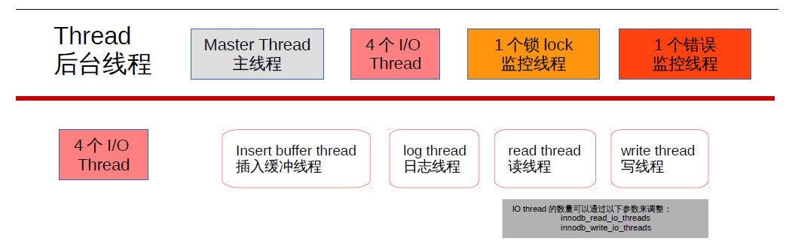
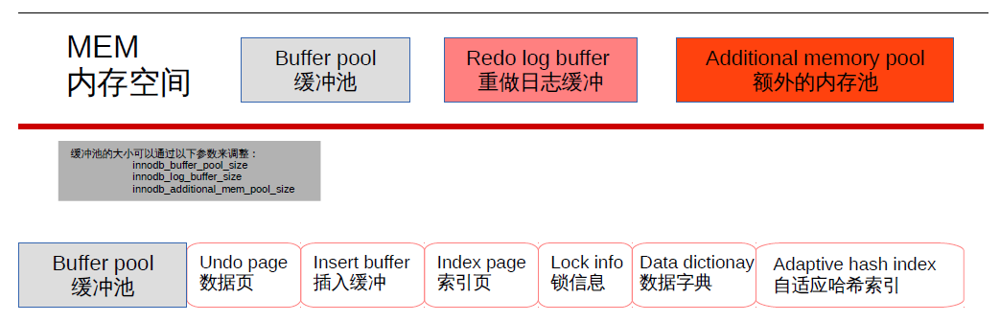
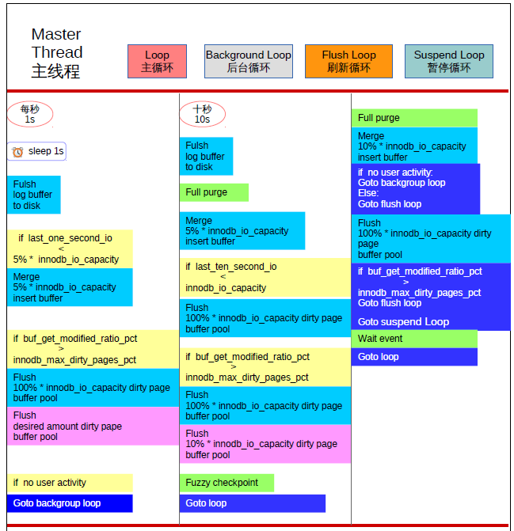

## MySQL逻辑架构和Innodb存储引擎

[TOC]

### MySQL 逻辑架构


MySQL 逻辑架构由：连接池组件、管理服务和工具组件、sql接口组件、查询分析器组件、优化器组件、 缓冲组件、插件式存储引擎、物理文件组成。独有的插件式体系结构，各个存储引擎有自己的特点。

* `Connectors`指的是不同语言中与SQL的交互
* `Management Serveices & Utilities`： 系统管理和控制工具
* `Connection Pool`: 连接池。管理缓冲用户连接，线程处理等需要缓存的需求
* `SQL Interface`: SQL接口。接受用户的SQL命令，并且返回用户需要查询的结果。比如`select from`就是调用S`QL Interface`
* `Parser`: 解析器。SQL命令传递到解析器的时候会被解析器验证和解析。解析器是由Lex和YACC实现的，是一个很长的脚本。

	主要功能：

	a . 将SQL语句分解成数据结构，并将这个结构传递到后续步骤，以后SQL语句的传递和处理就是基于这个结构的

	b.  如果在分解构成中遇到错误，那么就说明这个sql语句是不合理的

* `Optimizer`: 查询优化器。SQL语句在查询之前会使用查询优化器对查询进行优化。他使用的是“选取-投影-联接”策略进行查询。

 用一个例子就可以理解： `select uid,name from user where gender = 1; `

 这个`select` 查询先根据`where` 语句进行选取，而不是先将表全部查询出来以后再进行`gender`过滤；这个`select`查询先根据`uid`和`name`进行属性投影，而不是将属性全部取出以后再进行过滤；将这两个查询条件联接起来生成最终查询结果

* `Cache`和`Buffer`： 查询缓存。

 如果查询缓存有命中的查询结果，查询语句就可以直接去查询缓存中取数据。这个缓存机制是由一系列小缓存组成的。比如表缓存，记录缓存，key缓存，权限缓存等

* `Engine` ：存储引擎。

 存储引擎是MySql中具体的与文件打交道的子系统。也是Mysql最具有特色的一个地方。

 Mysql的存储引擎是插件式的。它根据MySQL AB公司提供的文件访问层的一个抽象接口来定制一种文件访问机制（这种访问机制就叫存储引擎）

 现在有很多种存储引擎，各个存储引擎的优势各不一样，最常用的MyISAM,InnoDB

	MySQL 5.5 版本之前默认使用MyISAM引擎，它查询速度快，有较好的索引优化和数据压缩技术。但是它不支持事务。

	MySQL 5.5 版本开始默认使用InnoDB引擎，它是第一个支持拥有ACID特性事务的存储引擎，并且提供行级的锁定，应用也相当广泛。

	Mysql也支持自己定制存储引擎，甚至一个库中不同的表使用不同的存储引擎，这些都是允许的。

### MySQL 存储引擎

#### 存储引擎概述 

`innodb`存储引擎：面向OLTP(online transaction processing)、行锁、支持外键、非锁定读、默认采用repeaable级别（可重复读）通过next-keylocking策略避免幻读、插入缓冲、二次写、自适应哈希索引、预读

`myisam`存储引擎：不支持事务、表锁、全文索引、适合olap（在线分析处理），其中myd:放数据文件，myi:放索引文件

`ndb`存储引擎：集群存储引擎，share nothing，可提高可用性

`memory`存储引擎：数据存放在内存中，表锁，并发性能差，默认使用哈希索引

`archive`存储引擎：只支持`insert`和`select` ，zlib算法压缩1：10，适合存储归档数据如日志等、行锁

`maria`存储引擎：目的取代myisam、缓存数据和索引、行锁、mvcc


---

#### 知名的两大存储引擎 

存储引擎是数据库当中非常重要的概念，这是一个重点。什么是存储引擎呢？引擎这个东西是用在车上的，说车子跑快跑慢，最直接的关系，引擎，当然不是唯一的关系。就像我们说计算机cpu是最直接的原因。对汽车来说呢，就是引擎最关键。数据库他的优点是数据读写比较快，那么他读写之所以比一般的应用程序快，那是因为他读写的方式不一样。我们把数据库读数据，读文件，写数据，写文件，那种读写操作的方法叫做存储引擎。指的是“DB读写数据的方式”。简单的一句话概括，数据库读写数据的方式叫做存储引擎。读写数据的方式会直接影响到数据库性能，所以是非常重要的。mysql用的是两大存储引擎，一个叫做myisam存储引擎，第二个叫做innodb存储引擎，这是最常见的、最知名的存储引擎，myisam和innodb存储引擎。其实还有其他存储引擎，大概我记得mysql支持8个不同的存储引擎，可能后来呢又扩容了，但是不管有几个，最常用的就是这么两个。

这两个存储引擎有各自的优劣点，有各自的特性。比如说，两个最大的区别，myisam是一个非事务型的存储引擎，可以支持表锁，或者说只支持表锁；innodb是一个事务型存储引擎，能够支持到行锁。这是两个特性，不是说事务型存储就能支持行锁，这是两个不同的特点，一个特点是事务型和非事务型，一个特点是行锁与表锁。实现行锁，其实大部分引擎实现的都是表锁，实现表锁的存储引擎不多，innodb是其中一个，ndb也是一个，比较著名的能够实现行锁的存储引擎。

INNODB可以实现行锁，所以INNODB在线上生存环境中，大并发用户请求下，他的性能损失并不大；而MYISAM用的是表锁，一旦并发用户数量多了，性能会急剧下降，随着他们用户数量的增加，冲突会明显增加，冲突次数越多，性能越低，排队用户越多。我们这里总结一下，我们推荐线上生产环境尽量使用INNODB，会有很多优点；但如果不涉及到锁冲突，不涉及到事务型，或者说不涉及到写操作，比如我这台服务器专门用来读，那么这个时候MYISAM的读性能是大于INNODB的，他是适合于小并发下面的读多写少的环境。锁行比锁表要麻烦，锁精度越精细，操作起来肯定越麻烦，所以在只读的环境下，用MYISAM肯定性能会高一些。多数情况下MYISAM存储引擎呢是给管理员做统计用的。管理员有一个数据库要去分析数据，一个人分析就够了，不会说有一千个用户同时登上去，大家一起分析，不会的。而且分析数据库，很多都是用的读环境，这个表当中有多少记录，哪个表当中有多少记录，表当中最大值是多少，最小值是多少，相对于上一次的统计结果我有什么样的改变，很多时候都是读操作。所以像这种线下数据统计分析比较适合于MYISAM。
另外提一下，还有一种情况下也会用MYISAM。在做主从同步的时候，也称为A/B复制。有一台服务器叫做Master，有一堆从服务器叫做Slave，Master用来做写操作，写完以后同步给从机，从机只用来做读操作。那么从机就是一个只读环境，用MYISAM数据库引擎，是不是符合我们读多写少的环境啊，而主服务器用INNODB，这也是一种架构的方式，了解一下，有的公司比较追求读性能就会用这种架构，但是我们大多数时候是主从都用INNODB。

接下来我们一起来了解一下MYSQL和MARIADB默认的存储引擎是什么，就是说你什么操作都不改，做数据读写的时候默认使用的存储引擎。MYSQL有几个不同的版本，在SUN公司手下的时候，有5.0版本和5.1版本，默认使用MYISAM存储引擎；后来被ORACLE收购之后的第一版本是5.5，开发的第二个版本是5.6，现在最新的版本是5.7，ORACLE收购完默认的存储引擎是INNODB。MARIADB有5.0，5.1相对于MYSQL的5.0和5.1，有一个MYSQL版本，就会有一个MARIADB版本。RHEL7默认用的MARIADB 5.5版本，MYSQL有5.6版本，MARIADB对应的是10版本，MYSQL 5.7版本，对应的是MARIADB 10.1版本。MARIADB说我以后不会跟着你的版本走，因为我后期开发的过程中，功能比你多，所以我版本跟你一样，会让用户有一个错误的判断，认为好像我有的功能MYSQL也有，而事实上MYSQL没有，我是超越MYSQL的。
ORACLE官方说，MYSQL 5.6版本性能要高出5.5版本的30%，相同的硬件，相同的机器上面，性能要高出30%。5.7相对于5.6高70%，这东西一般来说，我们在性能调优的时候是很难想象的，在相同的硬件上面，因为程序稍作修改让性能提升这么大。一般来说程序版本升级之后，性能增加个5%-10%，这是在一个可以理解的，通常的方案当中，但是ORACLE说能提升70%，他的确做了很多的修改。所以我的建议是，如果大家使用MYSQSL，那么起码要从5.6开始使用，最好是使用5.7版本，性能是一个问题，还有后面诸多问题，例如安全性问题、高可用的问题、很多延迟性的问题都得到了ORACLE公司非常有效的解决！当然ORACLE这么做也是有他的原因的，因为太多的人去使用MARIADB了，他如果不在MYSQL上作出一些重大的突破，就没人愿意去用MYSQL了，所以他还是有了非常大的改进。当然MARIADB也有了改进，你有的功能我也有，如果用MARIADB，我建议用10版本，这个倒不是性能问题，主要是一些新特性，和安全相关的一些特性，还有功能相关的一些特性，5.5版本确实是缺少了一些非常重要的一些特性，所以建议你上10或者10.1版本。
我们的课程当中还是以mariadb的5.5版本，因为常见的基础操作不管哪个版本都一样，基础讲完了会用mysql的5.7版本或者mariadb10.1版本，讲一些他们具有的新特性。以默认版本去讲基础操作，再以新版本去讲新特性。


INNODB 的特性


* 主体系结构：默认7个后台线程，4个io thread(insert buffer、log、read、write),1个master thread(优先级最高),1个锁(lock)监控线程，1个错误监控线程。可以通过`show engine innodb status`来查看。新版本已对默认的read thread和write thread分别增大到4个，可通过`show variables like 'innodb_io_thread%'`查看。



* 存储引擎组成：缓冲池(buffer pool)、重做日志缓冲池(redo log buffer)以及额外的内存池(additional memory pool).具体配置可由`show variables like 'innodb_buffer_pool_size'`、`show variables like
'innodb_log_buffer_size'`、`show variables like 'innodb_additional_mem_pool_size'`来查看。



* 缓冲池：占最大块内存，用来存放各种数据的缓存包括有索引页、数据页、undo页、插入缓冲、自适应哈希索引、innodb存储的锁信息、数据字典信息等。工作方式总是将数据库文件按页(每页16k)读取到缓冲池，然后按最近最少使用(lru)的算法来保留在缓冲池中的缓存数据。如果数据库文件需要修改，总是首先修改在缓存池中的页(发生修改后即为脏页)，然后再按照一定的频率将缓冲池的脏页刷新到文件。通过命令`show engine innodb status;`来查看。

* 日志缓冲：将重做日志信息先放入这个缓冲区，然后按一定频率将其刷新到重做日志文件。


---


> ### `master thread`:

> #### loop主循环每秒一次的操作：   

1. 睡觉
2. 将日志缓冲刷新到磁盘，即使事务未提交
3. 如果【前1s的I/O次数】小于【磁盘I/O吞吐量的5% （默认200*5%=10个页）】，则合并插入缓冲（数量为磁盘I/O吞吐量*5%即10个页）
4. 如果【脏页比例】大于【阀值（默认为75，脏页比例为百分之七十五）】，则刷新缓冲池中脏页到磁盘，否则只刷新合适的脏页数量（innodb_adaptive_flushing参数决定）
5. 当前没有用户活动，切换到后台循环

> #### loop主循环每十秒一次的操作：

1. 将日志缓冲刷新到磁盘，即使事务未提交
2. 删除无用的undo页
3. 合并插入缓冲，缓冲数量为【磁盘I/O吞吐量的5%，如果默认200，则合并插入缓冲10个】
4. 如果【前10s的I/O次数】小于【磁盘I/O吞吐量（默认200*100%=200个页）】，则刷新缓冲池中脏页到磁盘（数量为磁盘I/O吞吐量*100%即200个页）
5. 如果【脏页比例】大于【阀值（默认为75，脏页比例为百分之七十五）】，则刷新缓冲池中脏页到磁盘（数量为磁盘I/O吞吐量*100%即200个页），否则脏页刷新数量为（磁盘I/O吞吐量*10%即20个页）
6. 产生一个检查点（模糊检查点）     

> #### backgroud loop，若当前没有用户活动(数据库空闲时)或者数据库关闭时，就会切换到这个循环：

1. 删除无用的undo页
2. 合并插入缓冲，缓冲数量为【磁盘I/O吞吐量的10%，如果默认200，则合并插入缓冲20个】
3. 当前有用户活动，切换到主循环
4. 当前没有用户活动，切换到刷新循环

> #### flush loop 刷新循环，包括：

1. 刷新缓冲池中脏页到磁盘（数量为磁盘I/O吞吐量*100%即200个页）
2. 如果【脏页比例】大于【阀值（默认为75，脏页比例为百分之七十五）】，则继续进入刷新循环，否则进入暂停循环

> #### suspend_loop暂停循环，包括：

1. 等待事件发生，进入主循环





> ### `插入缓冲`：

不是缓冲池的一部分，Insert Buffer是物理页的一个组成部分,它带来InnoDB性能的提高。根据B+算法的特点，插入数据的时候主键索引是顺序的，不会造成数据库的随机读取，而对于非聚集索引(即辅助索引)，叶子节点的插入不再是顺序的了，这时需要离散地访问非聚集索引，插入性能在这里变低了。InnoDB引入插入缓冲，判断非聚集索引页是否在缓冲池中，如果在则直接插入;不在，则先放在 插入缓冲区中。然后根据上述master thread中介绍的，会有一定的频率将插入缓冲合并。此外，辅助索引不能是唯一的，因为插入到插入缓冲时，并不去查找索引页的情况，否则仍然会造成随机读，失去插入缓冲的意义了。插入缓冲可能会占缓冲池中内存，默认也能会占到1/2，所以可以将这个值调小点，到1/3。通过IBUF_POOL_SIZE_PER_MAX_SIZE来设置，2表示1/2,3表示1/3。

> ### `两次写`：  

它带来InnoDB数据的可靠性。如果写失效，可以通过重做日志进行恢复，但是重做日志中记录的是对页的物理操作，如果页本身损坏，再对其进行重做是没有意义的。所以，在应用重做日志前，需要一个页的副本，当写入失效发生时，先通过页的副本来还原该页，再进行重做，这就是doublewire。

恢复数据=页副本+重做日志

> ### INNODB 的表

1. `表空间`：表空间可看做是InnoDB存储引擎逻辑结构的最高层。
2. `段`：表空间由各个段组成，常见的段有数据段、索引段、回滚段等。
3. `区`：由64个连续的页组成，每个页大小为16kb，即每个区大小为1MB。
4. `页`：每页16kb，且不能更改。常见的页类型有：数据页、Undo页、系统页、事务数据页、插入缓冲位图页、插入缓冲空闲列表页、未压缩的二进制大对象页、压缩的二进制大对象页。
5. `行`：InnoDB存储引擎是面向行的(row-oriented)，每页最多允许存放7992行数据。
6. `行记录格式`：常见两种行记录格式Compact和Redundant，mysql5.1版本后，主要是Compact行记录格式。对于Compact，不管是char型还是varchar型，null型都是不占用存储空间的；对于Redudant,varchar的null不占用空间，char的null型是占用存储空间的。

varchar类型的长度限制是65535，其实达不到，会有别的开销，一般是65530左右，这还跟选取的字符集有关。此外这个长度限制是一整行的，例如：`create table test(a varchar(22000), b varchar(22000), cvarchar(22000)) charset=latin1 engine=innodb;`也会报错。

对于blob类型的数据，在数据页面中只保存了varchar(65535)的前768个字节前缀数据，之后跟的是偏移量，指向行溢出页，也就是Uncompressed BLOB Page。新的InnoDB Plugin引入了新的文件格式称为Barracuda，其有两种新的行记录格式Compressed和Dynamic，两者对于存入Blog字段采用了完全溢出的方式，在数据库页中存放20个字节的指针，实际的数据都存入在BLOB Page中。   


#### 事务

事务(Transaction)是并发控制的基本单位。

所谓事务,它是一个操作序列,这些操作要么都执行,要么都不执行, 它是一个不可分割的工作单位。例如,银行转帐工作:从一个帐号扣款并 使另一个帐号增款,这两个操作要么都执行,要么都不执行。

数据库事务必须具备ACID特性,ACID是Atomic(原子性)、 Consistency(一致性)、Isolation(隔离性)和Durability(持久性)的 英文缩写。

* 原子性:

指整个数据库事务是不可分割的工作单位。只有使据库中所 有的操作执行成功,才算整个事务成功;事务中任何一个SQL语句执行失 败,那么已经执行成功的SQL语句也必须撤销,数据库状态应该退回到执 行事务前的状态。

* 一致性:

指数据库事务不能破坏关系数据的完整性以及业务逻辑上的 一致性。例如对银行转帐事务,不管事务成功还是失败,应该保证事务结 束后ACCOUNTS表中Tom和Jack的存款总额为2000元。

* 隔离性:

指的是在并发环境中,当不同的事务同时操纵相同的数据 时,每个事务都有各自的完整数据空间。由并发事务所做的修改必须与任 何其他并发事务所做的修改隔离。事务查看数据更新时,数据所处的状态 要么是另一事务修改它之前的状态,要么是另一事务修改它之后的状态, 事务不会查看到中间状态的数据。

* 持久性:

指的是只要事务成功结束,它对数据库所做的更新就必须永 久保存下来。即使发生系统崩溃,重新启动数据库系统后,数据库还能恢 复到事务成功结束时的状态。

事务的(ACID)特性是由关系数据库管理系统（RDBMS）来实现的。数据库管理系统采用日志来保证事务的原子性、一致性和 持久性。日志记录了事务对数据库所做的更新,如果某个事务在执行过程 中发生错误,就可以根据日志,撤销事务对数据库已做的更新,使数据库 退回到执行事务前的初始状态。 数据库管理系统采用锁机制来实现事务的隔离性。当多个事务同时更 新数据库中相同的数据时,只允许持有锁的事务能更新该数据,其他事务 必须等待,直到前一个事务释放了锁,其他事务才有机会更新该数据。


#### 并发控制

##### 锁机制


InnoDB存储引擎锁的实现和Oracle非常类似，提供一致性的非锁定读、行级锁支持、行级锁没有相关的开销，可以同时得到并发性和一致性。

InnoDB存储引擎实现了如下两种标准的行级锁：

 1. 共享锁(S Lock)：允许事务读一行数据；
 2. 排他锁(X Lock)：允许事务删除或者更新一行数据。

当一个事务已经获得了行的共享锁，那么另外的事务可以立即获得行的共享锁，因为读取没有改变行的数据，我们称这种情况为锁兼容。但如果有事务想获得行的排他锁，则它必须等待事务释放行r上的共享锁————这种情况称为锁不兼容。

在InnoDB Plugin之前，只能通过`SHOW FULL PROCESSLIST;`，`SHOW ENGINE INOODB STATUS;`等命令来查看当前的数据库请求，然后再判断当前事务中的锁的情况。新版本的InnoDB Plugin中，在INFORMATION_SCHEMA架构下添加了`INNODB_TRX、INNODB_LOCKS、InnoDB_LOCK_WAITS`。通过这三张表，可以更简单地监控当前的事务并分析可能存在的锁的问题。

INNODB_TRX由8个字段组成：

> 通过`select * from infomation_schema.INNODB_TRX;`可查看

1. trx_id:InnoDB存储引擎内部唯一的事务ID
2. trx_state:当前事务的状态。
3. trx_started:事务的开始时间。
1. trx_requested_lock_id:等待事务的锁ID。如trx_state的状态为LOCK WAIT,那么该值代表当前的等待之前事务占用锁资源的ID.
1. 若trx_state不是LOCK WAIT,则该值为NULL。
1. trx_wait_started:事务等待开始的时间。
1. trx_weight:事务的权重，反映了一个事务修改和锁住的行数。在InnoDB存储引擎中，当发生死锁需要回滚时，InnoDB存储会选
择该值最小的进行回滚。
1. trx_mysql_thread_id:Mysql中的线程ID,`SHOW PROCESSLIST;`显示的结果。
1. trx_query:事务运行的sql语句。

INNODB_LOCKS表，该表由如下字段组成：

> 通过`select * from information_schema.INNODB_LOCK;`可查看

1. lock_id:锁的ID。
1. lock_trx_id:事务ID。
1. lock_mode:锁的模式。
1. lock_type:锁的类型，表锁还是行锁。
1. lock_table:要加锁的表。
1. lock_index:锁的索引。
1. lock_space:InnoDB存储引擎表空间的ID号。
1. lock_page:被锁住的页的数量。若是表锁，则该值为NULL。
1. lock_rec:被锁住的行的数量。若是表锁，则该值为NULL。
1. lock_data:被锁住的行的主键值。当是表锁时，该值为NULL。

INNODB_LOCK_WAIT由4个字段组成：

> 通过`select * from information_schema.INNODB_LOCK_WAITS;`可查看。

1. requesting_trx_id:申请锁资源的事务ID。
1. requesting_lock_id:申请的锁的ID。
1. blocking_trx_id:阻塞的锁的ID。


##### 多版本并发控制 MVCC

InnoDB存储引擎通过行`多版本控制 MVCC`的方式来读取当前执行时间数据库中行的数据。如果读取的行正在执行Delete、update操作，这时读取操作不会因此而会等待行上锁的释放，相反，InnoDB存储引擎会去读取行的一个快照数据。快照数据是指该行之前版本的数据，该实现是通过Undo段来实现。而Undo用来事务中回滚数据，因此快照本身是没有额外开销的。此外，快照数据是不需要上锁的，因为没有必要对历史的数据进行修改。一个行可能有不止一个快照数据，所以称这种技术为行多版本技术。由此带来并发控制，称之为多版本并发控制(Multi VersionConcurrency Control, MVCC)。

##### 事务的隔离级别

Read uncommitted、Read committed、Repeatable read、serializable。

在Read Committed和Repeatable Read下，InnoDB存储引擎使用非锁定一致性读。然而，对于快照的定义却不同。在Read Committed事务隔离级别下，对于快照数据，非一致性读总是读取被锁定行的最新一份快照数据。在Repeatable事务隔离级别下，对于快照数据，非一致性读总是读取事务开始时的行数据版本。   


### INNODB锁


#### 设置INNODB事务隔离级别

##### 实践1：查看innodb默认的事务隔离级别

知识点：

1. 可以查看局部变量`@@tx_isolation`和全局变量`@@global.tx_isolation`
2. 局部变量在会话中生效，而全局变量是在所有会话中生效，局部覆盖全局。

>查看当前会话中的事务隔离级别

```shell
 MariaDB [(none)]> select @@tx_isolation;
+-----------------+
| @@tx_isolation  |
+-----------------+
| REPEATABLE-READ |
+-----------------+
1 row in set (0.00 sec)
```

查看全局的事务隔离级别

```shell
MariaDB [(none)]> select @@global.tx_isolation;
+-----------------------+
| @@global.tx_isolation |
+-----------------------+
| REPEATABLE-READ       |
+-----------------------+
1 row in set (0.00 sec)

MariaDB [(none)]> show variables like "tx_isolation";
+---------------+-----------------+
| Variable_name | Value           |
+---------------+-----------------+
| tx_isolation  | REPEATABLE-READ |
+---------------+-----------------+
1 row in set (0.00 sec)

MariaDB [(none)]> select * from information_schema.global_variables where variable_name like "%isolation%";
+---------------+-----------------+
| VARIABLE_NAME | VARIABLE_VALUE  |
+---------------+-----------------+
| TX_ISOLATION  | REPEATABLE-READ |
+---------------+-----------------+
1 row in set (0.03 sec)
```

##### 实践2：改变单个会话的隔离级别


知识点：

1.用户可以用SET TRANSACTION语句改变单个会话的隔离级别。

```shell
SET SESSION  TRANSACTION ISOLATION LEVEL
                       {READ UNCOMMITTED | READ COMMITTED
                        | REPEATABLE READ | SERIALIZABLE}
```

2.会话结束重新开启新的会话，则使用全局变量的值


session1设置RR

由于默认的隔离级别就是RR，因此不用设置，查看一下即可

```shell
MariaDB [(none)]> select @@tx_isolation;
+-----------------+
| @@tx_isolation  |
+-----------------+
| REPEATABLE-READ |
+-----------------+
1 row in set (0.00 sec)
```

session2设置RC

```shell
MariaDB [information_schema]> select @@tx_isolation;
+-----------------+
| @@tx_isolation  |
+-----------------+
| REPEATABLE-READ |
+-----------------+
1 row in set (0.00 sec)

MariaDB [information_schema]> set session transaction isolation level read committed;
Query OK, 0 rows affected (0.00 sec)

MariaDB [information_schema]> select @@tx_isolation;
+----------------+
| @@tx_isolation |
+----------------+
| READ-COMMITTED |
+----------------+
1 row in set (0.00 sec)
```

session2结束会话，开启新的session3

```shell
MariaDB [information_schema]> exit
Bye
[root@localhost ~]# mysql
Welcome to the MariaDB monitor.  Commands end with ; or \g.
Your MariaDB connection id is 6
Server version: 5.5.44-MariaDB MariaDB Server

Copyright (c) 2000, 2015, Oracle, MariaDB Corporation Ab and others.

Type 'help;' or '\h' for help. Type '\c' to clear the current input statement.

MariaDB [(none)]> select @@tx_isolation;
+-----------------+
| @@tx_isolation  |
+-----------------+
| REPEATABLE-READ |
+-----------------+
1 row in set (0.00 sec)
```

##### 实践3：改变单个实例的隔离级别

知识点：

1.用户可以用SET TRANSACTION语句改变单个实例的隔离级别。

```shell
SET GLOBAL  TRANSACTION ISOLATION LEVEL
                       {READ UNCOMMITTED | READ COMMITTED
                        | REPEATABLE READ | SERIALIZABLE}
```

2.实例结束重新开启新的实例，则使用配置文件中的参数值，或程序编译时的参数值。


```shell
MariaDB [(none)]> set global transaction isolation level read committed;
Query OK, 0 rows affected (0.00 sec)

MariaDB [(none)]> select @@tx_isolation;
+-----------------+
| @@tx_isolation  |
+-----------------+
| REPEATABLE-READ |
+-----------------+
1 row in set (0.00 sec)

MariaDB [(none)]> select @@global.tx_isolation;
+-----------------------+
| @@global.tx_isolation |
+-----------------------+
| READ-COMMITTED        |
+-----------------------+
1 row in set (0.00 sec).
```


当前会话中，局部变量的值为RR，全局变量的值为RC，而局部会覆盖全局，所以当前会话中的隔离级别还是RR，我们需要退出当前会话，开启新的会话。


```shell
[root@localhost ~]# mysql
Welcome to the MariaDB monitor.  Commands end with ; or \g.
Your MariaDB connection id is 8
Server version: 5.5.44-MariaDB MariaDB Server

Copyright (c) 2000, 2015, Oracle, MariaDB Corporation Ab and others.

Type 'help;' or '\h' for help. Type '\c' to clear the current input statement.

MariaDB [(none)]> select @@tx_isolation;
+----------------+
| @@tx_isolation |
+----------------+
| READ-COMMITTED |
+----------------+
1 row in set (0.00 sec)

MariaDB [(none)]> select @@global.tx_isolation;
+-----------------------+
| @@global.tx_isolation |
+-----------------------+
| READ-COMMITTED        |
+-----------------------+
1 row in set (0.00 sec)
```

在会话中通过修改全局变量的方式，只能让当前的实例生效，如果服务重启了，则失效。

```shell
[root@localhost ~]# systemctl restart mariadb
[root@localhost ~]# mysql
Welcome to the MariaDB monitor.  Commands end with ; or \g.
Your MariaDB connection id is 2
Server version: 5.5.44-MariaDB MariaDB Server

Copyright (c) 2000, 2015, Oracle, MariaDB Corporation Ab and others.

Type 'help;' or '\h' for help. Type '\c' to clear the current input statement.

MariaDB [(none)]> select @@tx_isolation;
+-----------------+
| @@tx_isolation  |
+-----------------+
| REPEATABLE-READ |
+-----------------+
1 row in set (0.00 sec)

MariaDB [(none)]> select @@global.tx_isolation;
+-----------------------+
| @@global.tx_isolation |
+-----------------------+
| REPEATABLE-READ       |
+-----------------------+
1 row in set (0.00 sec)
```

##### 实践4：改变所有实例的隔离级别

知识点：

1.修改配置文件，为所有实例和连接设置默认隔离级别。

```shell
[mysqld]
transaction-isolation = {READ-UNCOMMITTED | READ-COMMITTED
                         | REPEATABLE-READ | SERIALIZABLE}
```

2.innodb默认的隔离级别为 REPEATABLE-READ

```shell
[root@localhost ~]# vim /etc/my.cnf
transaction-isolation=read-committed
[root@localhost ~]# systemctl restart mariadb
[root@localhost ~]# mysql -e "select @@tx_isolation"
+----------------+
| @@tx_isolation |
+----------------+
| READ-COMMITTED |
+----------------+
[root@localhost ~]# mysql -e "select @@global.tx_isolation"
+-----------------------+
| @@global.tx_isolation |
+-----------------------+
| READ-COMMITTED        |
+-----------------------+
```

---

#### 区分INNODB事务隔离级别


##### InnoDB 中的隔离级详细描述

- `READ UNCOMMITTED` 这通常称为 'dirty read'：non-locking SELECTs 的执行使我们不会看到一个记录的可能更早的版本；因而在这个隔离度下是非 'consistent' reads；另外，这级隔离的运作如同 READ COMMITTED。
- `READ COMMITTED` 有些类似 Oracle 的隔离级。所有 SELECT ... FOR UPDATE 和 SELECT ... LOCK IN SHARE MODE 语句只锁定索引记录，而不锁定之前的间隙，因而允许在锁定的记录后自由地插入新记录。以一个唯一地搜索条件使用一个唯一索引(unique index)的 UPDATE 和 DELETE，仅仅只锁定所找到的索引记录，而不锁定该索引之前的间隙。但是在范围型的 UPDATE and DELETE中，InnoDB 必须设置 next-key 或 gap locks 来阻塞其它用户对范围内的空隙插入。 自从为了 MySQL 进行复制(replication)与恢复(recovery)工作'phantom rows'必须被阻塞以来，这就是必须的了。Consistent reads 运作方式与 Oracle 有点类似： 每一个 consistent read，甚至是同一个事务中的，均设置并作用它自己的最新快照。
- `REPEATABLE READ` 这是 InnoDB 默认的事务隔离级。. SELECT ... FOR UPDATE, SELECT ... LOCK IN SHARE MODE, UPDATE, 和 DELETE ，这些以唯一条件搜索唯一索引的，只锁定所找到的索引记录，而不锁定该索引之前的间隙。 否则这些操作将使用 next-key 锁定，以 next-key 和 gap locks 锁定找到的索引范围，并阻塞其它用户的新建插入。在 consistent reads 中，与前一个隔离级相比这是一个重要的差别： 在这一级中，同一事务中所有的 consistent reads 均读取第一次读取时已确定的快照。这个约定就意味着如果在同一事务中发出几个无格式(plain)的SELECTs ，这些 SELECTs 的相互关系是一致的。
- `SERIALIZABLE` 这一级与上一级相似，只是无格式(plain)的 SELECTs 被隐含地转换为 SELECT ... LOCK IN SHARE MODE。

##### 实践1：SERIALIZABLE隔离级别查询自动加共享锁

* 开启四个会话session1-4，分别设置不同的隔离级别


* 再开启一个会话session5默认使用RR隔离级别


* session1-5都开启一个事务，查看test库中t1表中id=100的行


* session5中将id=100的行改为200，发现出现死锁，这是因为session4为SERIALIZABLE，查看id=100的行会被加上一个共享锁S，而其他三种模式都是不加锁的，使用一致性非锁定读。


```shell
MariaDB [(none)]> select * from information_schema.innodb_locks\G;
*************************** 1. row ***************************
    lock_id: 909:0:308:2
lock_trx_id: 909
  lock_mode: X
  lock_type: RECORD
 lock_table: `test`.`t1`
 lock_index: `PRIMARY`
 lock_space: 0
  lock_page: 308
   lock_rec: 2
  lock_data: 100
*************************** 2. row ***************************
    lock_id: 90A:0:308:2
lock_trx_id: 90A
  lock_mode: S
  lock_type: RECORD
 lock_table: `test`.`t1`
 lock_index: `PRIMARY`
 lock_space: 0
  lock_page: 308
   lock_rec: 2
  lock_data: 100
2 rows in set (0.01 sec)

ERROR: No query specified

MariaDB [(none)]> select * from information_schema.innodb_lock_waits\G;
*************************** 1. row ***************************
requesting_trx_id: 909
requested_lock_id: 909:0:308:2
  blocking_trx_id: 90A
 blocking_lock_id: 90A:0:308:2
1 row in set (0.04 sec)

ERROR: No query specified

MariaDB [(none)]> select * from information_schema.innodb_trx\G;
*************************** 1. row ***************************
                    trx_id: 90A
                 trx_state: RUNNING
               trx_started: 2016-12-15 17:08:01
     trx_requested_lock_id: NULL
          trx_wait_started: NULL
                trx_weight: 2
       trx_mysql_thread_id: 5
                 trx_query: NULL
       trx_operation_state: NULL
         trx_tables_in_use: 0
         trx_tables_locked: 0
          trx_lock_structs: 2
     trx_lock_memory_bytes: 376
           trx_rows_locked: 1
         trx_rows_modified: 0
   trx_concurrency_tickets: 0
       trx_isolation_level: SERIALIZABLE
         trx_unique_checks: 1
    trx_foreign_key_checks: 1
trx_last_foreign_key_error: NULL
 trx_adaptive_hash_latched: 0
 trx_adaptive_hash_timeout: 10000
*************************** 2. row ***************************
                    trx_id: 909
                 trx_state: LOCK WAIT
               trx_started: 2016-12-15 17:02:04
     trx_requested_lock_id: 909:0:308:2
          trx_wait_started: 2016-12-15 17:10:18
                trx_weight: 2
       trx_mysql_thread_id: 4
                 trx_query: update test.t1 set id=200 where id=100
       trx_operation_state: starting index read
         trx_tables_in_use: 1
         trx_tables_locked: 1
          trx_lock_structs: 2
     trx_lock_memory_bytes: 1248
           trx_rows_locked: 1
         trx_rows_modified: 0
   trx_concurrency_tickets: 0
       trx_isolation_level: REPEATABLE READ
         trx_unique_checks: 1
    trx_foreign_key_checks: 1
trx_last_foreign_key_error: NULL
 trx_adaptive_hash_latched: 0
 trx_adaptive_hash_timeout: 10000
*************************** 3. row ***************************
                    trx_id: 908
                 trx_state: RUNNING
               trx_started: 2016-12-15 17:02:02
     trx_requested_lock_id: NULL
          trx_wait_started: NULL
                trx_weight: 0
       trx_mysql_thread_id: 3
                 trx_query: NULL
       trx_operation_state: NULL
         trx_tables_in_use: 0
         trx_tables_locked: 0
          trx_lock_structs: 0
     trx_lock_memory_bytes: 376
           trx_rows_locked: 0
         trx_rows_modified: 0
   trx_concurrency_tickets: 0
       trx_isolation_level: READ COMMITTED
         trx_unique_checks: 1
    trx_foreign_key_checks: 1
trx_last_foreign_key_error: NULL
 trx_adaptive_hash_latched: 0
 trx_adaptive_hash_timeout: 10000
*************************** 4. row ***************************
                    trx_id: 906
                 trx_state: RUNNING
               trx_started: 2016-12-15 17:01:57
     trx_requested_lock_id: NULL
          trx_wait_started: NULL
                trx_weight: 0
       trx_mysql_thread_id: 6
                 trx_query: NULL
       trx_operation_state: NULL
         trx_tables_in_use: 0
         trx_tables_locked: 0
          trx_lock_structs: 0
     trx_lock_memory_bytes: 376
           trx_rows_locked: 0
         trx_rows_modified: 0
   trx_concurrency_tickets: 0
       trx_isolation_level: REPEATABLE READ
         trx_unique_checks: 1
    trx_foreign_key_checks: 1
trx_last_foreign_key_error: NULL
 trx_adaptive_hash_latched: 0
 trx_adaptive_hash_timeout: 10000
*************************** 5. row ***************************
                    trx_id: 905
                 trx_state: RUNNING
               trx_started: 2016-12-15 17:01:39
     trx_requested_lock_id: NULL
          trx_wait_started: NULL
                trx_weight: 0
       trx_mysql_thread_id: 2
                 trx_query: select * from information_schema.innodb_trx
       trx_operation_state: NULL
         trx_tables_in_use: 0
         trx_tables_locked: 0
          trx_lock_structs: 0
     trx_lock_memory_bytes: 376
           trx_rows_locked: 0
         trx_rows_modified: 0
   trx_concurrency_tickets: 0
       trx_isolation_level: READ UNCOMMITTED
         trx_unique_checks: 1
    trx_foreign_key_checks: 1
trx_last_foreign_key_error: NULL
 trx_adaptive_hash_latched: 0
 trx_adaptive_hash_timeout: 10000
5 rows in set (0.00 sec)

ERROR: No query specified

```

* session4中提交事务，则id=100的行锁被解除，我们关闭session4，下图为最新的情况


##### 实践2：RU、RC、RR隔离级别的对比

* session5，修改id=100的行，改为200，不提交事务，session1-,3分别查看id=100的值，观察情况


* RU级别的会话中的事务在session5中事务未提交的情况下，就能够查看到最新的行记录了


* RC级别的会话中的事务在session5会话的事务提交后就能够查看到最新的行记录了 


*　RR级别的会话中必须在session5的事务提交后并且自己的事务也提交后才能查到最新的行记录


#### 实现一致性锁定读

InnoDB默认是可重复读的（REPEATABLE READ），MVCC多版本并发控制，实现一致性地非锁定读操作。

InnoDB存储引擎的select操作使用一致性非锁定读；也就是说，select操作不会去请求共享锁S；

如何显示地使用一致性锁定读呢？

* 第一种方法，显式地加共享锁S：select * from t1 where id=1 lock on share mode;
* 第二种方法，显式地加排他锁X：select * from t1 where id=1 for update;

##### 实践1：设置innodb申请锁等待超时时间


```shell
MariaDB [(none)]> set @@innodb_lock_wait_timeout=3;
Query OK, 0 rows affected (0.01 sec)
```

##### 实践2：设置一致性锁定读，加共享锁测试


打开两个会话，分别按照图片中去做测试


从实践中可以得到以下信息:

* 事务A对id=1的行申请了共享S锁之后，事务B要么使用一致性非锁定读，即不请求锁，或者使用一致性锁定读的共享锁，即请求共享S锁
* 而事务B中需要请求排他锁的写操作都不能执行，每次都是锁请求等待超时


##### 实践3：设置一致性锁定读，加排他锁测试


这一次事务A以及对id=1的行申请了排他锁X，按照下图做测试：


从实践中可以得到以下信息:

* 事务A对id=1的行申请了排他锁X之后，事务B只能使用一致性非锁定读，即不请求锁
* 而事务B中需要请求锁的行为都会等待超时，包括排他锁的写操作和共享锁的读操作都不能执行


#### 认识锁的算法

nnoDB存储引擎的锁的算法有三种：

* Record lock：单个行记录上的锁
* Gap lock：间隙锁，锁定一个范围，不包括记录本身
* Next-key lock：record+gap 锁定一个范围，包含记录本身

Lock的精度（type）分为 行锁、表锁、意向锁

Lock的模式（mode）分为:

* 锁的类型 ——【读锁和写锁】或者【共享锁和排他锁】即 【X or S】
* 锁的范围 ——【record lock、gap lock、Next-key lock】

##### 知识点

1. innodb对于行的查询使用next-key lock
2. Next-locking keying为了解决Phantom Problem幻读问题
3. 当查询的索引含有唯一属性时，将next-key lock降级为record key
4. Gap锁设计的目的是为了阻止多个事务将记录插入到同一范围内，而这会导致幻读问题的产生
5. 有两种方式显式关闭gap锁：（除了外键约束和唯一性检查外，其余情况仅使用record lock）
	A. 将事务隔离级别设置为RC
	B. 将参数innodb_locks_unsafe_for_binlog设置为1


	
##### 实践1： 验证next-key lock降级为record key

创建db1.t1表，有列a和b，分别为char(10)和int型，并且b为key，注意b列为索引列，但并不是主键，因此不是唯一的。

```shell
MariaDB [db1]> create table db1.t1 (a char(10),b int,key (b));
Query OK, 0 rows affected (0.03 sec)

MariaDB [db1]> insert into db1.t1 values ('batman',1),('superman',3),('leo',5);
Query OK, 3 rows affected (0.15 sec)
Records: 3  Duplicates: 0  Warnings: 0

MariaDB [db1]> select * from db1.t1;
+----------+------+
| a        | b    |
+----------+------+
| batman   |    1 |
| superman |    3 |
| leo      |    5 |
+----------+------+
3 rows in set (0.02 sec)
```

接下来开启两个事务T1和T2，T1中查看b=3的行，显式加排他锁；T1未提交事务时，T2事务开启并尝试插入新行a='batman',b=2和a='batman',b=4；

```shell
#事务T1
MariaDB [db1]> begin;
Query OK, 0 rows affected (0.00 sec)

MariaDB [db1]> select * from db1.t1 where b=3 for update;
+----------+------+
| a        | b    |
+----------+------+
| superman |    3 |
+----------+------+
1 row in set (0.12 sec)

#事务T2
MariaDB [db1]> begin;
Query OK, 0 rows affected (0.00 sec)

MariaDB [db1]> insert into db1.t1 values ('batman',2);
ERROR 1205 (HY000): Lock wait timeout exceeded; try restarting transaction
MariaDB [db1]> insert into db1.t1 values ('batman',4);
ERROR 1205 (HY000): Lock wait timeout exceeded; try restarting transaction
```

发现T2事务中不能插入新行a='batman',b=2和a='batman',b=4；可以查看当前innodb锁的信息

```shell
MariaDB [db1]> select * from information_schema.innodb_locks\G;
*************************** 1. row ***************************
    lock_id: 111B:0:334:3
lock_trx_id: 111B
  lock_mode: X,GAP
  lock_type: RECORD
 lock_table: `db1`.`t1`
 lock_index: `b`
 lock_space: 0
  lock_page: 334
   lock_rec: 3
  lock_data: 3, 0x00000000020E
*************************** 2. row ***************************
    lock_id: 111A:0:334:3
lock_trx_id: 111A
  lock_mode: X
  lock_type: RECORD
 lock_table: `db1`.`t1`
 lock_index: `b`
 lock_space: 0
  lock_page: 334
   lock_rec: 3
  lock_data: 3, 0x00000000020E
2 rows in set (0.01 sec)

ERROR: No query specified

MariaDB [db1]> select * from information_schema.innodb_lock_waits\G;
*************************** 1. row ***************************
requesting_trx_id: 111B
requested_lock_id: 111B:0:334:3
  blocking_trx_id: 111A
 blocking_lock_id: 111A:0:334:3
1 row in set (0.09 sec)

MariaDB [db1]> select * from information_schema.innodb_lock_waits\G;
*************************** 1. row ***************************
requesting_trx_id: 111B
requested_lock_id: 111B:0:334:4
  blocking_trx_id: 111A
 blocking_lock_id: 111A:0:334:4
1 row in set (0.00 sec)

ERROR: No query specified

MariaDB [db1]> select * from information_schema.innodb_locks\G;
*************************** 1. row ***************************
    lock_id: 111B:0:334:4
lock_trx_id: 111B
  lock_mode: X,GAP
  lock_type: RECORD
 lock_table: `db1`.`t1`
 lock_index: `b`
 lock_space: 0
  lock_page: 334
   lock_rec: 4
  lock_data: 5, 0x00000000020F
*************************** 2. row ***************************
    lock_id: 111A:0:334:4
lock_trx_id: 111A
  lock_mode: X,GAP
  lock_type: RECORD
 lock_table: `db1`.`t1`
 lock_index: `b`
 lock_space: 0
  lock_page: 334
   lock_rec: 4
  lock_data: 5, 0x00000000020F
2 rows in set (0.11 sec)

ERROR: No query specified
```

我们看到T2事务的两次插入动作都在请求排他锁，但是此时T1事务已经在加了next-key lock(record + gap)，表现范围为b的(1,5)，包括记录3，所以T2事务在T1事务解锁之间，不能插入到b的(1,5)范围内

× `lock_mode: X,GAP` lock_mode 可以理解为 `读锁还是写锁？`；`是在什么范围上锁？`;此处加的写锁即排他锁；范围是(1,5)
* `lock_type: RECORD` 表示锁的精度，根据存储引擎不同，innodb是行锁，MYISAM是表锁

删除db1.t1表，重新创建db1.t1表，有列a和b，分别为char(10)和int型，并且b为primay key，因此b列是唯一的。

```shell
MariaDB [db1]> drop tables t1;
Query OK, 0 rows affected (0.12 sec)

MariaDB [db1]> create table db1.t1 (a char(10),b int ,primary key (b));
Query OK, 0 rows affected (0.02 sec)

MariaDB [db1]> insert into db1.t1 values ('batman',1),('superman',3),('leo',5);
Query OK, 3 rows affected (0.12 sec)
Records: 3  Duplicates: 0  Warnings: 0

MariaDB [db1]> select * from db1.t1;
+----------+---+
| a        | b |
+----------+---+
| batman   | 1 |
| superman | 3 |
| leo      | 5 |
+----------+---+
3 rows in set (0.08 sec)
```

接下来开启两个事务T1和T2，T1中查看b=3的行，显式加排他锁；T1未提交事务时，T2事务开启并尝试插入新行a='batman',b=2和a='batman',b=4；

```shell
#事务T1
MariaDB [db1]> begin;
Query OK, 0 rows affected (0.00 sec)

MariaDB [db1]> select * from db1.t1 where b=3 for update;
+----------+---+
| a        | b |
+----------+---+
| superman | 3 |
+----------+---+
1 row in set (0.14 sec)

#事务T2
MariaDB [db1]> begin;
Query OK, 0 rows affected (0.00 sec)

MariaDB [db1]> insert into db1.t1 values ('batman',2);
Query OK, 1 row affected (0.00 sec)

MariaDB [db1]> insert into db1.t1 values ('batman',4);
Query OK, 1 row affected (0.00 sec)
```

继续在T2事务中尝试查看b=3的行，显式加共享锁。

```shell
#事务T2
MariaDB [db1]> select * from db1.t1 where b=3 lock in share mode;
ERROR 1205 (HY000): Lock wait timeout exceeded; try restarting transaction
```

发现T2事务中可以插入新行a='batman',b=2和a='batman',b=4；但是不能查看b=3的行，接下来我们查看当前innodb锁的信息

```shell
MariaDB [db1]> select * from information_schema.innodb_locks\G;
*************************** 1. row ***************************
    lock_id: 1122:0:337:3
lock_trx_id: 1122
  lock_mode: S
  lock_type: RECORD
 lock_table: `db1`.`t1`
 lock_index: `PRIMARY`
 lock_space: 0
  lock_page: 337
   lock_rec: 3
  lock_data: 3
*************************** 2. row ***************************
    lock_id: 1121:0:337:3
lock_trx_id: 1121
  lock_mode: X
  lock_type: RECORD
 lock_table: `db1`.`t1`
 lock_index: `PRIMARY`
 lock_space: 0
  lock_page: 337
   lock_rec: 3
  lock_data: 3
2 rows in set (0.02 sec)

ERROR: No query specified

MariaDB [db1]> select * from information_schema.innodb_lock_waits\G;
*************************** 1. row ***************************
requesting_trx_id: 1122
requested_lock_id: 1122:0:337:3
  blocking_trx_id: 1121
 blocking_lock_id: 1121:0:337:3
1 row in set (0.00 sec)

ERROR: No query specified
```

从以上信息可以看到，T1事务当前只在b=3所在的行上加了写锁，排他锁，并没有同时使用gap锁来组成next-key lock。

到此，已经证明了，当查询的索引含有唯一属性时，将next-key lock降级为record key

我们第二次创建的t1表的列b是主键，而主键必须是唯一的。


##### 实践2： 关闭GAP锁_RC

有两种方式显式关闭gap锁：（除了外键约束和唯一性检查外，其余情况仅使用record lock）

A. 将事务隔离级别设置为RC
B. 将参数innodb_locks_unsafe_for_binlog设置为1
	
|T1 RR|T2 RR|
|:--|:--|
|begin;|begin;|
|select * from db1.t1 where b=3 for update;||
||insert into db1.t1 values ('batman',2)|
||ERROR 1205 (HY000): Lock wait timeout exceeded; try restarting transaction|
||set session transaction isolation level READ COMMITTED;|
|commit;|commit;|

注意，将T1事务设置为RC后，需要将二进制日志的格式改为row格式，否则执行显式加锁时会报错

```shell
MariaDB [db1]> insert into t1 values ('batman',2);
ERROR 1665 (HY000): Cannot execute statement: impossible to write to binary log since BINLOG_FORMAT = STATEMENT and at least one table uses a storage engine limited to row-based logging. InnoDB is limited to row-logging when transaction isolation level is READ COMMITTED or READ UNCOMMITTED.
```


|T1 RC|T2 RR|
|:--|:--|
|begin;|begin;|
|set session transaction isolation level READ COMMITTED;||
|select * from db1.t1 where b=3 for update;||
||insert into db1.t1 values ('batman',2)|
||insert into db1.t1 values ('batman',4)|
|commit;|commit;|


```shell
#T1事务
MariaDB [db1]> set session transaction isolation level READ COMMITTED;
Query OK, 0 rows affected (0.00 sec)

MariaDB [db1]> select @@tx_isolation;
+----------------+
| @@tx_isolation |
+----------------+
| READ-COMMITTED |
+----------------+
1 row in set (0.00 sec)

MariaDB [db1]> begin;
Query OK, 0 rows affected (0.09 sec)

MariaDB [db1]> select * from t1 where b=3 for update;
+----------+------+
| a        | b    |
+----------+------+
| superman |    3 |
+----------+------+
1 row in set (0.00 sec)

#T2事务
MariaDB [db1]> begin;
Query OK, 0 rows affected (0.16 sec)

MariaDB [db1]> select @@tx_isolation;
+----------------+
| @@tx_isolation |
+----------------+
| READ-COMMITTED |
+----------------+
1 row in set (0.00 sec)

MariaDB [db1]> insert into db1.t1 values ('batman',2);
Query OK, 1 row affected (0.00 sec)

MariaDB [db1]> commit;
Query OK, 0 rows affected (0.01 sec)

MariaDB [db1]> set session transaction isolation level REPEATABLE READ;
Query OK, 0 rows affected (0.00 sec)

MariaDB [db1]> select @@tx_isolation;
+-----------------+
| @@tx_isolation  |
+-----------------+
| REPEATABLE-READ |
+-----------------+
1 row in set (0.00 sec)

MariaDB [db1]> begin;
Query OK, 0 rows affected (0.00 sec)

MariaDB [db1]> insert into db1.t1 values ('batman',4);
Query OK, 1 row affected (0.00 sec)

MariaDB [db1]> commit;
Query OK, 0 rows affected (0.00 sec)

#T1事务
MariaDB [db1]> commit;
Query OK, 0 rows affected (0.00 sec)
```

我在做测试的时候，T1事务隔离界别为RC，T2事务的隔离界别分别用RC和RR做了测试，都是可以的

##### 实践3： 关闭GAP锁_innodb_locks_unsafe_for_binlog


查看当前innodb_locks_unsafe_for_binlog参数的值

```shell
MariaDB [(none)]> select @@innodb_locks_unsafe_for_binlog;
+----------------------------------+
| @@innodb_locks_unsafe_for_binlog |
+----------------------------------+
|                                0 |
+----------------------------------+
1 row in set (0.00 sec)
```

修改参数，并重新启动服务

```shell
[root@localhost ~]# vim /etc/my.cnf
innodb_locks_unsafe_for_binlog=1
[root@localhost ~]# systemctl restart mariadb

[root@localhost ~]# mysql -e "select @@innodb_locks_unsafe_for_binlog"
+----------------------------------+
| @@innodb_locks_unsafe_for_binlog |
+----------------------------------+
|                                1 |
+----------------------------------+
```

还是去创建db1.t1表，如果已有就先drop；有列a和b，分别为char(10)和int型，并且b为key，注意b列为索引列，但并不是主键，因此不是唯一的。


|T1 RR|T2 RR|
|:--|:--|
|begin;|begin;|
|select * from db1.t1 where b=3 for update;||
||insert into db1.t1 values ('batman',2)|
||insert into db1.t1 values ('batman',4)|
|commit;|commit;|

```shell
MariaDB [db1]> create table db1.t1 (a char(10),b int,key (b));
Query OK, 0 rows affected (0.03 sec)

MariaDB [db1]> insert into db1.t1 values ('batman',1),('superman',3),('leo',5);
Query OK, 3 rows affected (0.15 sec)
Records: 3  Duplicates: 0  Warnings: 0

MariaDB [db1]> select * from db1.t1;
+----------+------+
| a        | b    |
+----------+------+
| batman   |    1 |
| superman |    3 |
| leo      |    5 |
+----------+------+
3 rows in set (0.02 sec)
```

接下来开启两个事务T1和T2，T1中查看b=3的行，显式加排他锁；T1未提交事务时，T2事务开启并尝试插入新行a='batman',b=2和a='batman',b=4；

T1事务

```shell
MariaDB [(none)]> begin;
Query OK, 0 rows affected (0.00 sec)

MariaDB [(none)]> select * from db1.t1 where b=3 for update;
+----------+------+
| a        | b    |
+----------+------+
| superman |    3 |
+----------+------+
1 row in set (0.01 sec)
```

T2事务

```shell
MariaDB [(none)]> begin;
Query OK, 0 rows affected (0.00 sec)

MariaDB [(none)]> insert into db1.t1 values ('batman',4);
Query OK, 1 row affected (0.01 sec)

MariaDB [(none)]> insert into db1.t1 values ('batman',2);
Query OK, 1 row affected (0.00 sec)

MariaDB [(none)]> commit;
Query OK, 0 rows affected (0.00 sec)
```

T1事务

```shell
MariaDB [(none)]> commit;
Query OK, 0 rows affected (0.00 sec)
```

##### 实践4：next-key locking是如何解决幻读问题的


首先什么是幻读呢？ 

举个例子，两个男孩同时在追求一个女生的故事

A问：你有男朋友吗？女孩对他说没有。A追求女孩的事件还没有提交，就是继续追求哈。

就在A追求的同时，B也在追求，并且直接让女孩做他的女朋友，女孩答应了，B的追求事件结束。

A又问：你有男朋友吗？ 女孩对他说我已经有男朋友了！ 呜呜呜 ！刚才你还没有的，怎么现在就有了呢？

女孩说，你也没说过你追我的时候不让别人追我啊！... ... A哭着走了。


**幻读 Phantom Problem 是指在同一事务下，连续执行两次相同的sql语句可能导致不同的结果，第二次的sql语句可能会返回之前不存在的行。**

在刚才我举的例子里，A虽然问了女孩有没有男朋友，但是没有告诉女孩，在他追求时，不可以接受别人的追求，所以悲催的结局。

那么A怎么才能在他追求事件结束前让女孩不答应别人的追求呢？

innodb中的RR隔离级别是通过next-key locking是如何解决幻读问题的，就是锁住一个范围。

那么如果你是A你怎么做呢？你肯定要跟女孩说，只要我开始追求你，问了你有没有男朋友，在我结束追求你之前，你不可以答应别人的追求！我要把你脑子里记录男朋友的区域全部锁起来，啊哈啊！

下面我们来做一个测试，分别在RR和RC隔离级别中来实现：

测试使用表db1.t1 (a int primary key) ,记录有1,3,5

|T1 RC|T2 RR|
|:--|:--|
|begin;|begin;|
|set session transaction isolation level READ COMMITTED;||
|select * from db1.t1 where a>3 for update;||
|查询结果为5||
||insert into db1.t1 values (4);|
||commit;|
|select * from db1.t1 where a>3;||
|查询结果为4 5||

```shell
MariaDB [db1]> create table t1 (a int primary key);
Query OK, 0 rows affected (0.22 sec)

MariaDB [db1]> insert into t1 values (1),(3),(5);
Query OK, 3 rows affected (0.02 sec)
Records: 3  Duplicates: 0  Warnings: 0

#事务T1
MariaDB [db1]> begin;
Query OK, 0 rows affected (0.00 sec)

MariaDB [db1]> set session transaction isolation level read co
Query OK, 0 rows affected (0.01 sec)

MariaDB [db1]> select * from db1.t1 where a>3 for update;
+---+
| a |
+---+
| 5 |
+---+
1 row in set (0.01 sec)

#事务T2
MariaDB [db1]> begin;
Query OK, 0 rows affected (0.00 sec)

MariaDB [db1]> insert into db1.t1 values (4);
Query OK, 1 row affected (0.00 sec)

MariaDB [db1]> commit;
Query OK, 0 rows affected (0.03 sec)

#事务T1
MariaDB [db1]> select * from db1.t1 where a>3 for update;
+---+
| a |
+---+
| 4 |
| 5 |
+---+
2 rows in set (0.00 sec)
```


将会话中的隔离界别改为RR，并删除a=4记录。

```shell
MariaDB [db1]> set session transaction isolation level repeatable read;
Query OK, 0 rows affected (0.00 sec)

MariaDB [db1]> delete from db1.t1 where a=4;
Query OK, 1 row affected (0.00 sec)
```

|T1 RR|T2 RR|
|:--|:--|
|begin;|begin;|
|select * from db1.t1 where a>3 for update;||
|查询结果为5||
||insert into db1.t1 values (4);|
||ERROR 1205 (HY000): Lock wait timeout exceeded; try restarting transaction|
||commit;|
|select * from db1.t1 where a>3;||
|查询结果为5||

```shell
#事务T1
MariaDB [(none)]> begin;
Query OK, 0 rows affected (0.00 sec)

MariaDB [(none)]> select * from db1.t1 where a>3 for update;
+---+
| a |
+---+
| 5 |
+---+
1 row in set (0.02 sec)

#事务T2
MariaDB [(none)]> begin;
Query OK, 0 rows affected (0.00 sec)

MariaDB [(none)]> insert into db1.t1 values (4);
ERROR 1205 (HY000): Lock wait timeout exceeded; try restarting transaction
MariaDB [(none)]> commit;
Query OK, 0 rows affected (0.00 sec)

#事务T1
MariaDB [(none)]> select * from db1.t1 where a>3 for update;
+---+
| a |
+---+
| 5 |
+---+
1 row in set (0.02 sec)

```