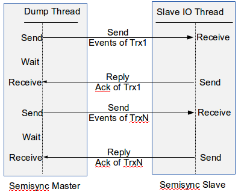
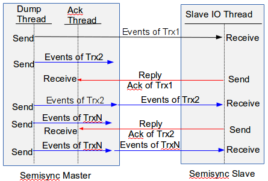
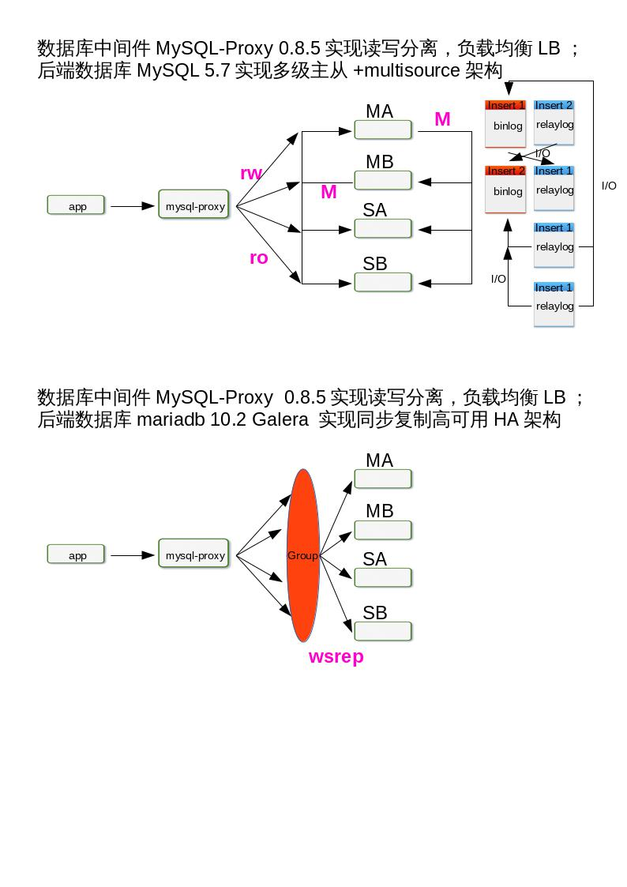
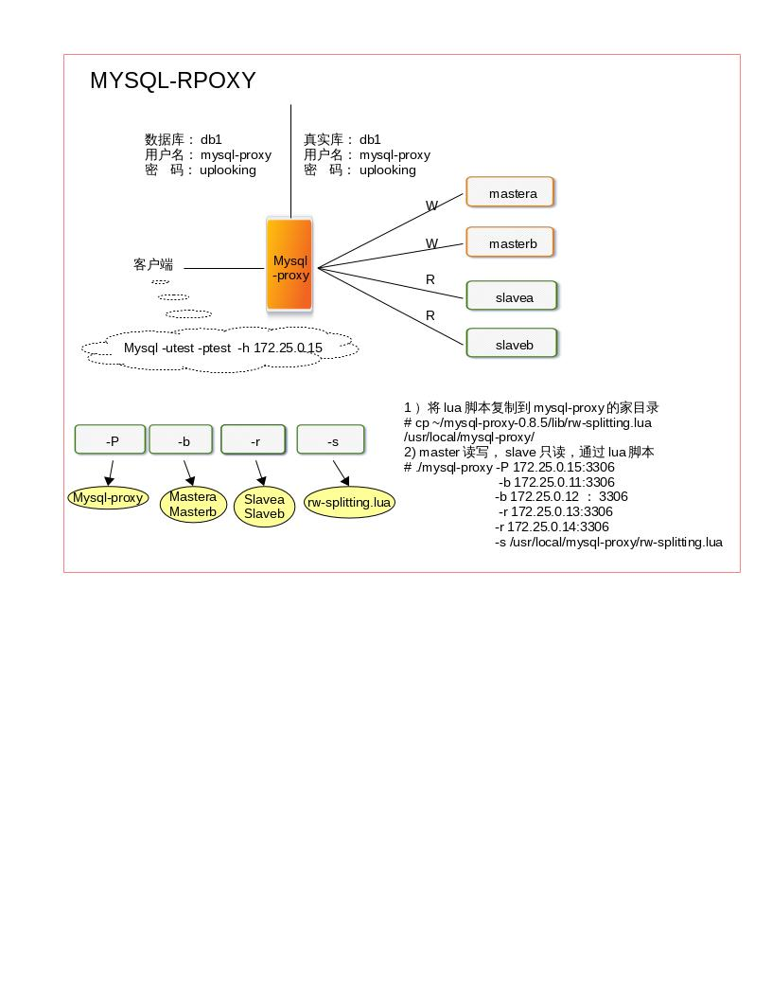
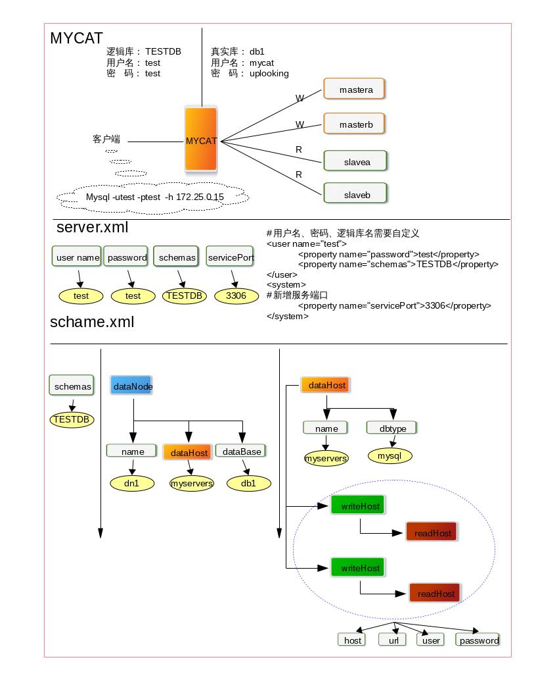

## 高可用性HA

[TOC]

### 什么是高可用

高可用性实际上有点像神秘的野兽。它通常是以百分比表示，这本身也是一种暗示：高可用性不是绝对的，只有相对更高的可用性。100%的可用性是不可能达到的。可用性的“9”规则是表示可用性目标最普遍的方法。你可能也知道，“5个9”表示99.999%的正常可用时间。换句话说，每年只允许5分钟的宕机时间。对于大多数应用这已经是令人惊叹的数字，尽量还有一些人试图获得更多的“9”。

每个应用对可用性的需求各不相同。在设定一个可用时间的目标之前，先问问自己，是不是确实需要达到这个目标。可用性每提高一点，所花费的成本都会远超之前；可用性的效果和开销的比例并不是线性的。需要保证多少可用时间，取决于能够承担多少成本。

高可用实际上是在宕机造成的损失与降低宕机时间所花费的成本之间取一个平衡。换句话说，如果需要花大量金钱去获取更好的可用时间，但所带来的收益却很低，可能就不值得去做。总的来说，应用在超过一定的点以后追求更高的可用性是非常困难的，成本也会很高，因此我们建议设定一个更现实的目标并且避免过渡设计。幸运的是，建立2个9或3个0的可用时间的目标可能并不困难，具体请款取决于应用。

### 导致宕机的原因

* 在运行环境的问题中，最普遍的问题是磁盘空间耗尽。
* 在性能问题中，最普遍的宕机原因确实是运行很糟糕的SQL，但也不一定都是这个原因，比如也有很多问题是由于服务器Bug或错误的行为导致的。
* 糟糕的Schema和索引设计是第二大影响性能的问题。
* 复制问题通常是由于主备数据不一致导致。
* 数据丢失问题通常由于DROP TABLE的误操作导致，并总是伴随着缺少可用备份的问题。

复制虽然被人们用来改善可用时间，但却也可能导致宕机。这主要是由于不确定的使用导致的，即便如此，它也阐明了一个普遍的情况：许多高可用策略可能会产生反作用。

### 如何实现高可用

* 降低故障率
* 优化架构

### 避免单点故障

#### 基于复制的冗余

前面我们已经学习MySQL Replication 的内容，如下架构：


MySQL 5.6 下的 semi-sync



MySQL 5.7 下的 semi-sync



#### MySQL 同步复制

当使用同步复制时，主库的事务只有在至少一个备库上提交才能认为其执行完成。这实现了两个目标：

* 当服务器崩溃时没有提交的事务会丢失，并且至少有一个备库有实时的数据副本。
* 大多数同步复制架构运行在主动-主动模式，这意味着每个服务器在任何时候都是故障转移的候选者，这使得通过冗余获得高可用性更加容易。

MySQL 到目前为止，（5.7版本）本身并不支持同步复制，但有两个基于MySQL的集群解决方案支持同步复制。

##### MySQL Cluster 集群

MySQL 中的同步复制首先出现在MySQL Clushter （NDB Cluster）。它在所有节点上进行同步的主-主复制。这意味着可以在任何节点上写入；这些节点拥有等同的读写能力。每一行都是冗余存储的，这样即使丢失一个节点，也不丢失数据，并且集群仍然能提供服务。尽管MySQL Cluster还不是适用于所有应用的完美解决方案，但正如我们在前一章提到的，在最近的版本中它做了非常快速的改进，现在已经拥有大量的新特性和功能：非索引数据的磁盘存储、增加数据节点能够在线扩展、使用ndinfo表来管理集群、配置和管理集群的脚本、多线程操作、下推（push-down）的关联操作（现在称为自适应查询本地化）、能够处理BLOB列和很多列的表、集中式的用户管理，以及通过像memcache协议一样的NDB API来实现NoSQL访问。在下一个版本中将包含最终一致运行模型，包括为跨数据中心的主动-主动复制提供事务冲突检测和跨WAN解决方案。简而言之，MySQL Cluster是一项引人注目的技术。

现在至少有两个为简化集群部署和管理提供附加产品的供应商：Oracle 针对 MySQL Cluster 的服务支持包含了 MySQL Cluster Manager 工具；Serveralines 提供了Cluster Control工具，该工具还能够帮助部署和管理复制集群。

##### Galera Cluster 集群

MariaDB作为Mysql的一个分支，在开源项目中已经广泛使用，例如大热的openstack，所以，为了保证服务的高可用性，同时提高系统的负载能力，集群部署是必不可少的。
 
MariaDB Galera Cluster 介绍

MariaDB集群是MariaDB同步多主机集群。它仅支持XtraDB/ InnoDB存储引擎（虽然有对MyISAM实验支持 - 看wsrep_replicate_myisam系统变量）。

主要功能:

- 同步复制
- 真正的multi-master，即所有节点可以同时读写数据库
- 自动的节点成员控制，失效节点自动被清除
- 新节点加入数据自动复制
- 真正的并行复制，行级
- 用户可以直接连接集群，使用感受上与MySQL完全一致

优势:

- 因为是多主，所以不存在Slavelag(延迟)
- 不存在丢失事务的情况
- 同时具有读和写的扩展能力
- 更小的客户端延迟
- 节点间数据是同步的,而Master/Slave模式是异步的,不同slave上的binlog可能是不同的

技术:

Galera集群的复制功能基于Galeralibrary实现,为了让MySQL与Galera library通讯，特别针对MySQL开发了wsrep API。

Galera插件保证集群同步数据，保持数据的一致性，靠的就是可认证的复制，工作原理如下图：


当客户端发出一个commit的指令，在事务被提交之前，所有对数据库的更改都会被write-set收集起来,并且将 write-set 纪录的内容发送给其他节点。

write-set 将在每个节点进行认证测试，测试结果决定着节点是否应用write-set更改数据。

如果认证测试失败，节点将丢弃 write-set ；如果认证测试成功，则事务提交。

> 软件的获取

http://classroom.example.com/materials/mariadb-10.2.repo

http://classroom.example.com/materials/thirdpart.repo

> 集群配置要求

1. 安装4个节点
2. 关闭第一个节点后重起服务，需要修改配置文件，
3. 关闭第三个节点，去查看错误日志，在集群中作插入动作，重起服务，看是否能够同步到数据。

> 详细步骤

>> 1.安装软件包
~~~
galera   25.3.15
jemalloc*                               
MariaDB-client  10.2         
MariaDB-server  10.2     
MariaDB-compat  10.2
~~~

需要先卸载mariadb-libs

```shell
# rpm -e mariadb-libs --nodeps
# rpm -e mariadb-common --nodeps
# yum install -y galera jemalloc* MariaDB-client  MariaDB-server MariaDB-compat
```

>> 2.初始化MariaDB数据库并启动MariaDB服务，并作安全加固

```shell
# systemctl start mysql
# mysql_secure_installation
# systemctl stop mysql
```

>> 3.配置

```shell
vim /etc/my.cnf.d/galera.cnf

[galera]
# Mandatory settings
wsrep_on=ON
wsrep_provider=/usr/lib64/galera/libgalera_smm.so
#启动节点时需要指定galera cluster的地址,作为cluster中第一个启动的节点,wsrep_cluster_address=gcomm://,对于后续启动的节点,wsrep_cluster_address=gcomm://node1,node2,node3
wsrep_cluster_address='gcomm://'
#所有node必须一样
wsrep_cluster_name='galera'
#节点地址
wsrep_node_address='172.25.0.11'
#节点名称
wsrep_node_name='galera1'
#Snapshot State Transter快照状态转移方法:mysqldump/rsync,默认mysqldump
wsrep_sst_method=rsync
#binlog的格式也有三种：STATEMENT，ROW，MIXED
binlog_format=row
default_storage_engine=InnoDB
#调整锁策略的
innodb_autoinc_lock_mode=2
bind-address=0.0.0.0
```

4.启动

```shell
systemctl start mysql

#查看目前mysql的端口
netstat -ntpl|grep sql
tcp        0      0 0.0.0.0:3306            0.0.0.0:*               LISTEN      12877/mysqld        
tcp        0      0 0.0.0.0:4567            0.0.0.0:*               LISTEN      12877/mysqld
```

>> 5.其他节点上做相同配置

依次启动其他节点,其他节点会根据配置自动加入集群并同步数据，一定要关闭selinux，或者设为0

```shell
[galera]
# Mandatory settings
wsrep_on=ON
wsrep_provider=/usr/lib64/galera/libgalera_smm.so
wsrep_cluster_address='gcomm://172.25.0.11'
wsrep_cluster_name='galera'
wsrep_node_address='172.25.0.12'
wsrep_node_name='<注意这里与解析的主机名相同>'
wsrep_sst_method=rsync

binlog_format=row
default_storage_engine=InnoDB
innodb_autoinc_lock_mode=2
bind-address=0.0.0.0
```

>> 6.观察日志

```shell
[root@mastera0 ~]# tail -f /var/log/mysqld.log
```


>> 7.在galera上查看集群状态

```shell
MariaDB [(none)]> show global status like 'wsrep_cluster%';
+--------------------------+--------------------------------------+
| Variable_name            | Value                                |
+--------------------------+--------------------------------------+
| wsrep_cluster_conf_id    | 14                                   |
| wsrep_cluster_size       | 2                                    |
| wsrep_cluster_state_uuid | ff8cb12b-168a-11e6-ba3c-b36f59743764 |
| wsrep_cluster_status     | Primary                              |
+--------------------------+--------------------------------------+

MariaDB [(none)]> show global status like 'wsrep_cluster%';
+--------------------------+--------------------------------------+
| Variable_name            | Value                                |
+--------------------------+--------------------------------------+
| wsrep_cluster_conf_id    | 15                                   |
| wsrep_cluster_size       | 3                                    |
| wsrep_cluster_state_uuid | ff8cb12b-168a-11e6-ba3c-b36f59743764 |
| wsrep_cluster_status     | Primary                              |
+--------------------------+--------------------------------------+
```

>> 8.测试

1.在一节点上新建表并插入数据以在其他实例上观测数据是否同步

2.测试节点故障机恢复A.masterb slavea B.mastera停掉之后，需要修改配置文件，才能重新加入。


我们可以关注几个关键的参数:

* `wsrep_connected = on` 链接已开启
* `wsrep_local_index = 1` 在集群中的索引值
* `wsrep_cluster_size =3 `集群中节点的数量
* `wsrep_incoming_addresses = 172.25.0.11:3306,172.25.0.12:3306,172.25.0.13:3306`

集群中节点的访问地址

### 故障转移和故障恢复

我们回忆一下，一开始我们只有一台数据库服务器，rhel7的操作系统，maraidb-server5.5版本。

* 1.1：用户少，数据量也不多，每天用tar打包压缩好，拷贝出来，这种方法每次都要停掉服务；  
* 1.2：tar打包太慢了，数据再增长会更慢；用LVM 快照方式，备份的时候要加读锁flush tables with read lock；瞬间完成后解锁unlock tables;再挂在拷贝出来；还原的时候数据大小决定还原时间长短
* 1.3：希望备份过程中保持数据一致性和服务可用性；改用mysqldump，结合二进制日志。每天早上8点做全备份；恢复的时候，先导入全备份，然后根据binlog做重演
* 1.4：用户数量越来越多，数据库从原来几个G到现在已经变成20个G了，用mysqldump命令太慢了，于是改用percona xtrabackup工具。并且制定了一个备份计划：

~~~
周一8：00 全备份；
周二8：00 增量备份；
周三8：00 增量备份；
周四8：00 增量备份；
周五8：00 增量备份；
周六8：00 增量备份；
周日8：00 增量备份；
恢复的时候，也很方便。
~~~

* 2.1：服务器宕机了，希望瞬间切换到另一台，于是添加一台服务器slavea，做主从同步。
* 2.2：防止从机单点故障，增加一台slaveb
* 2.3：如果 master 是单点故障,如何解决？多级主从 multi-source，两个主服务器，两个从服务器，作multi-source,如果一台主服务器宕掉了，那么从服务器会自动去找第二台主服务器。

#### 问题的提出

**两台master是否都能连呢？**

好了，现在我们前面的客户端要来连接数据库，是连接M1，还是M2呢?如果同时对M1和M2执行读写操作，在这个过程中，是否会出问题呢？我们可以来做个小游戏！找一个学生Tom连接M1，另一个学生Jack连接了M2，现在，他们同时对数据库进行写操作，修改db1.t1中的id=4的行，改为99，然后查看一下t1表的结果。

从结果看，同时多个用户对同一张表的同一个数据进行写操作，会有冲突的。所以写操作每次只给一台服务最好，但是如果用户不多，数据不多，问题也不大。

**当前的困境**

前端的应用程序无法使用多台数据库，前端只能指定一台数据库的ip地址，也就是说，如果你让前端应用连接M1，那么所有的读写操作都是通过M1，那么其他数据库除了热备的作用以外就没有了。这样很浪费性能，而且当我们前端的请求越来越多，一台数据库服务器会非常的吃力，既要响应读请求，还要响应写请求，他的压力会非常的大。如果M1宕机了，还要手动切换到M2，这样的效果并不是我们想要的，我们肯定希望他能瞬间切换。

另外，让前端应用连接slave就更不行了，如果在从机上触发写操作，那么主从同步将会被断开，因为从机的数据一定要和主机一模一样，不然就会有冲突了。

所以总结一下，现在我们遇到的困境：

1. 有多台数据库服务器，但是只能使用一台，不能作负载均衡（将前端用户的请求均衡地分配给后端的服务器）
2. 如果一台主服务器坏了，那么需要手动切换，不能做到瞬间自动切换
3. 两台slave只作为备份使用，浪费性能，虽然不能用来写，但是可以用来读取数据

从上面的总结来看，我们希望在这个架构下，能够实现更多的功能，比如：

1. 负载均衡	就是说能够均衡地分配前端的用户请求
2. 读写分离	两台master用来写，两台slave用来读，提升整体性能

#### 解决方案

**如何解决呢？**

* 第一种方案——在应用中处理故障转移，找开发人员作二次开发，将前端应用代码修改，让他能够实现上面的功能；
* 第二种方案——中间件解决方案，在前端应用和后台数据库之间添加一台代理服务器。通过数据库的mysql协议去转发sql语句。如果后面数据库是oracle数据库，那么这个反向代理服务器就应该能够支持oracle的协议，监听oracle的端口，能跟oracle进行通信。

我们来讲第二种方法。

 #### 什么是数据库代理服务器

 如果一个服务器能够支持数据库的协议，并且能够转发sql语句，我们就把他称之为数据库代理服务器。

> 负载均衡

数据库代理和web服务器的代理都需要具备一些基本代理服务器的功能，比如，负载均衡，至少要能实现负载均衡，我们后端有多台服务器，那么代理服务器能够将前端用户的请求以相对均衡的方式分担到后端多台服务器上面。

> 读写分离

如果我们后端的数据库不存在主和从的关系，大家都是master，任何一条语句都能写，那么发给谁都没有太大关系；但是如果后面是master和slave的关系，那么我们说从机是不能进行写操作的，所以在负载均衡，分发sql的过程当中，你的代理服务器要能够识别读和写，然后把读操作都分发给slave，写分发给master，我们把这个功能叫做读写分离。

负载均衡和读写分离是数据库代理服务器当中最基本的两个功能。你用任何一个数据库代理服务器，都需要这两个功能。如果不具备这两个功能，那基本上没人用。

作为代理服务器，他存在于我们客户端和数据库服务器之间，后端的数据库服务器不需要知道客户端的ip地址，他只要知道谁来找我的，谁发请求给我的，对于客户端来说，他不需要知道数据库服务器的地址，他只要知道代理就行了，后面怎么执行他不管。也就是说现在客户端不再直接与数据库服务器通信了，而是通过代理服务器进行通讯，代理服务器实现负载均衡，实现读写分离。

> 分库、分表、分片

进阶级的还会有其他的功能，比如一些优秀的代理服务器，可以实现分库、分表、分片；sql路由并发查询；sql过滤

举例说明：

4个库db1 db2 db3 db4，后面4台数据库做主从同步，他们的数据都是相同的，现在用户发起请求要访问db1，db1上有5张表，经过轮询，代理服务器将请求分发给了M1；如果用户再次访问db1，那么代理服务器还会将请求发给M1，M1上刚刚读过一个db1的文件，会产生缓存，所以再读一次的时候速度就很快了；如果轮询没有给到M1，而是给了S1，那么S1就要再读一次db1的文件，产生db1的缓存；如果用户再访问，可能这次分发给了S2，那么S2也要再读一次db1的文件，并产生db1的缓存。最终的结果就是四台机器将相同的数据都缓冲了，最终导致的问题就是我们的内存会有所浪费，因为内存里面缓冲的是一样的数据。而我们后端有4个库，不单单是db1，还有db2，3，4，用户在负载均衡的过程中，最终导致的结果是四台服务器全部把四个库的所有的表都尝试做缓冲，这四台服务器中有大量的数据是重复的，我们认为这是一种非常大的浪费，我们想减少这些性能消耗，怎么做呢？

在第一台数据只缓冲db1，第二台db2，第三台db3，第四台db4，用户访问哪个库就分给哪台服务器，这是一种比较好的方法。这样的话，能够保证用户发出请求后能够较快地返回结果，服务器的内存缓冲得到充分的利用。不单单提高了性能，还节约了内存，避免了数据的重复。

相同的理念，刚刚举的是库的例子，同样表也同样适用，不同的服务器缓冲不同的表。

这是我们将的分库、分表的功能，还有一个分片，指的是什么呢？

举例说明：只有t1一张表，发给谁呢？四台机器轮询地发，那么t1表的内容被四台机器全部缓冲下来，又会浪费内存。而且机器数量越多，性能浪费越大。那么我们怎么办呢？

可以这么做：

|服务器|缓冲|||
|:--|:--|:--|:--|
|m1|	1|	5|	9	|
|m2	|2	|6|	10 |
|s1	|3	|7|	11 |
|s2	|4	|8|	12 |

按照行来分发，这样的话问题就解决拉！这就是分片，这样就不会浪费性能，数据就不会重复拉！

> sql路由并发查询

案例：如果用户要执行`select * from t1 where id=1 or id=8;`怎么办呢？代理服务器是分发给m1还是s2呢？

当这条语句经过代理服务器的时候，被一分为二，一条是`select * from t1 where id=1;`一条是`select * from t1 where id=8;` 然后同时发给两台不同的服务器，将查询结果取出来，合并一下，然后返回给前端。这个叫做sql路由并发查询。

#### 目前市面上的数据库代理服务器

我们会去讲目前市面上的一些数据库代理服务器。目前数据库代理好用的真心比较少，非常少，包括mysql官方也开发过代理，非常地烂，破东西，开发了好多年了，一直很烂；然后呢，淘宝有自己的代理，但没有开源出来，或者说开源出来了不能用，他的代理要用在他们的那套基础架构上，而基础架构没开源出来，仅程序开源出来没用，没有运行环境；奇虎360对mysql-proxy做了更改，性能做了优化，优化下来的效果还可以，比官方好很多，运行的环境虽然开源出来了，但是不能在el7上跑，el6、el5可以跑，这东西没办法讲，我们知道一下，以后大家做代理不要用el7，用el5、el6可以跑着试试看；然后会去讲另外一个代理mycat，前生是阿里巴巴的数据库代理，阿里巴巴和淘宝用的数据库代理是两套程序，阿里巴巴之前的数据库代理各种坑，坑到他的开发人员实在受不了了，然后就自己组织了一批人，开始重写代码，将各种坑补掉，重写出来的这个开源产品呢就叫mycat，有理由相信mycat以后会越来越好，因为他有一个非常坚实的基础，就是他是拿阿里巴巴的系统，经过线上生产环境验证的一个代理服务器，拿他来改的，而且还补全了他很多的不足，把他变成了一个企业级的产品，目前mycat的用户并不算多，但是他的市场份额一直在逐步增加，从开源领域的代理服务器来讲，这个mycat还是非常不错的。

我们会举两个例子，mysql官方的 mysql-proxy，其实我是不想讲mysql官方的，讲这东西也没太大用处，他有些自己的缺点，当然了，这些缺点并不是不能克服的，可以解决，解决的前提是你需要会开发，他里面有一些代码要你自己改，因为他官方的代码比较烂。另一个就是mycat。去实现两个功能，负载均衡和读写分离。

|DBPROXY|||
|:--|:--|:--|
|Mysql-proxy|	lua脚本| 魔兽世界|
|tddl|	淘宝的数据库代理|	没有运行环境|
|atlas|	奇虎360的数据库代理|	rhel7不能用|
|corber|		阿里巴巴|	测试版不能用|
|mycat	|	阿里巴巴二次开发|商业型产品|


首先，我们来看一下我们项目的一个网络架构。




##### mysql-proxy



> 数据库中间件 mysql-proxy 0.8.5 实现 读写分离负载均衡

>> 1.网络拓扑规划

|服务器|IP|software|
|:--|:--|:--|
|mastera0|	172.25.0.11|	mariadb5.5|
|masterb0|	172.25.0.12| 	mariadb5.5|
|slavea0|		172.25.0.13|	mariadb5.5|
|slaveb0|		172.25.0.14|	mariadb5.5|
|dbproxy0|	172.25.0.15|	mysql-proxy0.8.5|

>> 2.安装软件

1）无密码ssh登陆虚拟机

```shell
 ssh-keygen -t rsa
 for i in 10 11 12 13 14 15 ;do ssh-copy-id root@172.25.0.$i ;done
```

2）关闭selinux,firewalld

```shell
for i in 10 11 12 13 14 15 ;\
do ssh root@172.25.0.$i \
\"sed -i '/^SELINUX/s/SELINUX=enforcing/SELINUX=disabled/' /etc/selinux/config;\
grep -v "^#" /etc/selinux/config;\
systemctl stop firewalld \";done
```

3）需要安装的软件包`wget，net-tools,rpc-bind,nfs-utils,vim`

`for i in 10 11 12 13 14 ;do ssh root@172.25.0.$i "yum install -y wget net-tools rpc-bind nfs-utils vim ";done`

4）查看ip地址`ip addr`

5）修改yum源，根据实际需求来

从服务器上下载到/etc/yum.repos.d/目录

```shell
cd /etc/yum.repos.d && \
wget http://classroom.example.com/materials/mariadb-10.2.repo;\
wget http://classroom.example.com/materials/mysql-5.7.repo;\
wget http://classroom.example.com/materials/thirdpart.repo

yum clean all && yum makecache
```

6) 安装mariadb-server，并启动服务

```shell
for i in 11 12 13 14 ;do ssh root@172.25.0.$i "yum install -y mariadb-server" ;done
for i in 11 12 13 14 ;do ssh root@172.25.0.$i "systemctl start mariadb" ;done
```

7) 安装依赖包

`yum install gcc* lua lua-devel libevent libevent-devel glib2 glib2-devel pkgconfig mariadb-devel flex`

8) 安装mysql-proxy

```shell
wget http://172.25.254.254/content/courses/db100/rhel7.2/materials/mysql-proxy-0.8.5.tar.gz
tar -zxf mysql-proxy-0.8.5.tar.gz
cd mysql-proxy-0.8.5
./configure --prefix=/usr/local/mysql-proxy
make
make install
```

>> 3.配置

设置密码

```shell
for i in 11 12 13 14 ;do ssh root@172.25.0.$i "mysqladmin -uroot password uplooking" ;done
```

1）mastera0

```shell
mysql -uroot -puplooking
> create database db1;
> use db1;
> create table t1 (num int not null);
> insert into t1 values (1);
> grant all on db1.* to 'mysql-proxy'@172.25.0.15 identified by 'uplooking';
> flush privileges;
```

2）slavea0

```shell
mysql -uroot -puplooking
> create database db1;
> use db1;
> create table t1 (num int not null);
> insert into t1 values (2);
> grant all on db1.* to 'mysql-proxy'@172.25.0.15 identified by 'uplooking';
> flush privileges;
```

3) 进入mysql-proxy的家目录/usr/local/mysql-proxy

```shell
cd /usr/local/mysql-proxy/;ls
# bin  include  lib  libexec  share
cd bin;ls
# mysql-binlog-dump  mysql-myisam-dump  mysql-proxy
./mysql-proxy --help-all---》查看命令帮助
./mysql-proxy -P 172.25.0.15:3306 -b 172.25.0.11:3306 -b 172.25.0.13:3306 &
netstat -ntalp|grep 3306
# tcp        0      0 172.25.0.15:3306        0.0.0.0:*               LISTEN      24483/./mysql-proxy
```

>> 4.测试

客户端 172.25.0.10

```shell
mysql -u'mysql-proxy' -puplooking -h172.25.0.15
> use db1;
> select * from t1;
+-----+
| num |
+-----+
|   1 |
+-----+
```

将mastera0的服务关闭后，再查看表1中的内容

```shell
systemctl stop mariadb

mysql -u'mysql-proxy' -puplooking -h172.25.0.15
> select * from t1;
ERROR 2013 (HY000): Lost connection to MySQL server during query
MariaDB [db1]> select * from t1;
ERROR 2006 (HY000): MySQL server has gone away
No connection. Trying to reconnect...
Connection id:    5
Current database: db1

+-----+
| num |
+-----+
|   2 |
+-----+
```

>> 5.配置

1）将lua脚本复制到mysql-proxy的家目录

`cp ~/mysql-proxy-0.8.5/lib/rw-splitting.lua /usr/local/mysql-proxy/`

2) mastera0读写，slavea0只读，通过lua脚本

`./mysql-proxy -P 172.25.0.15:3306 -b 172.25.0.11:3306 -r 172.25.0.13:3306 -s /usr/local/mysql-proxy/rw-splitting.lua`

>> 6.测试

1）客户端上登陆后插入33；

```shell
mysql -u'mysql-proxy' -puplooking -h172.25.0.15
> use db1;
> insert into t1 values (33);
```

2）mastera0查看t1表；

```shell
mysql -u'mysql-proxy' -puplooking -h172.25.0.15
> use db1;
> select * from t1;
+-----+
| num |
+-----+
|   1 |
|  33 |
+-----+
```

3）slavea0查看t1；

```shell
mysql -u'mysql-proxy' -puplooking -h172.25.0.15
> select * from t1;
+-----+
| num |
+-----+
|   2 |
+-----+
```

4）客户端查看t1表；

```shell
mysql -u'mysql-proxy' -puplooking -h172.25.0.15
> select * from t1;
+-----+
| num |
+-----+
|   2 |
+-----+
```


##### mycat

2013 年阿里的 Cobar 在社区使用过程中出现存在一些比较严重的问题,及其使用限制，经过 Mycat 第一次改良,第一代改良版——Mycat 诞生。 Mycat 开源之后,一些 Cobar 的用户参与了 Mycat 的开发,最终 Mycat 发展成为一个由众多软件公司的实力派架构师和资深开发人员维护的社区型开源软件。

* Mycat 捐赠地址 :http://www.mycat.io/donate.html
* Mycat 官网网站:http://www.mycat.io/
* Mycat 源码:https://github.com/MyCATApache/Mycat-Server
* Mycat 下载地址:https://github.com/MyCATApache/Mycat-download




>> 1.网络拓扑规划

|服务器|IP|software|
|:--|:--|:--|
|mastera0|	172.25.0.11|	mariadb5.5|
|masterb0|	172.25.0.12| 	mariadb5.5|
|slavea0|		172.25.0.13|	mariadb5.5|
|slaveb0|		172.25.0.14|	mariadb5.5|
|dbproxy0|	172.25.0.15|	mysql-proxy0.8.5|

>> 2.安装软件

**安装jdk软件** 因为mycat是用java语言编写的,并宣告家目录

```shell
# wget http://172.25.254.254/content/class/mariadb/mycat/jdk-7u79-linux-x64.rpm
# wget http://172.25.254.254/content/class/mariadb/mycat/Mycat-server-1.5.1-RELEASE-20160328130228-linux.tar.gz
# rpm -ivh jdk-7u79-liunux-x64.rpm
# rpm -ql jdk|head
# export JAVA_HOME='/usr/java/jdk1.7.0_79'
```

临时生效，如果要永久生效需要写到bash启动脚本中例如/etc/bashrc

**安装mycat** 直接解压缩即可使用

```shell
*************************************
bin	mycat启动脚本
conf	schema.xml	数据库配置
	    server.xml	逻辑库配置
*************************************
[root@dbproxy0 ~]# tar xf Mycat-server-1.5.1-RELEASE-20160328130228-linux.tar.gz -C /usr/local
[root@dbproxy0 ~]# cd /usr/local;ls
[root@dbproxy0 local]# cd mycat;ll
[root@dbproxy0 mycat]# chmod 755 * -R
```

>> 4.配置文件

```shell
[root@dbproxy0 mycat]# vim conf/schema.xml
[root@dbproxy0 mycat]# vim conf/server.xml
```

~~~
server.xml
#用户名、密码、逻辑库名需要自定义
<user name="test">
	<property name="password">test</property>   注意：此处test是密码
	<property name="schemas">TESTDB</property>
</user>
<system>
#新增服务端口
	<property name="servicePort">3306</property>
</system>
****************************
<mycat:schema xmlns:mycat="http://org.opencloudb/">

        <schema name="TESTDB" checkSQLschema="false" sqlMaxLimit="100">
                <!-- auto sharding by id (long) -->
                <table name="travelrecord" dataNode="dn1,dn2,dn3" rule="auto-sharding-long" />

                <table name="t1" dataNode="dn1" />
                <!-- global table is auto cloned to all defined data nodes ,so can join
                        with any table whose sharding node is in the same data node -->
                <table name="company" primaryKey="ID" type="global" dataNode="dn1,dn2,dn3" />
                <table name="goods" primaryKey="ID" type="global" dataNode="dn1,dn2" />
                <!-- random sharding using mod sharind rule -->
                <table name="hotnews" primaryKey="ID" dataNode="dn1,dn2,dn3"
                        rule="mod-long" />
                <!-- <table name="dual" primaryKey="ID" dataNode="dnx,dnoracle2" type="global"
                        needAddLimit="false"/> <table name="worker" primaryKey="ID" dataNode="jdbc_dn1,jdbc_dn2,jdbc_dn3"
                        rule="mod-long" /> -->
                <table name="employee" primaryKey="ID" dataNode="dn1,dn2"
                        rule="sharding-by-intfile" />
                <table name="customer" primaryKey="ID" dataNode="dn1,dn2"
                        rule="sharding-by-intfile">
                        <childTable name="orders" primaryKey="ID" joinKey="customer_id"
                                parentKey="id">
                                <childTable name="order_items" joinKey="order_id"
                                        parentKey="id" />
                        </childTable>
			<childTable name="customer_addr" primaryKey="ID" joinKey="customer_id"
                                parentKey="id" />
                </table>
                <!-- <table name="oc_call" primaryKey="ID" dataNode="dn1$0-743" rule="latest-month-calldate"
                        /> -->
        </schema>


<dataNode name="dn1" dataHost="localhost1" database="db1" />
<dataHost name="localhost1" maxCon="1000" minCon="10" balance="3"
                writeType="0" dbType="mysql" dbDriver="native" switchType="1"  slaveThreshold="100">
                <heartbeat>select user()</heartbeat>
                <!-- can have multi write hosts -->
                <writeHost host="mastera" url="172.25.0.11:3306" user="mysqlproxy"
                        password="uplooking">

                <readHost host="slavea" url="172.25.0.13:3306" user="mysqlproxy"
                        password="uplooking" />
                <readHost host="slaveb" url="172.25.0.14:3306" user="mysqlproxy"
                        password="uplooking" />
                </writeHost>

                <writeHost host="masterb" url="172.25.0.12:3306" user="mysqlproxy"
                        password="uplooking">

                <readHost host="slavea" url="172.25.0.13:3306" user="mysqlproxy"
                        password="uplooking" />
                <readHost host="slaveb" url="172.25.0.14:3306" user="mysqlproxy"
                        password="uplooking" />
                </writeHost>
</dataHost>

</mycat:schema>
~~~

>> 5）启动服务

```shell
[root@dbproxy0 mycat]# bin/mycat start
[root@dbproxy0 mycat]# netstat -luntp|grep tcp
tcp        0      0 0.0.0.0:22              0.0.0.0:*               LISTEN      1190/sshd           
tcp        0      0 127.0.0.1:25            0.0.0.0:*               LISTEN      1853/master         
tcp        0      0 127.0.0.1:32000         0.0.0.0:*               LISTEN      3168/java           
tcp6       0      0 :::3306                 :::*                    LISTEN      3168/java           
tcp6       0      0 :::9066                 :::*                    LISTEN      3168/java           
tcp6       0      0 :::46764                :::*                    LISTEN      3168/java           
tcp6       0      0 :::22                   :::*                    LISTEN      1190/sshd           
tcp6       0      0 ::1:25                  :::*                    LISTEN      1853/master         
tcp6       0      0 :::1984                 :::*                    LISTEN      3168/java           
tcp6       0      0 :::43493                :::*                    LISTEN      3168/java
```

>> 6）测试

mycat的master每次之能用一个来写，以这种方法来防止两台master产生冲突。
当其中一台master宕机以后，可以自动切换。


**balance 属性**

负载均衡类型有 3 种:

1. balance="0", master可读可写，slave不使用，也就是不启动读写分离
2. balance="1",master可读可写，slave只读；stand by writeHost 参与 select 询句癿负载均衡
3. balance="2",master可读可写，slave只读；所有读操作都随机的在 master和slave上分配。
4. balance="3",master只写，slave只读；1.4版本以后有

**switchType 属性**
- -1 表示不自动切换
- 1 默认值,自动切换
- 2 基于 MySQL 主从同步的状态决定是否切换

**更多内容** 请查看《Mycat 权威指南》

### 实战项目

> 实战项目1： 数据库中间件 mysql-proxy 0.8.5 实现 读写分离负载均衡，后端数据库服务器为 MySQL 5.7 M-M-S-S Multisource Replication 高可用架构

```shell
软件名	mysql-proxy
	http://classroom.example.com/materials/mysql-proxy-0.8.5.tar.gz
服务启动脚本
	mysql-proxy
		-P, --proxy-address=<host:port> 	4040	指定mysql-proxy运行的位置和端口号
		-b, --proxy-backend-addresses=<host:port>	可读可写
		-r, --proxy-read-only-backend-addresses=<host:port> 只读
		-s, --proxy-lua-script=<file>			lua脚本		


# 安装并启动mysql-proxy

1）依赖关系
yum install -y  gcc* libev lua  lua-devel libevent libevent-devel glib2 glib2-devel pkgconfig mariadb-devel flex
2）源码编译
1.configure
2.make
3.make install
---------------
3）启动服务
mysql-proxy -P 172.25.0.15:3306 -b 172.25.0.11:3306 -b 172.25.0.12:3306 -r 172.25.0.13:3306 -r 172.25.0.14:3306 -s /usr/local/mysql-proxy/rw-splitting.lua

注意，启动服务之前需要：
	1）关闭所有服务器的selinux和firewalld
	2）后端真实数据库需要给dbproxy授权

---------------
mysql-proxy详细步骤

1.网络拓扑规划
mastera0	172.25.0.11	mariadb5.7 	mysql-5.7.repo
masterb0	172.25.0.12 	mariadb5.7 	mysql-5.7.repo
slavea0		172.25.0.13	mariadb5.7 	mysql-5.7.repo
slaveb0		172.25.0.14	mariadb5.7	mysql-5.7.repo
dbproxy0	172.25.0.15	mysql-proxy0.8.5 thirdpart.repo
2.安装软件
1）无密码ssh登陆虚拟机
# ssh-keygen -t rsa
# for i in 10 11 12 13 14 15 ;do ssh-copy-id root@172.25.0.$i ;done

2）关闭selinux,firewalld
for i in 10 11 12 13 14 15 ;\
do ssh root@172.25.0.$i \
"sed -i '/^SELINUX/s/SELINUX=enforcing/SELINUX=disabled/' /etc/selinux/config;\
grep -v "^#" /etc/selinux/config;\
systemctl stop firewalld;setenforce 0 ";done

3）需要安装的软件包wget，net-tools,rpc-bind,nfs-utils,vim
for i in 10 11 12 13 14 ;do ssh root@172.25.0.$i "yum install -y wget net-tools rpc-bind nfs-utils vim ";done

4）查看ip地址ip addr
5）修改yum源，根据实际需求来
从服务器上下载到/etc/yum.repos.d/目录

6) mastera--slaveb四台数据库服务器，安装mysql5.7，并启动服务,修改初始密码
为了测试中间件的功能，分别创建db1.t1
mastera	db1.t1 (1,'mastera')
masterb db1.t1 (1,'masterb')
slavea db1.t1 (1,'slavea')
slaveb db1.t1 (1,'slaveb')

7) dbproxy安装依赖包 (需要第三方yum源 thirdpart.repo)
yum install -y  gcc* libev lua  lua-devel libevent libevent-devel glib2 glib2-devel pkgconfig mariadb-devel flex

8) 安装mysql-proxy
# wget http://172.25.254.254/content/courses/db100/rhel7.2/materials/mysql-proxy-0.8.5.tar.gz
# tar -zxf mysql-proxy-0.8.5.tar.gz
# cd mysql-proxy-0.8.5
# ./configure --prefix=/usr/local/mysql-proxy
# make
# make install


3) 进入mysql-proxy的家目录/usr/local/mysql-proxy
# cd /usr/local/mysql-proxy/;ls
bin  include  lib  libexec  share
# cd bin;ls
mysql-binlog-dump  mysql-myisam-dump  mysql-proxy
# ./mysql-proxy --help-proxy  
# 将lua脚本复制到mysql-proxy的家目录
# cp ~/mysql-proxy-0.8.5/lib/rw-splitting.lua /usr/local/mysql-proxy/
# 启动服务
# mysql-proxy -P 172.25.0.15:3306 -b 172.25.0.11:3306 -b 172.25.0.12:3306 -r 172.25.0.13:3306 -r 172.25.0.14:3306 -s /usr/local/mysql-proxy/rw-splitting.lua
# 查看mysql-proxy监听端口号
# netstat -ntalp|grep 3306
tcp        0      0 172.25.0.15:3306        0.0.0.0:*               LISTEN      24483/./mysql-proxy

4.workstation测试(需要安装mariadb客户端，或者mysql客户端)
客户端172.25.0.10
# mysql -u'dbproxy' -p'Uploo00king' -h172.25.0.15
MySQL [(none)]> select * from db1.t1;
+----+---------+
| id | name    |
+----+---------+
|  1 | mastera |
+----+---------+
1 row in set (0.00 sec)


***************************************
#将mastera0的服务关闭后，再查看表1中的内容
# systemctl stop mysqld
****************************************

MySQL [(none)]> select * from db1.t1;
ERROR 2013 (HY000): Lost connection to MySQL server during query
MySQL [(none)]> select * from db1.t1;
ERROR 2006 (HY000): MySQL server has gone away
No connection. Trying to reconnect...
Connection id:    9
Current database: *** NONE ***

+----+---------+
| id | name    |
+----+---------+
|  1 | masterb |
+----+---------+
1 row in set (0.00 sec)

***************************************
#插入数据，查看插入到哪个服务器中了
****************************************  
MySQL [(none)]> insert into db1.t1 values (2,'test');
Query OK, 1 row affected (0.04 sec)
MySQL [(none)]> select @@hostname;
+----------------------+
| @@hostname           |
+----------------------+
| masterb0.example.com |
+----------------------+
1 row in set (0.00 sec)


***************************************
#将masterb0的服务关闭后，再插入数据
# systemctl stop mysqld
****************************************

MySQL [(none)]> insert into db1.t1 values (100,'oo');
ERROR 2013 (HY000): Lost connection to MySQL server during query

MySQL [(none)]> select @@hostname;
ERROR 2013 (HY000): Lost connection to MySQL server during query
MySQL [(none)]> select @@hostname;
ERROR 2006 (HY000): MySQL server has gone away
No connection. Trying to reconnect...
Connection id:    7
Current database: *** NONE ***

+---------------------+
| @@hostname          |
+---------------------+
| slavea0.example.com |
+---------------------+
1 row in set (0.01 sec)


***************************************
#将mastera0的服务启动后，再插入数据
# systemctl start mysqld
****************************************

MySQL [(none)]> begin;
Query OK, 0 rows affected (0.00 sec)

MySQL [(none)]> select @@hostname;
+----------------------+
| @@hostname           |
+----------------------+
| mastera0.example.com |
+----------------------+
1 row in set (0.00 sec)

MySQL [(none)]> insert into db1.t1 values (101,'oo');
Query OK, 1 row affected (0.00 sec)

MySQL [(none)]> commit;
Query OK, 0 rows affected (0.07 sec)


MySQL [(none)]> select @@hostname;
+---------------------+
| @@hostname          |
+---------------------+
| slavea0.example.com |
+---------------------+
1 row in set (0.00 sec)

MySQL [(none)]> select * from db1.t1;
+----+--------+
| id | name   |
+----+--------+
|  1 | slavea |
+----+--------+
1 row in set (0.00 sec)

***************************************
#此时发现，写操作连接mastera，读操作连接slavea
****************************************
```

> 实战项目2：数据库中间件 mysql-proxy 0.8.5 实现 读写分离负载均衡，后端数据库服务器为 Mariadb 10.2 Galera Cluster 同步复制高可用架构

> 实战项目3: 数据库中间件 Mycat 实现 读写分离负载均衡，后端数据库服务器为 Mariadb 10.2 Galera Cluster 同步复制高可用架构

### 总结

1. Galera Cluster是MariaDB的一个双活多主集群,其可以使得MariDB的所有节点保持同步,Galera为MariaDB提供了同步复制(相对于原生的异步复制),因此其可以保证HA,且其当前仅支持XtraDB/InnoDB存储引擎(扩展支持MyISAM),并且只可在Linux下使用。
2. mariadb10.2的galera版本和之前版本有所区别，需要注意
3. mysql-proxy还没有正式版，问题比较多，安装需要源码编译，使用lua脚本实现读写分离；
4. mycat是目前开源里面做的最好的数据库代理服务器，tar包解压到制定目录就能使用，但是注意需要安装jdk，并宣告java家目录的位置。
