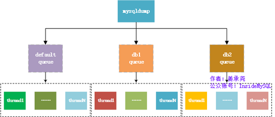
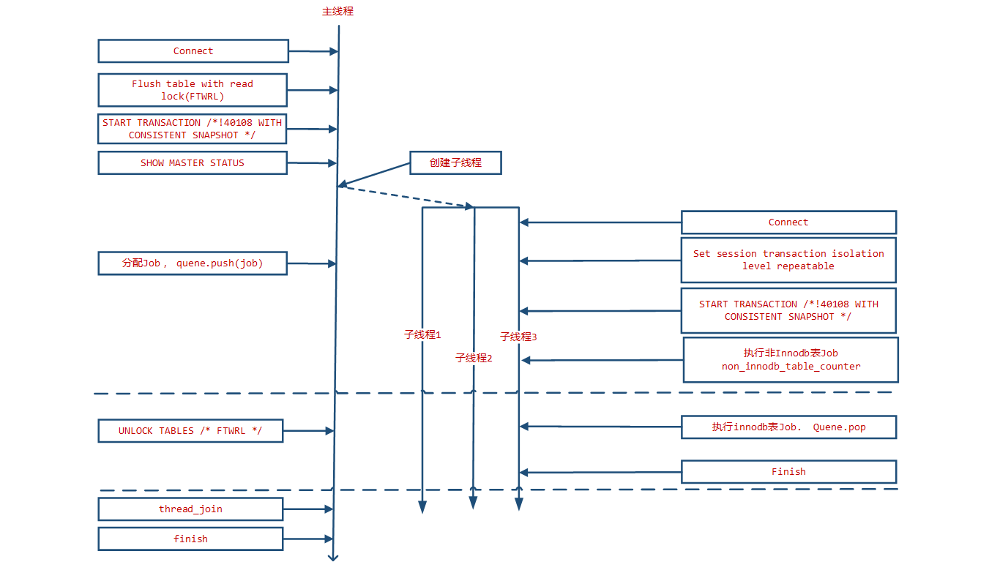

# MySQL逻辑备份工具mysqldump,mysqlpump,mydumper

[TOC]

## mysqldump

mysql经典逻辑备份工具

参数说明，具体的参数可以用mysqldump --help查看。

比较重要的几个参数

①：--single-transaction

通过将导出操作封装在一个事务(Repeatable Read)内来使得导出的数据是一个一致性快照。只有当表使用支持MVCC的存储引擎（目前只有InnoDB）时才可以工作；其他引擎不能保证导出是一致的。当导出开启了–single-transaction选项时，要确保导出文件有效（正确的表数据和二进制日志位置），就要保证没有其他连接会执行如下语句：ALTER TABLE, DROP TABLE, RENAME TABLE, TRUNCATE TABLE，这会导致一致性快照失效。这个选项开启后会自动关闭lock-tables。并且在mysql5.7.11之前，--default-parallelism大于1的时候和此参也互斥，必须使用--default-parallelism=0。5.7.11之后解决了--single-transaction和--default-parallelism的互斥问题。

②：--master-data


这个选项可以把binlog的位置和文件名添加到输出中，如果等于1，将会打印成一个CHANGE MASTER命令；如果等于2，会加上注释前缀。并且这个选项会自动打开–lock-all-tables，除非同时设置了–single-transaction（这种情况下，全局读锁只会在开始dump的时候加上一小段时间，不要忘了阅读–single-transaction的部分）。在任何情况下，所有日志中的操作都会发生在导出的准确时刻。这个选项会自动关闭–lock-tables。打开该参数需要有reload权限，并且服务器开启binlog。

③：--lock-all-tables ，-x

锁定所有库中所有的表。这是通过在整个dump的过程中持有全局读锁来实现的。会自动关闭–single-transaction 和 –lock-tables。

④：--lock-tables，-l

备份某个库就锁该库的所有表，用READ LOCAL来锁表。MyISAM允许并发写入，因为锁表只针对指定的数据库，不能保证物理上的一致性，不同库的表备份完成时会有不同的状态。用–skip-lock-tables来关闭。

⑤：--flush-logs，-F

在开始导出前刷新服务器的日志文件。注意，如果你一次性导出很多数据库（使用--databases= 或--all-databases 选项），导出每个库时都会触发日志刷新。例外是当使用了--lock-all-tables、--master-data或--single-transaction时：日志只会被刷新一次，那个时候所有表都会被锁住。所以如果你希望你的导出和日志刷新发生在同一个确定的时刻，你需要使用--lock-all-tables、--master-data和--single-transaction配合 –flush-logs。

⑥：--opt

该参数默认开启，表示快递启动--add-drop-table --add-locks --create-options --disable-keys --extended-insert --lock-tables --quick --set-charset选项，通过 --skip-opt 关闭。

--all-databases  , -A
导出全部数据库。

--all-tablespaces  , -Y
导出全部表空间。

--no-tablespaces  , -y
不导出任何表空间信息。

--add-drop-database
每个数据库创建之前添加drop数据库语句。

--add-drop-table
每个数据表创建之前添加drop数据表语句。(默认为打开状态，使用--skip-add-drop-table取消选项)

--add-locks
在每个表导出之前增加LOCK TABLES并且之后UNLOCK  TABLE。(默认为打开状态，使用--skip-add-locks取消选项)

--allow-keywords
允许创建是关键词的列名字。这由表名前缀于每个列名做到。

--apply-slave-statements
在'CHANGE MASTER'前添加'STOP SLAVE'，并且在导出的最后添加'START SLAVE'。

--character-sets-dir
字符集文件的目录

--comments
附加注释信息。默认为打开，可以用--skip-comments取消

--compatible
导出的数据将和其它数据库或旧版本的MySQL 相兼容。值可以为ansi、mysql323、mysql40、postgresql、oracle、mssql、db2、maxdb、no_key_options、no_tables_options、no_field_options等，
要使用几个值，用逗号将它们隔开。它并不保证能完全兼容，而是尽量兼容。

--compact
导出更少的输出信息(用于调试)。去掉注释和头尾等结构。可以使用选项：--skip-add-drop-table  --skip-add-locks --skip-comments --skip-disable-keys

--complete-insert,  -c
使用完整的insert语句(包含列名称)。这么做能提高插入效率，但是可能会受到max_allowed_packet参数的影响而导致插入失败。

--compress, -C
在客户端和服务器之间启用压缩传递所有信息

--create-options,  -a
在CREATE TABLE语句中包括所有MySQL特性选项。(默认为打开状态)

--databases,  -B
导出几个数据库。参数后面所有名字参量都被看作数据库名。

--debug
输出debug信息，用于调试。默认值为：d:t:o,/tmp/mysqldump.trace

--debug-check
检查内存和打开文件使用说明并退出。

--debug-info
输出调试信息并退出

--default-character-set
设置默认字符集，默认值为utf8

--delayed-insert
采用延时插入方式（INSERT DELAYED）导出数据

--delete-master-logs
master备份后删除日志. 这个参数将自动激活--master-data。

--disable-keys
对于每个表，用/*!40000 ALTER TABLE tbl_name DISABLE KEYS */;和/*!40000 ALTER TABLE tbl_name ENABLE KEYS */;语句引用INSERT语句。这样可以更快地导入dump出来的文件，因为它是在插入所有行后创建索引的。该选项只适合MyISAM表，默认为打开状态。

--dump-slave
该选项将导致主的binlog位置和文件名追加到导出数据的文件中。设置为1时，将会以CHANGE MASTER命令输出到数据文件；设置为2时，在命令前增加说明信息。该选项将会打开--lock-all-tables，除非--single-transaction被指定。该选项会自动关闭--lock-tables选项。默认值为0。

--events, -E
导出事件。

--extended-insert,  -e
使用具有多个VALUES列的INSERT语法。这样使导出文件更小，并加速导入时的速度。默认为打开状态，使用--skip-extended-insert取消选项。

--fields-terminated-by
导出文件中忽略给定字段。与--tab选项一起使用，不能用于--databases和--all-databases选项

--fields-enclosed-by
输出文件中的各个字段用给定字符包裹。与--tab选项一起使用，不能用于--databases和--all-databases选项

--fields-optionally-enclosed-by
输出文件中的各个字段用给定字符选择性包裹。与--tab选项一起使用，不能用于--databases和--all-databases选项

--fields-escaped-by
输出文件中的各个字段忽略给定字符。与--tab选项一起使用，不能用于--databases和--all-databases选项

--flush-logs
开始导出之前刷新日志。
请注意：假如一次导出多个数据库(使用选项--databases或者--all-databases)，将会逐个数据库刷新日志。除使用--lock-all-tables或者--master-data外。在这种情况下，日志将会被刷新一次，相应的所以表同时被锁定。因此，如果打算同时导出和刷新日志应该使用--lock-all-tables 或者--master-data 和--flush-logs。

--flush-privileges
在导出mysql数据库之后，发出一条FLUSH  PRIVILEGES 语句。为了正确恢复，该选项应该用于导出mysql数据库和依赖mysql数据库数据的任何时候。

--force
在导出过程中忽略出现的SQL错误。

--help
显示帮助信息并退出。

--hex-blob
使用十六进制格式导出二进制字符串字段。如果有二进制数据就必须使用该选项。影响到的字段类型有BINARY、VARBINARY、BLOB。

--host, -h
需要导出的主机信息

--ignore-table
不导出指定表。指定忽略多个表时，需要重复多次，每次一个表。每个表必须同时指定数据库和表名。例如：--ignore-table=database.table1 --ignore-table=database.table2 ……

--include-master-host-port
在--dump-slave产生的'CHANGE  MASTER TO..'语句中增加'MASTER_HOST=<host>，MASTER_PORT=<port>'  

--insert-ignore
在插入行时使用INSERT IGNORE语句.

--lines-terminated-by
输出文件的每行用给定字符串划分。与--tab选项一起使用，不能用于--databases和--all-databases选项。

--lock-all-tables,  -x
提交请求锁定所有数据库中的所有表，以保证数据的一致性。这是一个全局读锁，并且自动关闭--single-transaction 和--lock-tables 选项。

--lock-tables,  -l
开始导出前，锁定所有表。用READ  LOCAL锁定表以允许MyISAM表并行插入。对于支持事务的表例如InnoDB和BDB，--single-transaction是一个更好的选择，因为它根本不需要锁定表。
请注意当导出多个数据库时，--lock-tables分别为每个数据库锁定表。因此，该选项不能保证导出文件中的表在数据库之间的逻辑一致性。不同数据库表的导出状态可以完全不同。

--log-error
附加警告和错误信息到给定文件

--master-data
该选项将binlog的位置和文件名追加到输出文件中。如果为1，将会输出CHANGE MASTER 命令；如果为2，输出的CHANGE  MASTER命令前添加注释信息。该选项将打开--lock-all-tables 选项，除非--single-transaction也被指定（在这种情况下，全局读锁在开始导出时获得很短的时间；其他内容参考下面的--single-transaction选项）。该选项自动关闭--lock-tables选项。

--max_allowed_packet
服务器发送和接受的最大包长度。

--net_buffer_length
TCP/IP和socket连接的缓存大小。

--no-autocommit
使用autocommit/commit 语句包裹表。

--no-create-db,  -n
只导出数据，而不添加CREATE DATABASE 语句。

--no-create-info,  -t
只导出数据，而不添加CREATE TABLE 语句。

--no-data, -d
不导出任何数据，只导出数据库表结构。

--no-set-names,  -N
等同于--skip-set-charset

--opt
等同于--add-drop-table,  --add-locks, --create-options, --quick, --extended-insert, --lock-tables,  --set-charset, --disable-keys 该选项默认开启,  可以用--skip-opt禁用.

--order-by-primary
如果存在主键，或者第一个唯一键，对每个表的记录进行排序。在导出MyISAM表到InnoDB表时有效，但会使得导出工作花费很长时间。 

--password, -p
连接数据库密码

--pipe(windows系统可用)
使用命名管道连接mysql

--port, -P
连接数据库端口号

--protocol
使用的连接协议，包括：tcp, socket, pipe, memory.

--quick, -q
不缓冲查询，直接导出到标准输出。默认为打开状态，使用--skip-quick取消该选项。

--quote-names,-Q
使用（`）引起表和列名。默认为打开状态，使用--skip-quote-names取消该选项。

--replace
使用REPLACE INTO 取代INSERT INTO.

--result-file,  -r
直接输出到指定文件中。该选项应该用在使用回车换行对（\\r\\n）换行的系统上（例如：DOS，Windows）。该选项确保只有一行被使用。

--routines, -R
导出存储过程以及自定义函数。

--set-charset
添加'SET NAMES  default_character_set'到输出文件。默认为打开状态，使用--skip-set-charset关闭选项。

--single-transaction
该选项在导出数据之前提交一个BEGIN SQL语句，BEGIN 不会阻塞任何应用程序且能保证导出时数据库的一致性状态。它只适用于多版本存储引擎，仅InnoDB。本选项和--lock-tables 选项是互斥的，因为LOCK  TABLES 会使任何挂起的事务隐含提交。要想导出大表的话，应结合使用--quick 选项。

--dump-date
将导出时间添加到输出文件中。默认为打开状态，使用--skip-dump-date关闭选项。

--skip-opt
禁用–opt选项.

--socket,-S
`指定连接mysql的socket文件位置，默认路径/tmp/mysql.sock

--tab,-T
为每个表在给定路径创建tab分割的文本文件。注意：仅仅用于mysqldump和mysqld服务器运行在相同机器上。

--tables
覆盖--databases (-B)参数，指定需要导出的表名。

--triggers

导出触发器。该选项默认启用，用--skip-triggers禁用它。
`
--tz-utc
在导出顶部设置时区TIME_ZONE='+00:00' ，以保证在不同时区导出的TIMESTAMP 数据或者数据被移动其他时区时的正确性。

--user, -u
指定连接的用户名。

--verbose, --v
输出多种平台信息。

--version, -V
输出mysqldump版本信息并退出

--where, -w
只转储给定的WHERE条件选择的记录。请注意如果条件包含命令解释符专用空格或字符，一定要将条件引用起来。

--xml, -X
导出XML格式.

--plugin_dir
客户端插件的目录，用于兼容不同的插件版本。

--default_auth
客户端插件默认使用权限。

备份数据库常用案例：

| 备份内容   | 情况1 | 参数 | 情况2  | 参数           | 情况3   |
| ---------- | ----- | ---- | ------ | -------------- | ------- |
| 库的数量   | 所有  | -A   | 多个   | -B db1 db2 db3 | db1     |
| 表的数量   | 所有  |      | 多个   | --table t1 t2  | 一个 t1 |
| 结构       | 导出  |      | 不导出 | -t             |         |
| 数据       | 导出  |      | 不导出 | -d             |         |
| 列名       | 导出  | -c   | 不导出 |                |         |
| 存储过程   | 导出  | -R   | 不导出 |                |         |
| 创建数据库 | 导出  |      | 不导出 | -n             |         |


1. 导出结构不导出数据

   `mysqldump -d 数据库名 -uroot -p > xxx.sql`

2. 导出数据不导出结构

   `mysqldump -t 数据库名 -uroot -p > xxx.sql`

3. 导出数据和表结构

   `mysqldump 数据库名 -uroot -p > xxx.sql`

4. 导出特定表的结构

   `mysqldump -uroot -p -B数据库名 --table 表名 > xxx.sql`

5. 导出db1库中t1表的表结构和数据，并且打印出列名

   `mysqldump -uusername -ppassword db1 t1 -c > xxx.sql` 

    -c, --complete-insert   使用完整的insert语句(用列名字)。

6. 只导出存储过程

   `mysqldump -B db1 db2 -t -d -n -R > xxx.sql`


 


## mysqlpump

MySQL5.7之后多了一个备份工具：mysqlpump。它是mysqldump的一个衍生，mysqldump就不多说明了，现在看看mysqlpump到底有了哪些提升，可以查看官方文档，这里针对如何使用做下说明。

mysqlpump和mysqldump一样，属于逻辑备份，备份以SQL形式的文本保存。逻辑备份相对物理备份的好处是不关心undo log的大小，直接备份数据即可。它最主要的特点是：

- 并行备份数据库和数据库中的对象的，加快备份过程。
- 更好的控制数据库和数据库对象（表，存储过程，用户帐户）的备份。
- 备份用户账号作为帐户管理语句（CREATE USER，GRANT），而不是直接插入到MySQL的系统数据库。
- 备份出来直接生成压缩后的备份文件。
- 备份进度指示（估计值）。
- 重新加载（还原）备份文件，先建表后插入数据最后建立索引，减少了索引维护开销，
- 加快了还原速度。
- 备份可以排除或则指定数据库。

### 参数

绝大部分参数和mysqldump一致

1：--add-drop-database：在建立库之前先执行删库操作。

DROP DATABASE IF EXISTS `...`;

2：--add-drop-table：在建表之前先执行删表操作。

DROP TABLE IF EXISTS `...`.`...`;

3：--add-drop-user：在CREATE USER语句之前增加DROP USER，注意：这个参数需要和--users一起使用，否者不生效。

DROP USER 'backup'@'192.168.123.%';

4：--add-locks：备份表时，使用LOCK TABLES和UNLOCK TABLES。注意：这个参数不支持并行备份，需要关闭并行备份功能：--default-parallelism=0 

```shell
LOCK TABLES `...`.`...` WRITE;
...
UNLOCK TABLES;
```

5：--all-databases：备份所有库，-A。

6：--bind-address：指定通过哪个网络接口来连接Mysql服务器（一台服务器可能有多个IP），防止同一个网卡出去影响业务。

7：--complete-insert：dump出包含所有列的完整insert语句。

8：--compress： 压缩客户端和服务器传输的所有的数据，-C。

9：--compress-output：默认不压缩输出，目前可以使用的压缩算法有LZ4和ZLIB。

```shell
shell> mysqlpump --compress-output=LZ4 > dump.lz4
shell> lz4_decompress dump.lz4 dump.txt

shell> mysqlpump --compress-output=ZLIB > dump.zlib
shell> zlib_decompress dump.zlib dump.txt
```

10：--databases：手动指定要备份的库，支持多个数据库，用空格分隔，-B。

11：--default-character-set：指定备份的字符集。

12：--default-parallelism：指定并行线程数，默认是2，如果设置成0，表示不使用并行备份。注意：每个线程的备份步骤是：先create table但不建立二级索引（主键会在create table时候建立），再写入数据，最后建立二级索引。

13：--defer-table-indexes：延迟创建索引，直到所有数据都加载完之后，再创建索引，默认开启。若关闭则会和mysqldump一样：先创建一个表和所有索引，再导入数据，因为在加载还原数据的时候要维护二级索引的开销，导致效率比较低。关闭使用参数：--skip--defer-table-indexes。

14：--events：备份数据库的事件，默认开启，关闭使用--skip-events参数。

15：--exclude-databases：备份排除该参数指定的数据库，多个用逗号分隔。类似的还有--exclude-events、--exclude-routines、--exclude-tables、--exclude-triggers、--exclude-users。

```shell
mysqlpump --exclude-databases=mysql,sys    #备份过滤mysql和sys数据库

mysqlpump --exclude-tables=rr,tt   #备份过滤所有数据库中rr、tt表

mysqlpump -B test --exclude-tables=tmp_ifulltext,tt #备份过滤test库中的rr、tt表
```

注意：要是只备份数据库的账号，需要添加参数--users，并且需要过滤掉所有的数据库，如：

mysqlpump --users --exclude-databases=sys,mysql,db1,db2 --exclude-users=dba,backup  #备份除dba和backup的所有账号。

16：--include-databases：指定备份数据库，多个用逗号分隔，类似的还有--include-events、--include-routines、--include-tables、--include-triggers、--include-users，大致方法使用同15。

17：--insert-ignore：备份用insert ignore语句代替insert语句。

18：--log-error-file：备份出现的warnings和erros信息输出到一个指定的文件。

19：--max-allowed-packet：备份时用于client/server直接通信的最大buffer包的大小。

20：--net-buffer-length：备份时用于client/server通信的初始buffer大小，当创建多行插入语句的时候，mysqlpump 创建行到N个字节长。

21：--no-create-db：备份不写CREATE DATABASE语句。要是备份多个库，需要使用参数-B，而使用-B的时候会出现create database语句，该参数可以屏蔽create database 语句。

22：--no-create-info：备份不写建表语句，即不备份表结构，只备份数据，-t。

23：--hex-blob： 备份binary字段的时候使用十六进制计数法，受影响的字段类型有BINARY、VARBINARY、BLOB、BIT。

24：--host ：备份指定的数据库地址，-h。

25：--parallel-schemas=[N:]db_list：指定并行备份的库，多个库用逗号分隔，如果指定了N，将使用N个线程的地队列，如果N不指定，将由 --default-parallelism才确认N的值，可以设置多个--parallel-schemas。

```shell
mysqlpump --parallel-schemas=4:vs,aa --parallel-schemas=3:pt   #4个线程备份vs和aa，3个线程备份pt。通过show processlist 可以看到有7个线程。

mysqlpump --parallel-schemas=vs,abc --parallel-schemas=pt  #默认2个线程，即2个线程备份vs和abc，2个线程备份pt
####当然要是硬盘IO不允许的话，可以少开几个线程和数据库进行并行备份
```

26：--password：备份需要的密码。

27：--port ：备份数据库的端口。

28：--protocol={TCP|SOCKET|PIPE|MEMORY}：指定连接服务器的协议。

29：--replace：备份出来replace into语句。

30：--routines：备份出来包含存储过程和函数，默认开启，需要对 mysql.proc表有查看权限。生成的文件中会包含CREATE PROCEDURE 和 CREATE FUNCTION语句以用于恢复，关闭则需要用--skip-routines参数。

31：--triggers：备份出来包含触发器，默认开启，使用--skip-triggers来关闭。

31：--set-charset：备份文件里写SET NAMES default_character_set 到输出，此参默认开启。 -- skip-set-charset禁用此参数，不会在备份文件里面写出set names...

32：--single-transaction：该参数在事务隔离级别设置成Repeatable Read，并在dump之前发送start transaction 语句给服务端。这在使用innodb时很有用，因为在发出start transaction时，保证了在不阻塞任何应用下的一致性状态。对myisam和memory等非事务表，还是会改变状态的，当使用此参的时候要确保没有其他连接在使用ALTER TABLE、CREATE TABLE、DROP TABLE、RENAME TABLE、TRUNCATE TABLE等语句，否则会出现不正确的内容或则失败。--add-locks和此参互斥，在mysql5.7.11之前，--default-parallelism大于1的时候和此参也互斥，必须使用--default-parallelism=0。5.7.11之后解决了--single-transaction和--default-parallelism的互斥问题。

33：--skip-definer：忽略那些创建视图和存储过程用到的 DEFINER 和 SQL SECURITY 语句，恢复的时候，会使用默认值，否则会在还原的时候看到没有DEFINER定义时的账号而报错。

34：--skip-dump-rows：只备份表结构，不备份数据，-d。注意：mysqldump支持--no-data，mysqlpump不支持--no-data

35：--socket：对于连接到localhost，Unix使用套接字文件，在Windows上是命名管道的名称使用，-S。

36：--ssl：--ssl参数将要被去除，用--ssl-mode取代。关于ssl相关的备份，请看官方文档。

37：--tz-utc：备份时会在备份文件的最前几行添加SET TIME_ZONE='+00:00'。注意：如果还原的服务器不在同一个时区并且还原表中的列有timestamp字段，会导致还原出来的结果不一致。默认开启该参数，用 --skip-tz-utc来关闭参数。

38：--user：备份时候的用户名，-u。

39：--users：备份数据库用户，备份的形式是CREATE USER...，GRANT...，只备份数据库账号可以通过如下命令：

mysqlpump --exclude-databases=% --users    #过滤掉所有数据库

40：--watch-progress：定期显示进度的完成，包括总数表、行和其他对象。该参数默认开启，用--skip-watch-progress来关闭。

### 使用说明

mysqlpump的架构如下图所示：



mysqlpump支持基于库和表的并行导出，mysqlpump的并行导出功能的架构为：队列+线程，允许有多个队列（--parallel-schemas？），每个队列下有多个线程（N？），而一个队列可以绑定1个或者多个数据库（逗号分隔）。mysqlpump的备份是基于表并行的，对于每张表的导出只能是单个线程的，这里会有个限制是如果某个数据库有一张表非常大，可能大部分的时间都是消耗在这个表的备份上面，并行备份的效果可能就不明显。这里可以利用mydumper其是以chunk的方式批量导出，即mydumper支持一张表多个线程以chunk的方式批量导出。但是相对于mysqldump还是有了很大的提升。这里大致测试下mysqlpump和mysqldump的备份效率。 

```shell
#mysqlpump压缩备份vs数据库 三个并发线程备份，消耗时间：222s
mysqlpump -uzjy -p -h192.168.123.70 --single-transaction --default-character-set=utf8 --compress-output=LZ4 --default-parallelism=3 -B vs > /home/zhoujy/vs_db.sql.lz4

#mysqldump备份压缩vs数据库 单个线程备份，消耗时间：900s，gzip的压缩率比LZ4的高
mysqldump -uzjy -p -h192.168.123.70 --default-character-set=utf8 -P3306 --skip-opt --add-drop-table --create-options  --quick --extended-insert --single-transaction -B vs | gzip > /home/zhoujy/vs.sql.gz

#mydumper备份vs数据库 三个并发线程备份，消耗时间：300s，gzip的压缩率比LZ4的高
mydumper -u zjy -p  -h 192.168.123.70 -P 3306 -t 3 -c -l 3600 -s 10000000 -B vs -o /home/zhoujy/vs/

#mydumper备份vs数据库，五个并发线程备份，并且开启对一张表多个线程以chunk的方式批量导出，-r。消耗时间：180s
mydumper -u zjy -p  -h 192.168.123.70 -P 3306 -t 5 -c -r 300000 -l 3600 -s 10000000 -B vs -o /home/zhoujy/vs/
```

从上面看出，mysqlpump的备份效率是最快的，mydumper次之，mysqldump最差。所以在IO允许的情况下，能用多线程就别用单线程备份。并且mysqlpump还支持多数据库的并行备份，而mydumper要么备份一个库，要么就备份所有库。姜大神的Oracle官方并行逻辑备份工具mysqlpump这篇文章的测试结果也说明了mysqlpump比mysqldump的测试好。由于实际情况不同，测试给出的速度提升只是参考。到底开启多少个并行备份的线程，这个看磁盘IO的承受能力，若该服务器只进行备份任务，可以最大限制的来利用磁盘。

总结：

mysqldump和mysqlpump的使用方法绝大部分一致，到底用那种工具备份数据库这个要在具体的环境下才能做出选择，有些时候可能用物理备份更好（xtrabackup），总之根据需要进行测试，最后再决定使用哪种备份工具进行备份。

--

## mydumper

mydumper（&myloader）是用于对MySQL数据库进行多线程备份和恢复的开源 (GNU GPLv3)工具。开发人员主要来自MySQL、Facebook和SkySQL公司，目前由Percona公司开发和维护，是PerconaRemote DBA项目的重要组成部分，包含在Percona XtraDB Cluster中。mydumper的第一版0.1发布于2010.3.26，最新版本0.9.1发布于2015.11.06。

mydumper是一种比MySQL官方mysqldump更优秀的备份工具，主要体现在多线程和备份文件保存方式上。在MySQL 5.7版本中，官方发布了一种新的备份工具mysqlpump，也是多线程的，其实现方式给人耳目一新的感觉，但遗憾的是其仍为表级别的并行。而mydumper能够实现记录级别的并行备份，其备份框架由主线程和多个工作线程组成.

这里一致性数据指的是在某个时间点，导出的数据与导出的Binlog文件信息相匹配，如果导出了多张表的数据，这些不同表之间的数据都是同一个时间点的数据。

### mydumper备份原理

在mydumper进行备份的时候，由一个主线程以及多个备份线程完成。其主线程的流程是：

1. 连接数据库
2. FLUSH TABLES WITH READ LOCK 将脏页刷新到磁盘并获得只读锁
3. START TRANSACTION /!40108 WITH CONSISTENT SNAPSHOT / 开启事物并获取一致性快照
4. SHOW MASTER STATUS 获得binlog信息
5. 创建子线程并连接数据库
6. 为子线程分配任务并push到队列中
7. UNLOCK TABLES / FTWRL / 释放锁

子线程的主要流程是：

1. 连接数据库
2. SET SESSION TRANSACTION ISOLATION LEVEL REPEATABLE
3. START TRANSACTION /!40108 WITH CONSISTENT SNAPSHOT /
4. 从队列中pop任务并执行

上述两个线程的流程的关系如图



从图中可以看到，主线程释放锁是在子线程开启事物之后。这里是保证子线程获得的数据一定为一致性数据的关键。

主线程在连接到数据库后立即通过Flush tables with read lock(FTWRL) 操作将脏页刷新到磁盘，并获取一个全局的只读锁，这样便可以保证在锁释放之前由主线程看到的数据是一致的。然后立即通过 Start Transaction with consistent snapshot 创建一个快照读事物，并通过 show master status获取binlog位置信息。

然后创建完成dump任务的子线程并为其分配任务。

主线程在创建子线程后通过一个异步消息队列 ready 等待子线程准备完毕。 子线程在创建后立即创建到MySQL数据库的连接，然后设置当前事务隔离级别为Repeatable Read。

设置完成之后开始快照读事务。在完成这一系列操作之后，子线程才会通过ready队列告诉主线自己程准备完毕。主线程等待全部子线程准备完毕开启一致性读Snapshot事务后才会释放全局只读锁（Unlock Table）。

如果只有Innodb表，那么只有在创建任务阶段会加锁。但是如果存在MyIsam表或其他不带有MVCC功能的表，那么在这些表的导出任务完成之前都必须对这些表进行加锁。Mydumper本身维护了一个 non_innodb_table 列表，在创建任务阶段会首先为非Innodb表创建任务。同时还维护了一个全局的unlock_table队列以及一个原子计数器 non_innodb_table_counter , 子线程每完成一个非Innodb表的任务便将 non_innodb_table_counter 减一，如果non_innodb_table_counter 值为0 遍通过向 unlock_table 队列push一个消息的方式通知主线程完成了非Innodb表的导出任务可以执行 unlock table操作。

mydumper支持记录级别的并发导出。在记录级别的导出时，主线程在做任务分配的时候会对表进行拆分，为表的一部分记录创建一个任务。这样做一个好处就是当有某个表特别大的时候可以尽可能的利用多线程并发以免某个线程在导出一个大表而其他线程处于空闲状态。在分割时，首先选取主键（PRIMARY KEY）作为分隔依据，如果没有主键则查找有无唯一索引(UNIQUE KEY)。在以上尝试都失败后，再选取一个区分度比较高的字段做为记录划分的依据(通过 show index 结果集中的cardinality的值确定)。

划分的方式比较暴力，直接通过 select min(filed),max(filed) from table 获得划分字段的取值范围，通过 explain select filed from table 获取字段记录的行数，然后通过一个确定的步长获得每一个子任务的执行时的where条件。这种计算方式只支持数字类型的字段。

以上就是mydumper的并发获取一致性数据的方式，其关键在于利用了Innodb表的MVCC功能，可以通过快照读因此只有在任务创建阶段才需要加锁。

### mydumper 参数

```shell
01
-B, --database              要备份的数据库，不指定则备份所有库
02.
-T, --tables-list           需要备份的表，名字用逗号隔开
03.
-o, --outputdir             备份文件输出的目录
04.
-s, --statement-size        生成的insert语句的字节数，默认1000000
05.
-r, --rows                  将表按行分块时，指定的块行数，指定这个选项会关闭 --chunk-filesize
06.
-F, --chunk-filesize        将表按大小分块时，指定的块大小，单位是 MB
07.
-c, --compress              压缩输出文件
08.
-e, --build-empty-files     如果表数据是空，还是产生一个空文件（默认无数据则只有表结构文件）
09.
-x, --regex                 是同正则表达式匹配 'db.table'
10.
-i, --ignore-engines        忽略的存储引擎，用都厚分割
11.
-m, --no-schemas            不备份表结构
12.
-k, --no-locks              不使用临时共享只读锁，使用这个选项会造成数据不一致
13.
--less-locking              减少对InnoDB表的锁施加时间（这种模式的机制下文详解）
14.
-l, --long-query-guard      设定阻塞备份的长查询超时时间，单位是秒，默认是60秒（超时后默认mydumper将会退出）
15.
--kill-long-queries         杀掉长查询 (不退出)
16.
-b, --binlogs               导出binlog
17.
-D, --daemon                启用守护进程模式，守护进程模式以某个间隔不间断对数据库进行备份
18.
-I, --snapshot-interval     dump快照间隔时间，默认60s，需要在daemon模式下
19.
-L, --logfile               使用的日志文件名(mydumper所产生的日志), 默认使用标准输出
20.
--tz-utc                    跨时区是使用的选项，不解释了
21.
--skip-tz-utc               同上
22.
--use-savepoints            使用savepoints来减少采集metadata所造成的锁时间，需要 SUPER 权限
23.
--success-on-1146           Not increment error count and Warning instead of Critical in case of table doesn't exist
24.
-h, --host                  连接的主机名
25.
-u, --user                  备份所使用的用户
26.
-p, --pass<a href="http://www.it165.net/edu/ebg/" target="_blank"class="keylink">word</a>              密码
27.
-P, --port                  端口
28.
-S, --socket                使用socket通信时的socket文件
29.
-t, --threads               开启的备份线程数，默认是4
30.
-C, --compress-protocol     压缩与mysql通信的数据
31.
-V, --version               显示版本号
32.
-v, --verbose               输出信息模式, 0 = silent, 1 = errors, 2 = warnings, 3= info, 默认为 2
```

### myloader 参数

```shell
01
-d, --directory                   备份文件的文件夹
02.
-q, --queries-per-transaction     每次事物执行的查询数量，默认是1000
03.
-o, --overwrite-tables            如果要恢复的表存在，则先drop掉该表，使用该参数，需要备份时候要备份表结构
04.
-B, --database                    需要还原的数据库
05.
-e, --enable-binlog               启用还原数据的二进制日志
06.
-h, --host                        主机
07.
-u, --user                        还原的用户
08.
-p, --pass<a href="http://www.it165.net/edu/ebg/" target="_blank"class="keylink">word</a>                    密码
09.
-P, --port                        端口
10.
-S, --socket                      socket文件
11.
-t, --threads                     还原所使用的线程数，默认是4
12.
-C, --compress-protocol           压缩协议
13.
-V, --version                     显示版本
14.
-v, --verbose                     输出模式, 0 = silent, 1 = errors, 2 = warnings,3 = info, 默认为2
```

### 使用案例

```shell
# 备份game库到/backup/01文件夹中，并压缩备份文件
mydumper -u root -p ### -h localhost -B game -c -o /backup/01

# 备份所有数据库，并备份二进制日志文件，备份至/backup/02文件夹

mydumper -u root -p ### -h localhost -o /backup/02

# 备份game.tb_player表，且不备份表结构，备份至/backup/03文件夹

mydumper -u root -p ### -h localhost -T tb_player -m -o /backup/03

# 还原

mysqlload -u root -p ### -h localhost -B game -d /backup/02

mydumper的less locking模式

mydumper使用--less-locking可以减少锁等待时间，此时mydumper的执行机制大致为
```

## mysqldump,mysqlpump,mydumper对比

|虚拟机	|IP地址|软件|
|:--|:--|:--|
|mastera|172.25.0.11|mysql server 5.7.17|
|workstation|172.25.0.10|python python-matplotlib|


```shell
[root@mastera mysql5.7]# ls
mysql-5.7.17-1.el7.x86_64.rpm-bundle.tar                 mysql-community-libs-compat-5.7.17-1.el7.x86_64.rpm
mysql-community-client-5.7.17-1.el7.x86_64.rpm           mysql-community-minimal-debuginfo-5.7.17-1.el7.x86_64.rpm
mysql-community-common-5.7.17-1.el7.x86_64.rpm           mysql-community-server-5.7.17-1.el7.x86_64.rpm
mysql-community-devel-5.7.17-1.el7.x86_64.rpm            mysql-community-server-minimal-5.7.17-1.el7.x86_64.rpm
mysql-community-embedded-5.7.17-1.el7.x86_64.rpm         mysql-community-test-5.7.17-1.el7.x86_64.rpm
mysql-community-embedded-compat-5.7.17-1.el7.x86_64.rpm  sysbench-master
mysql-community-embedded-devel-5.7.17-1.el7.x86_64.rpm   sysbench-master.zip
mysql-community-libs-5.7.17-1.el7.x86_64.rpm
[root@mastera mysql5.7]# rpm -ivh mysql-community-client-5.7.17-1.el7.x86_64.rpm mysql-community-common-5.7.17-1.el7.x86_64.rpm mysql-community-devel-5.7.17-1.el7.x86_64.rpm mysql-community-server-5.7.17-1.el7.x86_64.rpm mysql-community-libs-5.7.17-1.el7.x86_64.rpm 
warning: mysql-community-client-5.7.17-1.el7.x86_64.rpm: Header V3 DSA/SHA1 Signature, key ID 5072e1f5: NOKEY
Preparing...                          ################################# [100%]
Updating / installing...
   1:mysql-community-common-5.7.17-1.e################################# [ 20%]
   2:mysql-community-libs-5.7.17-1.el7################################# [ 40%]
   3:mysql-community-client-5.7.17-1.e################################# [ 60%]
   4:mysql-community-server-5.7.17-1.e################################# [ 80%]
   5:mysql-community-devel-5.7.17-1.el################################# [100%]
[root@mastera mysql5.7]# systemctl start mysqld
[root@mastera mysql5.7]# grep password /var/log/mysqld.log
2017-02-09T08:32:17.515190Z 1 [Note] A temporary password is generated for root@localhost: p!hHXls+U6Po
[root@mastera mysql5.7]# mysqladmin -uroot -p'p!hHXls+U6Po' password '(Uploo00king)'
mysqladmin: [Warning] Using a password on the command line interface can be insecure.
Warning: Since password will be sent to server in plain text, use ssl connection to ensure password safety.
[root@mastera mysql5.7]# mysql -uroot -p'(Uploo00king)'
mysql: [Warning] Using a password on the command line interface can be insecure.
Welcome to the MySQL monitor.  Commands end with ; or \g.
Your MySQL connection id is 4
Server version: 5.7.17 MySQL Community Server (GPL)

Copyright (c) 2000, 2016, Oracle and/or its affiliates. All rights reserved.

Oracle is a registered trademark of Oracle Corporation and/or its
affiliates. Other names may be trademarks of their respective
owners.

Type 'help;' or '\h' for help. Type '\c' to clear the current input statement.

mysql> create database db1;
Query OK, 1 row affected (0.00 sec)

mysql> use db1;
Database changed

mysql> create table t1 (id int primary key auto_increment,num int);
Query OK, 0 rows affected (0.06 sec)

mysql> create table t2 like t1;
Query OK, 0 rows affected (0.24 sec)

mysql> create table t3 like t1;
Query OK, 0 rows affected (0.04 sec)

mysql> create table t4 like t1;
Query OK, 0 rows affected (0.34 sec)

mysql> delimiter //

mysql> create procedure booboo_insert (in tb_name varchar(20)) begin declare i int; declare j int; declare _sql varchar(100); set i=1; set j=10000; set _sql=concat('insert into ',tb_name,' set num=',i); set @sql=_sql;start transaction; prepare s2 from @sql; while i<=j do execute s2; set i=i+1;end while; deallocate prepare s2; commit; end//
Query OK, 0 rows affected (0.01 sec)

mysql> call booboo_insert('t1')//
Query OK, 0 rows affected (0.71 sec)

mysql> call booboo_insert('t2')//
Query OK, 0 rows affected (0.71 sec)

mysql> call booboo_insert('t3')//
Query OK, 0 rows affected (0.68 sec)

mysql> call booboo_insert('t4')//
Query OK, 0 rows affected (0.83 sec)

mysql> show table status;
+------+--------+---------+------------+-------+----------------+-------------+-----------------+--------------+-----------+----------------+---------------------+---------------------+------------+-------------------+----------+----------------+---------+
| Name | Engine | Version | Row_format | Rows  | Avg_row_length | Data_length | Max_data_length | Index_length | Data_free | Auto_increment | Create_time         | Update_time         | Check_time | Collation         | Checksum | Create_options | Comment |
+------+--------+---------+------------+-------+----------------+-------------+-----------------+--------------+-----------+----------------+---------------------+---------------------+------------+-------------------+----------+----------------+---------+
| t1   | InnoDB |      10 | Dynamic    | 10000 |             32 |      327680 |               0 |            0 |         0 |          10002 | 2017-02-09 16:40:53 | 2017-02-09 16:43:39 | NULL       | latin1_swedish_ci |     NULL |                |         |
| t2   | InnoDB |      10 | Dynamic    | 10000 |             32 |      327680 |               0 |            0 |         0 |          10001 | 2017-02-09 16:40:58 | 2017-02-09 16:43:59 | NULL       | latin1_swedish_ci |     NULL |                |         |
| t3   | InnoDB |      10 | Dynamic    | 10000 |             32 |      327680 |               0 |            0 |         0 |          10001 | 2017-02-09 16:41:00 | 2017-02-09 16:44:02 | NULL       | latin1_swedish_ci |     NULL |                |         |
| t4   | InnoDB |      10 | Dynamic    | 10000 |             32 |      327680 |               0 |            0 |         0 |          10001 | 2017-02-09 16:41:03 | 2017-02-09 16:44:05 | NULL       | latin1_swedish_ci |     NULL |                |         |
+------+--------+---------+------------+-------+----------------+-------------+-----------------+--------------+-----------+----------------+---------------------+---------------------+------------+-------------------+----------+----------------+---------+
4 rows in set (0.00 sec)

mysql> exit
Bye

[root@mastera mysql5.7]# du -h /var/lib/mysql
12M	/var/lib/mysql/mysql
1.1M	/var/lib/mysql/performance_schema
676K	/var/lib/mysql/sys
1.6M	/var/lib/mysql/db1
135M	/var/lib/mysql

```

存储过程

该存储过程可以循环插入10000条数据，并且可以带参数（表名）调用

```shell
create procedure booboo_insert (in tb_name varchar(20)) 
begin 
declare i int; 
declare j int; 
declare _sql varchar(100); 
set i=1; set j=10000; 
set _sql=concat('insert into ',tb_name,' set num=',i); 
set @sql=_sql;
start transaction; 
prepare s2 from @sql; 
while i<=j do 
execute s2; 
set i=i+1;
end while; 
deallocate prepare s2; 
commit; 
end//
```

手动创建了四个测试表，我们可以看到db1库的很小才1.6M，我们来测试一下数据量比较小时，mysqldump和mysqlpump的性能

```shell
[root@mastera mysql5.7]# time mysqlpump -uroot -p'(Uploo00king)' db1 --default-parallelism=4 > /tmp/mysql.pump4.sql
mysqlpump: [Warning] Using a password on the command line interface can be insecure.
Dump progress: 0/1 tables, 250/10000 rows
Dump completed in 3016 milliseconds

real	0m3.166s
user	0m0.219s
sys	0m0.475s
[root@mastera mysql5.7]# time mysqlpump -uroot -p'(Uploo00king)' db1  > /tmp/mysql.pump2.sql
mysqlpump: [Warning] Using a password on the command line interface can be insecure.
Dump progress: 0/1 tables, 250/10000 rows
Dump completed in 3703 milliseconds

real	0m3.871s
user	0m0.307s
sys	0m0.606s
[root@mastera mysql5.7]# time mysqldump -uroot -p'(Uploo00king)' db1 > /tmp/mysql.dump.sql
mysqldump: [Warning] Using a password on the command line interface can be insecure.

real	0m0.411s
user	0m0.024s
sys	0m0.116s
```

从结果看，数据量非常小的时候没必要并行复制，mysqlpump反而更慢

接下来我们试一下数据量比较大的时候

创建sbtest库，使用sysbench压测工具准备4个1000000行的表

```shell
mysql> show table status;
+---------+--------+---------+------------+--------+----------------+-------------+-----------------+--------------+-----------+----------------+---------------------+---------------------+------------+-------------------+----------+------------------+---------+
| Name    | Engine | Version | Row_format | Rows   | Avg_row_length | Data_length | Max_data_length | Index_length | Data_free | Auto_increment | Create_time         | Update_time         | Check_time | Collation         | Checksum | Create_options   | Comment |
+---------+--------+---------+------------+--------+----------------+-------------+-----------------+--------------+-----------+----------------+---------------------+---------------------+------------+-------------------+----------+------------------+---------+
| sbtest1 | InnoDB |      10 | Dynamic    | 986776 |            221 |   218841088 |               0 |            0 |   4194304 |        1000001 | 2017-02-09 17:03:29 | 2017-02-09 17:03:18 | NULL       | latin1_swedish_ci |     NULL | max_rows=1000000 |         |
| sbtest2 | InnoDB |      10 | Dynamic    | 986020 |            234 |   231456768 |               0 |            0 |   6291456 |           NULL | 2017-02-09 17:06:22 | 2017-02-09 17:07:14 | NULL       | latin1_swedish_ci |     NULL |                  |         |
| sbtest3 | InnoDB |      10 | Dynamic    | 986020 |            234 |   231456768 |               0 |            0 |   6291456 |           NULL | 2017-02-09 17:07:25 | 2017-02-09 17:08:11 | NULL       | latin1_swedish_ci |     NULL |                  |         |
| sbtest4 | InnoDB |      10 | Dynamic    | 986559 |            225 |   222019584 |               0 |            0 |   6291456 |           NULL | 2017-02-09 17:08:24 | 2017-02-09 17:09:15 | NULL       | latin1_swedish_ci |     NULL |                  |         |
+---------+--------+---------+------------+--------+----------------+-------------+-----------------+--------------+-----------+----------------+---------------------+---------------------+------------+-------------------+----------+------------------+---------+
4 rows in set (0.00 sec)

[root@mastera sysbench-master]# du -h /var/lib/mysql
12M	/var/lib/mysql/mysql
1.1M	/var/lib/mysql/performance_schema
676K	/var/lib/mysql/sys
1.6M	/var/lib/mysql/db1
937M	/var/lib/mysql/sbtest
1.2G	/var/lib/mysql
```

看到当前数据库的数据达到了11G，接下来做备份

```shell
[root@mastera ~]# time mysqldump -uroot -p'(Uploo00king)' sbtest --single-transaction > /tmp/mysqldump.sbtest.sql
[root@mastera ~]# time mysqlpump -uroot -p'(Uploo00king)' sbtest --single-transaction --default-parallelism=2 > /tmp/mysqlpump.sbtest.sql
```
