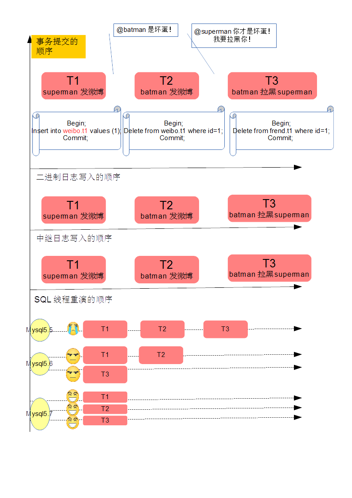
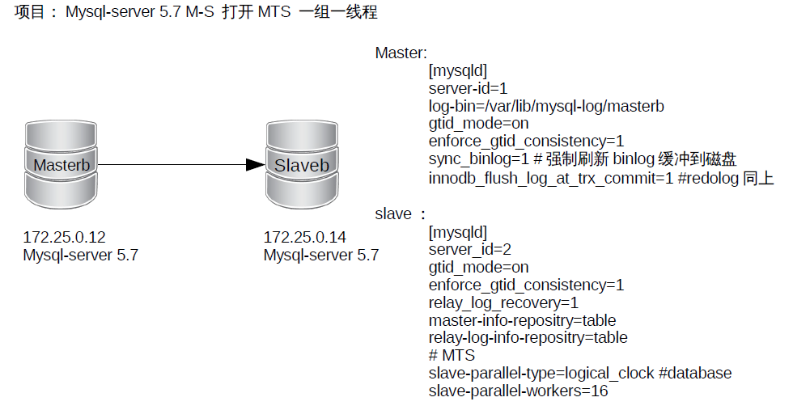

# MySQL 5.7并行复制MTS

* MySQL 5.5 只有一个sql线程进行重演
* MySQL 5.6 一库一线程 
* MySQL 5.7 一组一线程



MySQL 5.7才可称为真正的并行复制，这其中最为主要的原因就是slave服务器的回放与主机是一致的即master服务器上是怎么并行执行的slave上就怎样进行并行回放。

MTS: Prepared transactions slave parallel applier 

该并行复制的思想最早是由MariaDB的Kristain提出，并已在MariaDB 10中出现，相信很多选择MariaDB的小伙伴最为看重的功能之一就是并行复制。

MySQL 5.7并行复制的思想简单易懂，一言以蔽之：一个组提交的事务都是可以并行回放，因为这些事务都已进入到事务的prepare阶段，则说明事务之间没有任何冲突（否则就不可能提交）。


## 设置重演模式`slave-parallel-type`

为了兼容MySQL 5.6基于库的并行复制，5.7引入了新的变量`slave-parallel-type`，其可以配置的值有：

* DATABASE：默认值，基于库的并行复制方式
* LOGICAL_CLOCK：基于组提交的并行复制方式


支持并行复制的GTID

last_committed

sequence_number

并行复制配置与调优
master_info_repository

## 设置重演线程数`slave_parallel_workers`

* slave_parallel_workers设置为0，则MySQL 5.7退化为原单线程复制
* slave_parallel_workers设置为1，则SQL线程功能转化为coordinator线程，但是只有1个worker线程进行回放，也是单线程复制。然而，这两种性能却又有一些的区别，因为多了一次coordinator
线程的转发，因此slave_parallel_workers=1的性能反而比0还要差

## Enhanced Multi-Threaded Slave配置总结

# slave
slave-parallel-type=LOGICAL_CLOCK
slave-parallel-workers=16
master_info_repository=TABLE
relay_log_info_repository=TABLE
relay_log_recovery=ON

## 课堂实践――搭建 MySQL 5.7 基于GTID的MTS并行复制




### 软件安装

|host|ip|software|
|:--|:--|:--|
|masterb|	172.25.0.12|	mysql-community-server-5.7|
|slaveb|	172.25.0.14|	mysql-community-server-5.7|


### 配置文件

```shell
## master
	[mysqld]
	# AB replication
	server-id=1
	log-bin=/var/lib/mysql-log/masterb

	# GTID
	gtid_mode=on
	enforce_gtid_consistency=1

	# crash safe
	sync_binlog=1
	innodb_flush_log_at_trx_commit=1


## slave
	[mysqld]
	# AB replication
	server-id=2

	# open gtid mode
	gtid_mode=on
	enforce_gtid_consistency=1

	# slave crash
	relay_log_recovery=1

	# multisource
	master-info-repository=table
	relay-log-info-repository=table

	# MTS 一组一线程
	slave-parallel-type=logical_clock
	slave-parallel-workers=16
```

## 总结

MySQL 5.7推出的Enhanced Multi-Threaded Slave解决了困扰MySQL长达数十年的复制延迟问题
