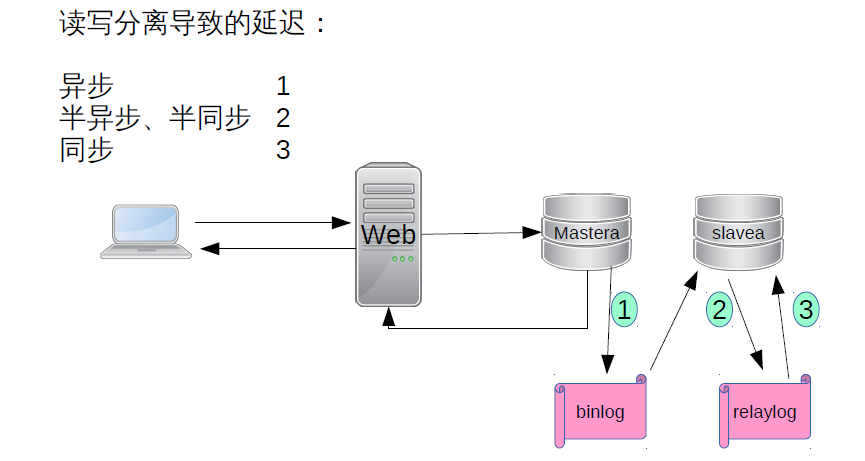
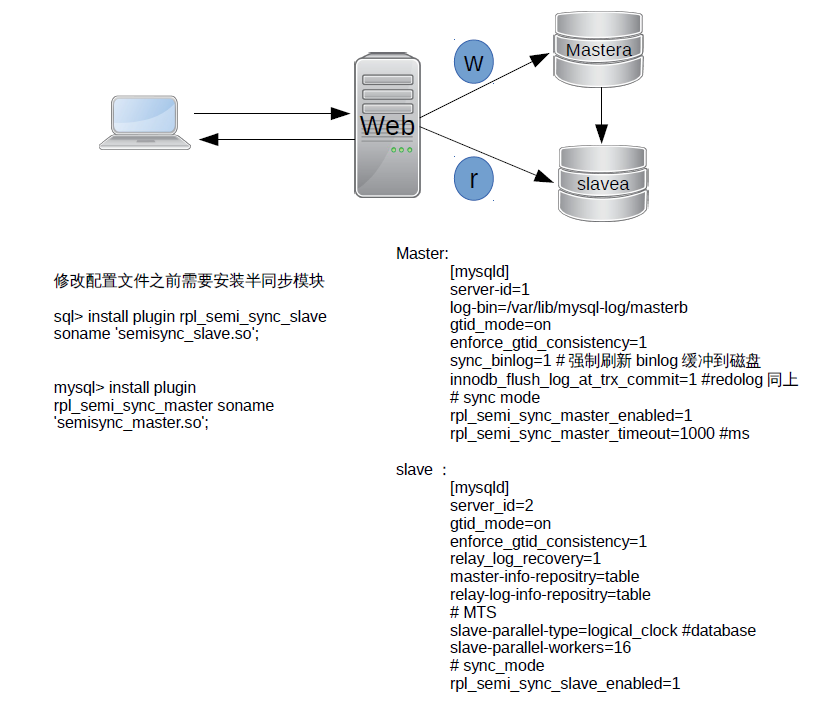

# MySQL 5.7半同步并行复制MTS


## 同步异步半同步

从MySQL5.5开始，MySQL以插件的形式支持半同步复制。


异步复制（Asynchronous replication）

MySQL默认的复制即是异步的，主库在执行完客户端提交的事务后会立即将结果返给给客户端，并不关心从库是否已经接收并处理，这样就会有一个问题，主如果crash掉了，此时主上已经提交的事务可能并没有传到从上，如果此时，强行将从提升为主，可能导致新主上的数据不完整。

 

全同步复制（Fully synchronous replication）

指当主库执行完一个事务，所有的从库都执行了该事务才返回给客户端。因为需要等待所有从库执行完该事务才能返回，所以全同步复制的性能必然会收到严重的影响。

 

半同步复制（Semisynchronous replication）

介于异步复制和全同步复制之间，主库在执行完客户端提交的事务后不是立刻返回给客户端，而是等待至少一个从库接收到并写到relay log中才返回给客户端。相对于异步复制，半同步复制提高了数据的安全性，同时它也造成了一定程度的延迟，这个延迟最少是一个TCP/IP往返的时间。所以，半同步复制最好在低延时的网络中使用。

 

 
## 半同步复制的潜在问题

客户端事务在存储引擎层提交后，在得到从库确认的过程中，主库宕机了，此时，可能的情况有两种

 

1.事务还没发送到从库上


此时，客户端会收到事务提交失败的信息，客户端会重新提交该事务到新的主上，当宕机的主库重新启动后，以从库的身份重新加入到该主从结构中，会发现，该事务在从库中被提交了两次，一次是之前作为主的时候，一次是被新主同步过来的。

 

2.事务已经发送到从库上


此时，从库已经收到并应用了该事务，但是客户端仍然会收到事务提交失败的信息，重新提交该事务到新的主上。

 

## 无数据丢失的半同步复制


针对上述潜在问题，MySQL 5.7引入了一种新的半同步方案：Loss-Less半同步复制。

 

当然，之前的半同步方案同样支持，MySQL 5.7.2引入了一个新的参数进行控制-`rpl_semi_sync_master_wait_point`

rpl_semi_sync_master_wait_point有两种取值

 

`AFTER_SYNC` 这个即新的半同步方案，Waiting Slave dump在Storage Commit之前。

`AFTER_COMMIT` 老的半同步方案

 

## 课堂实践――搭建mysql5.7基于GTID的主从半同步MTS模式


要想使用半同步复制，必须满足以下几个条件：

1. MySQL 5.5及以上版本

2. 变量have_dynamic_loading为YES

3. 异步复制已经存在



### 安装插件

```shell
mysql> install plugin rpl_semi_sync_master soname 'semisync_master.so';
Query OK, 0 rows affected (0.10 sec)

mysql> install plugin rpl_semi_sync_slave soname 'semisync_slave.so';
Query OK, 0 rows affected (0.05 sec)
```

### 配置文件

```shell
## master
	[mysqld]
	# AB replication
	server-id=1
	log-bin=/var/lib/mysql-log/masterb

	# GTID
	gtid_mode=on
	enforce_gtid_consistency=1

	# crash safe
	sync_binlog=1
	innodb_flush_log_at_trx_commit=1

	# 半同步模式
	rpl_semi_sync_master_enabled=1
	rpl_semi_sync_master_timeout=1000

## slave
	[mysqld]
	# AB replication
	server-id=2

	# open gtid mode
	gtid_mode=on
	enforce_gtid_consistency=1

	# slave crash
	relay_log_recovery=1

	# multisource
	master-info-repository=table
	relay-log-info-repository=table

	# MTS 一组一线程
	slave-parallel-type=logical_clock
	slave-parallel-workers=16

	# 半同步模式
	rpl_semi_sync_slave_enabled=1
```

### 测试半同步复制超时后自动切换回异步模式


```shell
mysql> create database db1;
Query OK, 1 row affected (0.06 sec)

mysql> create table db1.t1 (id int);
Query OK, 0 rows affected (0.26 sec)

mysql> insert into db1.t1 values (1);
Query OK, 1 row affected (0.23 sec)
# 将slave关闭后再执行以下操作
mysql> insert into db1.t1 values (2);
Query OK, 1 row affected (1.19 sec)

mysql> insert into db1.t1 values (3);
Query OK, 1 row affected (0.36 sec)

mysql> insert into db1.t1 values (4);
Query OK, 1 row affected (0.08 sec)
```

如果从机想回到半异步模式，需要重启slave，否则默认还是异步复制。


### 监控主从是否运行在半同步复制模式下

* `show status like 'rpl_semi_sync_master_status';`
* `show status like 'rpl_semi_sync_slave_status';`


### 环境变量

```shell
mysql> show variables like '%Rpl%';
+-------------------------------------------+------------+
| Variable_name                             | Value      |
+-------------------------------------------+------------+
| rpl_semi_sync_master_enabled              | ON         |
| rpl_semi_sync_master_timeout              | 10000      |
| rpl_semi_sync_master_trace_level          | 32         |
| rpl_semi_sync_master_wait_for_slave_count | 1          |
| rpl_semi_sync_master_wait_no_slave        | ON         |
| rpl_semi_sync_master_wait_point           | AFTER_SYNC |
| rpl_stop_slave_timeout                    | 31536000   |
+-------------------------------------------+------------+
7 rows in set (0.30 sec)
```

`rpl_semi_sync_master_wait_for_slave_count`

MySQL 5.7.3引入的，该变量设置主需要等待多少个slave应答，才能返回给客户端，默认为1。

 

`rpl_semi_sync_master_wait_no_slave`

ON

默认值，当状态变量Rpl_semi_sync_master_clients中的值小于rpl_semi_sync_master_wait_for_slave_count时，Rpl_semi_sync_master_status依旧显示为ON。

OFF

当状态变量Rpl_semi_sync_master_clients中的值于rpl_semi_sync_master_wait_for_slave_count时，Rpl_semi_sync_master_status立即显示为OFF，即异步复制。

说得直白一点，如果我的架构是1主2从，2个从都采用了半同步复制，且设置的是rpl_semi_sync_master_wait_for_slave_count=2，如果其中一个挂掉了，对于rpl_semi_sync_master_wait_no_slave设置为ON的情况，此时显示的仍然是半同步复制，如果rpl_semi_sync_master_wait_no_slave设置为OFF，则会立刻变成异步复制。

 

### 状态变量

```shell
mysql> show status like '%Rpl_semi%';
+--------------------------------------------+-------+
| Variable_name                              | Value |
+--------------------------------------------+-------+
| Rpl_semi_sync_master_clients               | 1     |
| Rpl_semi_sync_master_net_avg_wait_time     | 0     |
| Rpl_semi_sync_master_net_wait_time         | 0     |
| Rpl_semi_sync_master_net_waits             | 6     |
| Rpl_semi_sync_master_no_times              | 1     |
| Rpl_semi_sync_master_no_tx                 | 1     |
| Rpl_semi_sync_master_status                | ON    |
| Rpl_semi_sync_master_timefunc_failures     | 0     |
| Rpl_semi_sync_master_tx_avg_wait_time      | 1120  |
| Rpl_semi_sync_master_tx_wait_time          | 4483  |
| Rpl_semi_sync_master_tx_waits              | 4     |
| Rpl_semi_sync_master_wait_pos_backtraverse | 0     |
| Rpl_semi_sync_master_wait_sessions         | 0     |
| Rpl_semi_sync_master_yes_tx                | 4     |
+--------------------------------------------+-------+
14 rows in set (0.00 sec)
```
 

上述状态变量中，比较重要的有以下几个

 

`Rpl_semi_sync_master_clients`

当前半同步复制从的个数，如果是一主多从的架构，并不包含异步复制从的个数。

 

`Rpl_semi_sync_master_no_tx`

The number of commits that were not acknowledged successfully by a slave.

具体到上面的测试中，指的是insert into test.test values(2)这个事务。

 

`Rpl_semi_sync_master_yes_tx`

The number of commits that were acknowledged successfully by a slave.


 

## 总结

1. 在一主多从的架构中，如果要开启半同步复制，并不要求所有的从都是半同步复制。

2. MySQL 5.7极大的提升了半同步复制的性能。

    5.6版本的半同步复制，dump thread 承担了两份不同且又十分频繁的任务：传送binlog 给slave ，还需要等待slave反馈信息，而且这两个任务是串行的，dump thread 必须等待 slave 返回之后才会传送下一个 events 事务。dump thread 已然成为整个半同步提高性能的瓶颈。在高并发业务场景下，这样的机制会影响数据库整体的TPS 。

    5.7版本的半同步复制中，独立出一个 ack collector thread ，专门用于接收slave 的反馈信息。这样master 上有两个线程独立工作，可以同时发送binlog 到slave ，和接收slave的反馈。 